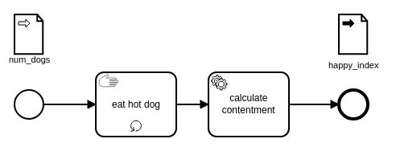

# SpiffWorkflow Extensions for BPMN.js
This package provides extensions that can be applied to BPMN.js that will enable some important features of [SpiffWorkflow](https://github.com/sartography/SpiffWorkflow) - the Python BPMN Library for executing business processes.  See below for more information.

# About

This extension creates a BPMN editor with all the capabilities of [BPMN.js](https://github.com/bpmn-io/bpmn-js) and the following additions / modifications:

* Ability to insert BPMN's Data Input and Data Output Objects.
* A SpiffWorkflow centric Properties Panel for specifying scripts to run before and after a task, and for defining documentation, and Mark-up content for displaying in user and manual tasks.  Among other things.

# Data Input and Data Output Element
This extension will allow you to drag BPMN Data Input and Data Output elements onto the diagram and give them appropriate labels.  This will generate valid BPMN elements in the underlying XML file - connecting them to the IO Specification of the process, as shown below:
```xml
  <bpmn:process id="my_delightful_process" isExecutable="true">
    <bpmn:ioSpecification>
      <bpmn:dataInput id="DataInput-745019423-1" name="num_dogs" />
      <bpmn:dataOutput id="DataOutput-711207596-1" name="happy_index" />
    </bpmn:ioSpecification>
    ...
```


Using these data input and outputs will allow you to create processes designed to be used as Call Activities.  SpiffWorkflow (in a soon-to-be released version) will pick up this information, and enforce it.  So that you must provide these input variables to execute, and only the variables mentioned in the output will be passed back to the calling process.

## Usage
```javascript
import BpmnModeler from 'bpmn-js/lib/Modeler';
import spiffworkflow from 'bpmn-js-spiffworkflow/app/spiffworkflow';


var bpmnJS = new BpmnModeler({
  additionalModules: [
    spiffworkflow
  ],
  moddleExtensions: {
    spiffworkflowModdle: spiffModdleExtension
  }
});
```

## Run the Example

You need a [NodeJS](http://nodejs.org) development stack with [npm](https://npmjs.org) installed to build the project.

To install all project dependencies execute

```sh
npm install
```

To start the example execute

```sh
npm start
```

To build the example into the `public` folder execute

```sh
npm run all
```

# Integration Points
You can use the EventBus to communicate with this UI, sending and receiving messages to change 
the behavior of the editor making it easier for your end users.  There are many examples of 
this in the app.js file.  
Below is a table of all the events that are sent and accepted:

| Event Name                     | Description                                                      | Fired or Acceped | Parameters           | Description                                                              |
|--------------------------------|------------------------------------------------------------------|---------|----------------------|--------------------------------------------------------------------------|
| spiff.service\_tasks.requested | Request a list of available services for service task.           | Fired   | \-                   |                                                                          |
| spiff.service\_tasks.returned  | Provides a list of services.                                     | Recieved | serviceTaskOperators | ex: \[{id:'Chuck Facts', parameters\[{id:'category', type:'string'}\]}\] |
| spiff.script.edit              | Request to edit a python script in some sort of facy editor.     | Fired   | scriptType           | one of: script, preScript, postScript                                    |
|                                |                                                                  |         | value                | The actual python script                                                 |
|                                |                                                                  |         | element              | The element that needs updating                                          |
|                                |                                                                  |         | eventBus             | Used by receiver to fire back an event                                   |
| spiff.script.update            | Update a python script to a new value.                           | Recieved | scriptType           | one of: script, preScript, postScript                                    |
|                                |                                                                  |         | value                | The updated script                                                       |
|                                |                                                                  |         | element              | The element that needs updating                                          |
| spiff.markdown.edit            | Request to edit markdown in a fancy editor.                      | Fired   | element              | The element that needs updating                                          |
|                                |                                                                  |         | value                | The current markdown content                                             |
| spiff.markdown.update          | Update Markdown content for a paticular elements 'instructions'. | Recieved | element              | The element that needs updating                                          |
|                                |                                                                  |         | value                | Tne updated Markdown content                                             |
| spiff.callactivity.edit        | Requst to edit a call activity by process id.                    | Fired   | processId            | The Process the users wants to edit                                      |
| spiff.callactivity.search      | Requst to search for a call activity                             | Fired   | processUd            | The currently seleted process id                                         |
|                                |                                                                  |         | eventBus             | For sending back the selected process id.                                |
| spiff.callactivity.update      | Update the process id from a call activity (based on search)     | Received | processId            | The Process the users wants to edit                                      |
| spiff.file.edit                | request to edit a file, but file name.                           | Fired   | value                | The file name the user wants to edit                                     |
| spiff.dmn.edit                 | request to edit a dmn by process id.                             | Fired   | value                | The DMN id the user wants to edit                                        |
| spiff.json\_files.requested    | request a list of local json files.                              | Fired   | optionType           | The type of options required ('json' or 'dmn')                           |
| spff.dmn\_files.requested      | request of list of local dmn files.                              |         |                      |                                                                          |
| spiff.json\_files.returned     | Return a list of available json files                            | Recieved | options              | \[{lable:'My Label', value:'1'}\]                                        |
| spff.dmn\_files.returned       | Return a list of available dmn files.                            | Recieved | options              | \[{lable:'My Label', value:'1'}\]                                        |
