# Built-in Examples Overview

When logging into the dashboard, it is crucial to familiarize yourself with the functions it offers and how the underlying engine operates.
In the demo website, we will explore two examples: the Minimal Example and the Essential Example, to provide a clear understanding of the process.


## Minimal Example

Let's begin with the Minimal Example, which serves as a "Hello World" process—a simple executable BPMN Diagram designed to demonstrate basic functionality.
Rather than immediately starting the process, we will first examine its structure.


### Access the Process Directory

Clicking on the process name will open the directory dedicated to the Minimal Example process.
From here, you can start the process if desired, but for the purpose of this example, we will proceed with an explanation of its components and functionality.
Therefore, locate and click on the .bpmn file to access the BPMN editor.


The BPMN editor provides a visual representation of the process workflow.


### Understand the Process Workflow

The Minimal Example process consists of three key elements: a start event, a manual task, and an end event.
It is essential to understand the purpose and functionality of the properties panel, which is an integral component of the process diagram.
Without selecting any specific task within the diagram editor, the properties panel will appear as follows:


General

-   The Name field is usually empty unless the user wants to provide it.
It serves as a label or identifier for the process.

-   The ID is automatically populated by the system (default behavior).
However, it can be updated by the user, but it must be unique across all of the processes within SpiffArena.

-   By default, all processes are executable, which means the engine can run the process.


Documentation

-   This field can be used to provide any notes related to the process.


Data Objects

-   Used to configure Data Objects added to the process.
See full article [here](https://medium.com/@danfunk/understanding-bpmns-data-objects-with-spiffworkflow-26e195e23398).


**1. Start Event**


The first event in the Minimal Example is the start event.
Each process diagram begins with a Start Event.
Now explore the properties panel when you click on the first process of the diagram, “Start Event”.


General

-   The name for a Start Event is often left blank unless it needs to be named to provide more clarity on the flow or to be able to view this name in Process Instance logs.

-   ID is automatically populated by the system (default behavior).
However, it can be updated by the user, but it must remain unique within the process.
Often the ID would be updated to allow easier referencing in messages and also logs as long as it’s unique in the process.


Documentation

-   This field is used to provide any notes related to the element.


```{admonition} Note:

In the Minimal Example, the Start Event is a None Start Event.
This type of Start Event signifies that the process can be initiated without any triggering message or timer event.
It is worth noting that there are other types of Start Events available, such as Message Start Events and Timer Start Events.
These advanced Start Events will be discussed in detail in the subsequent sections, providing further insights into their specific use cases and functionalities.
```

**2. Manual Task**

Within the process flow, the next step is a manual task.
A Manual Task is another type of BPMN Task requiring human involvement.
Manual Tasks do not require user input other than clicking a button to acknowledge the completion of a task that usually occurs outside of the process.

Now explore the properties panel when you click on the first process of the process of “Show Example Manual Task”.


Panel General Section

-   Enter/Edit the User Task name in this section.
Alternatively, double-click on the User Task in the diagram.

-   The ID is automatically entered and can be edited for improved referencing in error messages, but it must be unique within the process.


Documentation Section

-   This field is used to provide any notes related to the element.


SpiffWorkflow Scripts

-   Pre-Script: Updates Task Data using Python prior to the execution of the Activity.

-   Post-Script: Updates Task Data using Python immediately after the execution of the Activity.


Instructions

During the execution of this task, the following instructions will be displayed to the end user.
This section serves as a means to format and present information to the user.
The formatting is achieved through a combination of Markdown and Jinja.
To view and edit the instructions, click on the editor, and a window will open displaying the instructions in the specified format.


**3. End Task**


The next process in the workflow is an end task.
A BPMN diagram should contain an end event for every distinct end state of a process.

Now explore the properties panel when you click on the last end event process:


General

-   The name for a Start Event is often left blank unless it needs to be named to provide more clarity on the flow or to be able to view this name in Process Instance logs.

-   ID is automatically populated by the system (default behavior).
However, the user can update it, but it must remain unique within the process.


Documentation

-   This field is used to provide any notes related to the element.


Instructions

-   These are the instructions for the end user, which will be displayed when this task is executed.
You can click on launch editor to see the markdown file.


## Essential Example

Now that we have explored the Minimal Example, let's delve into a more comprehensive BPMN model known as the Essential Example.
This example serves as a stepping stone towards a deeper understanding of BPMN, as it incorporates a variety of fundamental concepts that work harmoniously together.

### Access the Process Directory

Clicking on the process name will open the directory dedicated to the Essential Example process.
Here are the four files in the process:

**BPMN editor**: The BPMN editor is a primary file that runs the engine.
In the Minimal Example, we learned that it allows you to visually design and represent business processes using the Business Process Model and Notation (BPMN) standard.

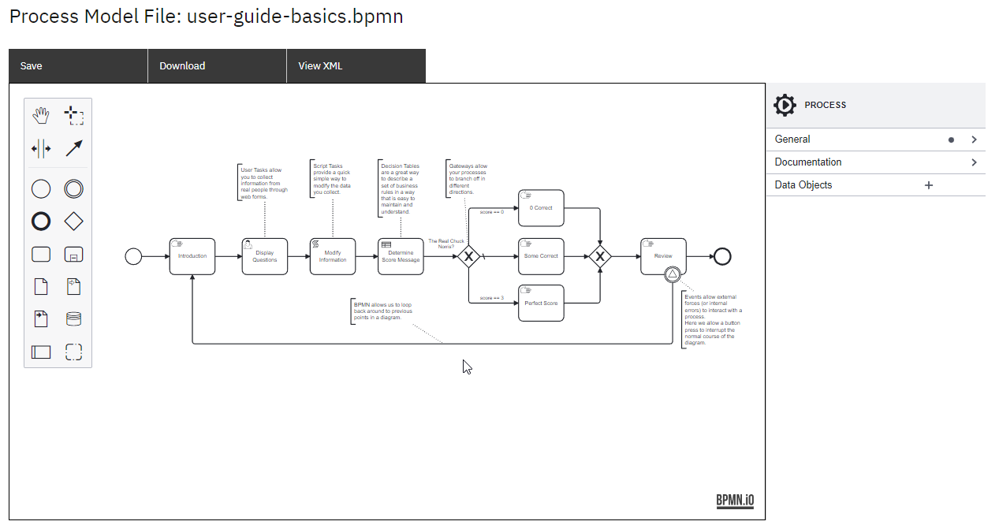

**DMN table**: A file that defines decision-making logic using the Decision Model and Notation (DMN) standard, enabling you to model complex decision rules and outcomes.

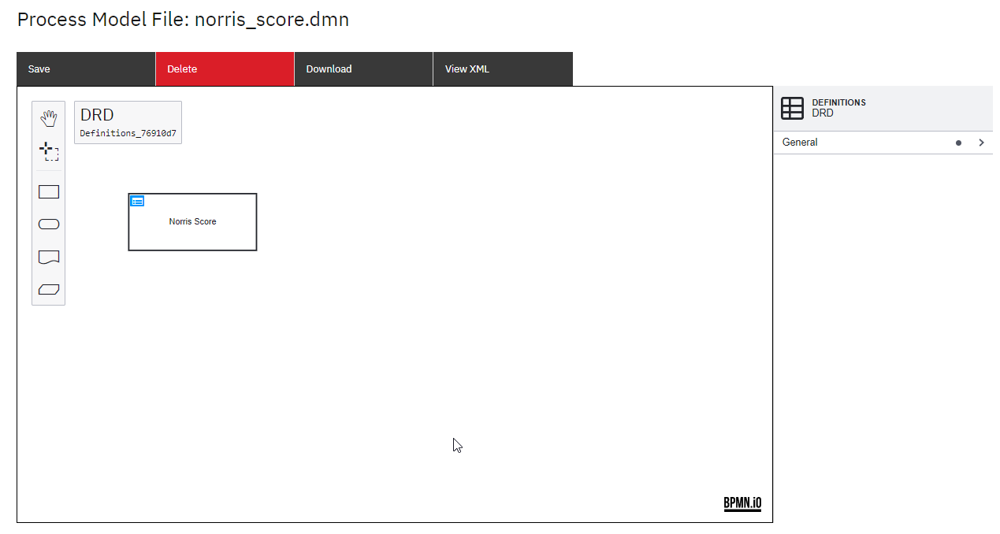

Here's what a DMN table looks like:

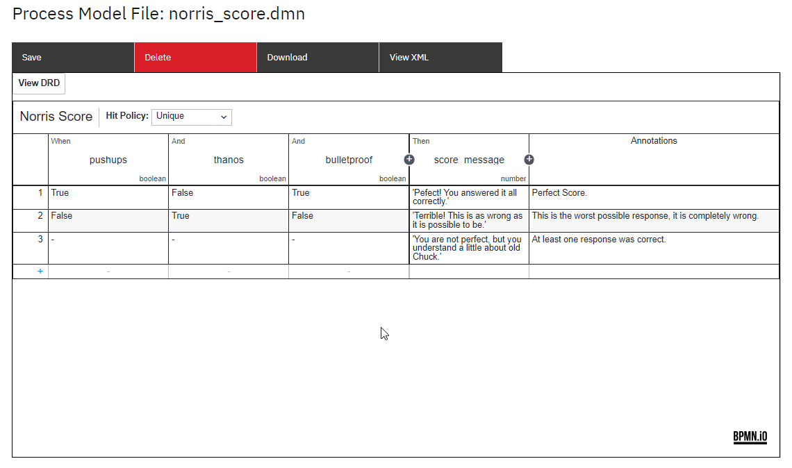

**JSON Schema**: A file that describes the structure, format, and validation rules for data in JSON format, ensuring data integrity and interoperability.
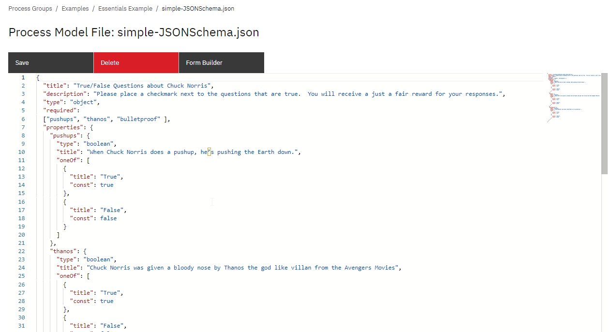

**UI Schema**: A file that defines the layout, structure, and behavior of user interfaces, facilitating the development of intuitive and interactive user experiences.
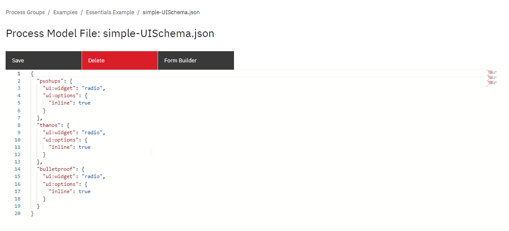

### Process Workflow

In this BPMN diagram example, the process is outlined step by step.
The process initiates with a start event, serving as the entry point for the workflow.

Following the start event, a manual task named "Introduction" is incorporated, responsible for displaying a welcoming message to the user.

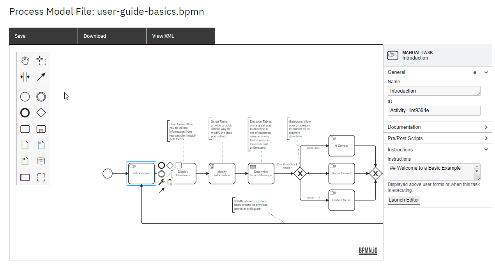

Next, a **User task** named "Display Questions" is added, facilitating the collection of information from real individuals through web forms.
In the properties section, a JSON form is created to specify the questions for the users to respond to.

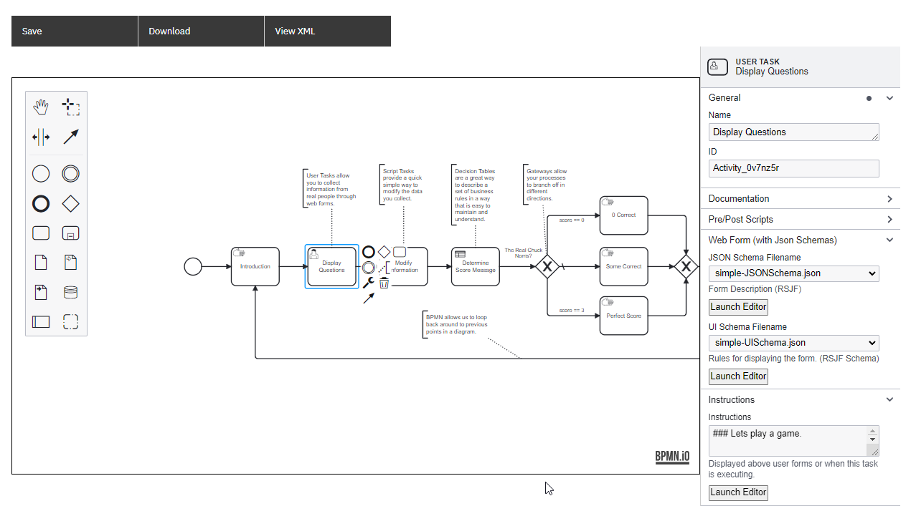

Once the user completes the form, the gathered data is passed on to a **script task** named "Modify Information", responsible for calculating the data score.
The script for this calculation is embedded in the properties section.

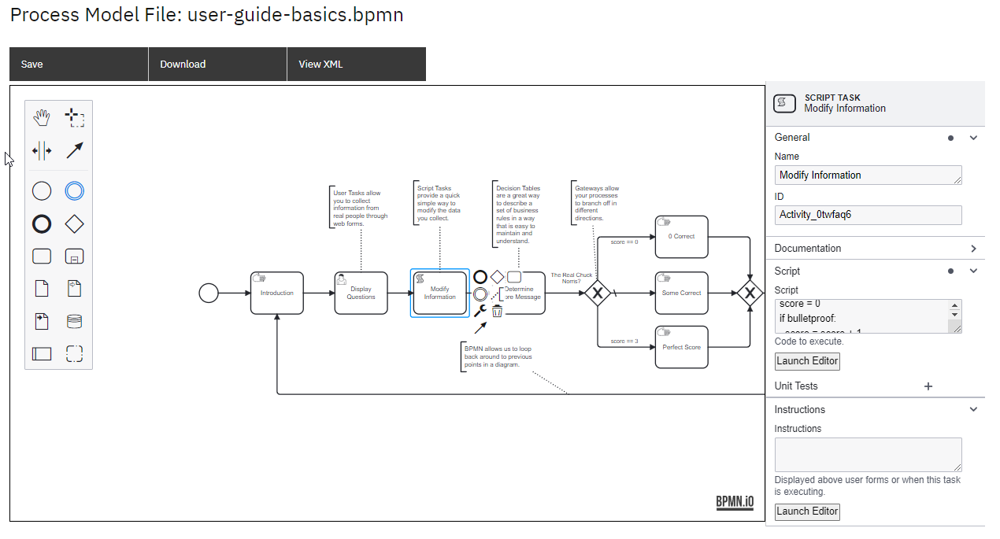

As an alternative approach, the data score can also be determined using a **DMN table** named "Determine Score Message".
Decision tables offer an effective means of defining business rules in an easily comprehensible format.
The DMN table calculates the score based on predefined rules.

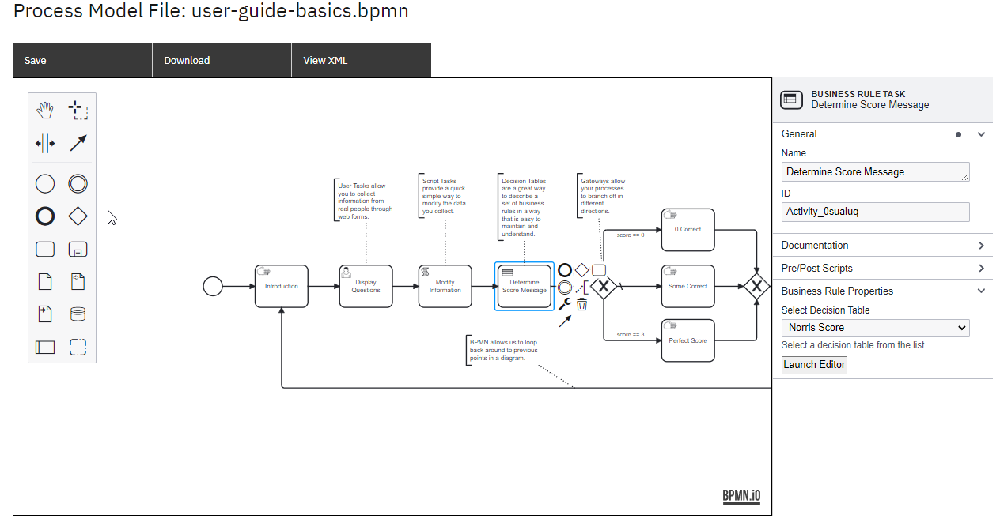

After the score calculation, an **exclusive gateway** is employed to make decisions based on the determined score.
Three manual tasks are defined, each displaying a different message based on the obtained score:

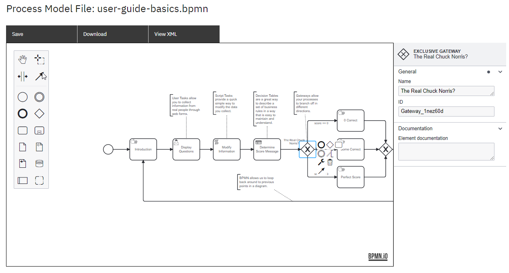

a. **Worst Possible Response**: If the score indicates the worst possible response, a manual task displays a message stating that it is completely wrong.

b. **At Least One Correct Response**: If the score indicates that at least one response was correct, a manual task displays a message acknowledging the correct response.

c. **Perfect Score**: If the score indicates a perfect score, a manual task displays a message recognizing the excellent performance.

Once the score messages are displayed, a **signal event** is included, providing users with the option to continue and conclude the process or choose to repeat the process from the beginning.
Signal events enable external forces or internal errors to interact with the process, and in this scenario, a button press allows for the interruption of the diagram's normal course.

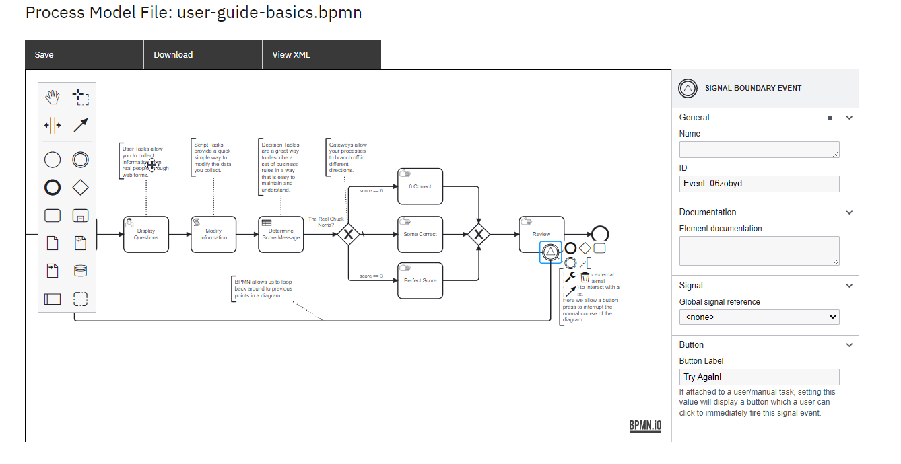
