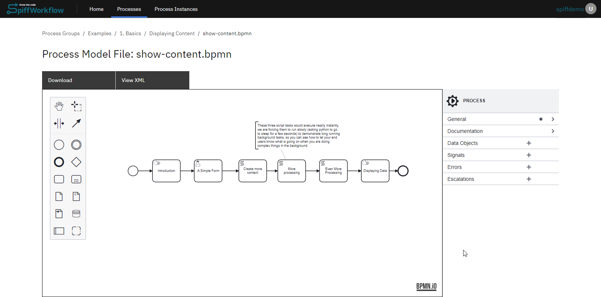
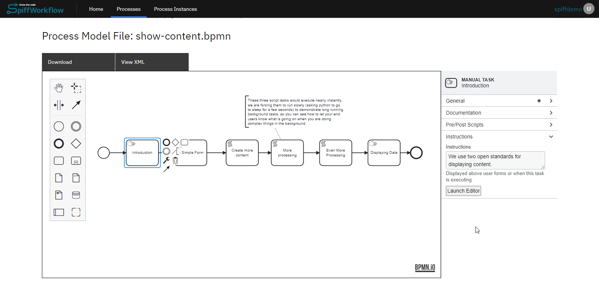
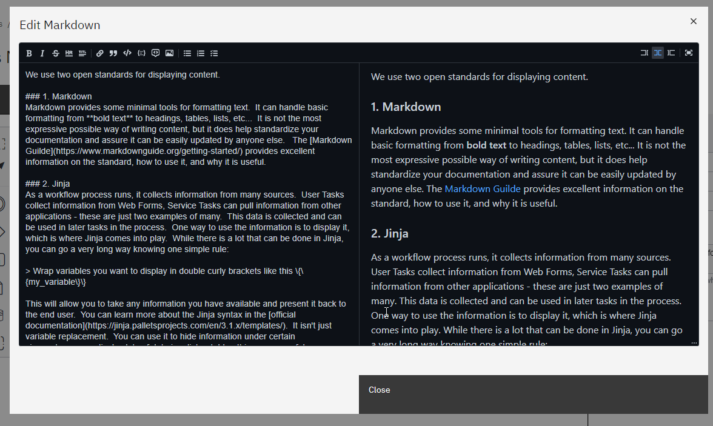
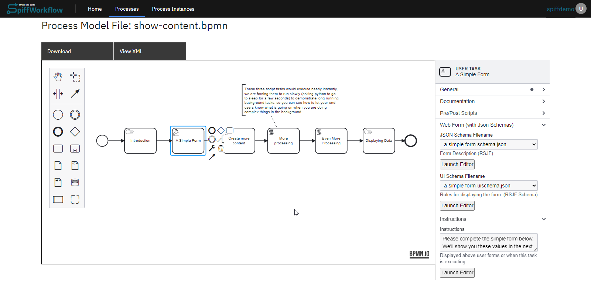
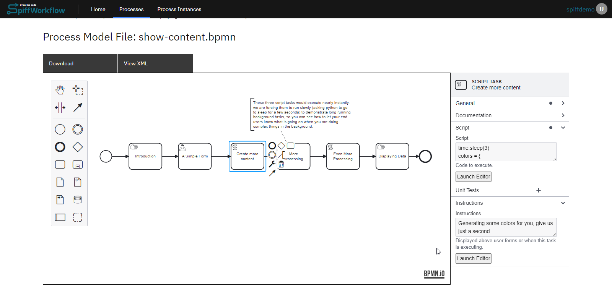
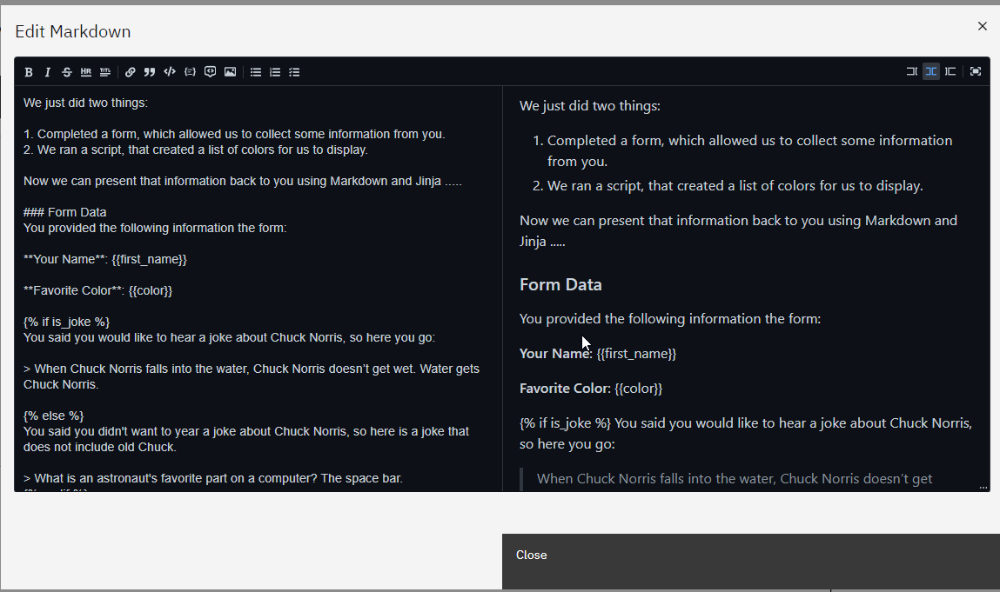
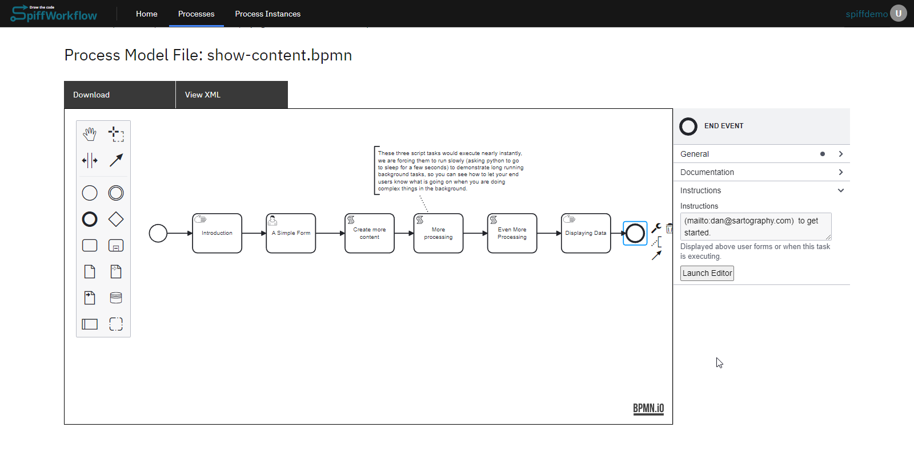
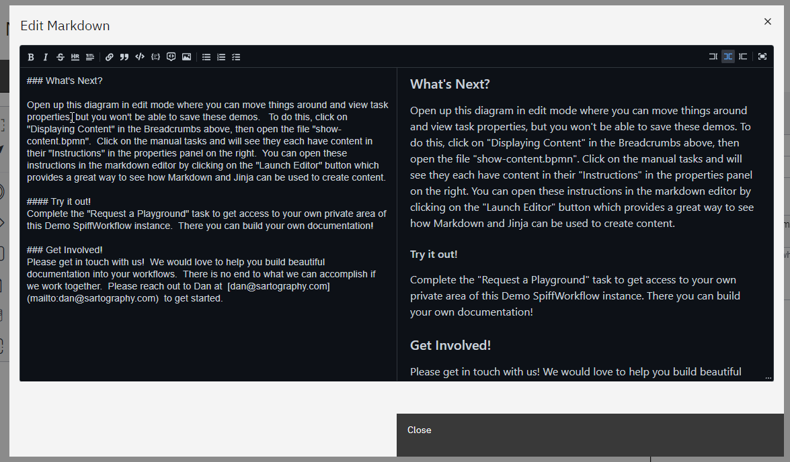

# Displaying Content

The SpiffArena platform offers powerful features for displaying content within your BPMN processes.
Follow the steps below to effectively display content in your processes.

In this guide, we'll explore how to effectively display content in SpiffArena, providing a seamless user experience and an engaging presentation of information.

Let's dive in and learn the key aspects of displaying content within your workflows.

## Markdown: Formatting Content

Markdown is a powerful tool for formatting and styling your content in SpiffArena.
With Markdown, you can easily add headings, lists, tables, hyperlinks, and more to enhance the readability and visual appeal of your displayed content.

## Jinja Templating: Dynamic Content Generation

Jinja Templating in SpiffArena empowers you to generate dynamic content based on variables, conditions, and logic.
By leveraging Jinja's syntax and functionality, you can customize your content to adapt to specific scenarios, display personalized information, or perform calculations based on collected data.

## Combining Markdown and Jinja: Unleashing the Power

By utilizing the strengths of Markdown and Jinja, you can create rich, interactive, and data-driven content that goes beyond static text.
We'll demonstrate using an example of how to leverage Markdown and Jinja together to create captivating content that responds to user input and presents dynamic information.

## Basic Example for Displaying Content

In our SpiffArena dashboard, we have a simple example of how to display content in the basics section.
Now, let's explore the process workflow of the content display process model and discover various ways to present content in different scenarios.

### Display Content Process Overview

Here is a summary of the process:

1. **Start Event and Introduction Manual Task**

The process begins with a Start Event, signaling the start of the workflow.

It is followed by a Manual Task called "Introduction" that displays a welcome message or instructions for the users.
The content to be displayed is specified in the task's properties panel.

2. **User Task with Form**

A User Task named "simple form" is included, allowing users to complete a form.
The properties panel of the User Task contains a JSON form schema, defining the structure of the form.
The instructions panel of the User Task guides users to fill out the form, indicating that the entered values will be shown in the subsequent Manual Task.

3. **Script Tasks**

Three Script Tasks are incorporated into the process, each serving a specific purpose.
Script Task 1 introduces a delay using the code "time.sleep(3)" and generates a dictionary of colors.
Script Task 2 includes a delay with the code "time.sleep(1)" and focuses on making the colors more playful.
Script Task 3 includes a delay with the code "time.sleep(2)" and aims to increase the silliness level.

4. **Manual Task to Display Content**

A Manual Task will display content based on the collected data and script-generated information.
The instructions panel of the Manual Task provides the content to be displayed, which includes the form data entered by the user.
It also offers an optional Chuck Norris joke based on user preference and a table of silly color names generated using Jinja templating.

5. **End Event**

The process concludes with an End Event, indicating the end of the workflow.
The instructions panel of the End Event suggests next steps, such as exploring the diagram in edit mode and completing the "Request a Playground" task.

