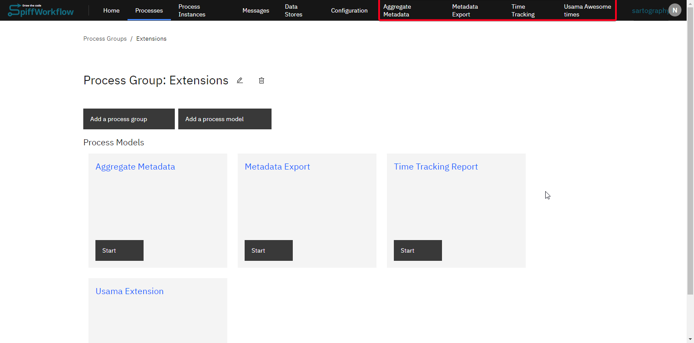
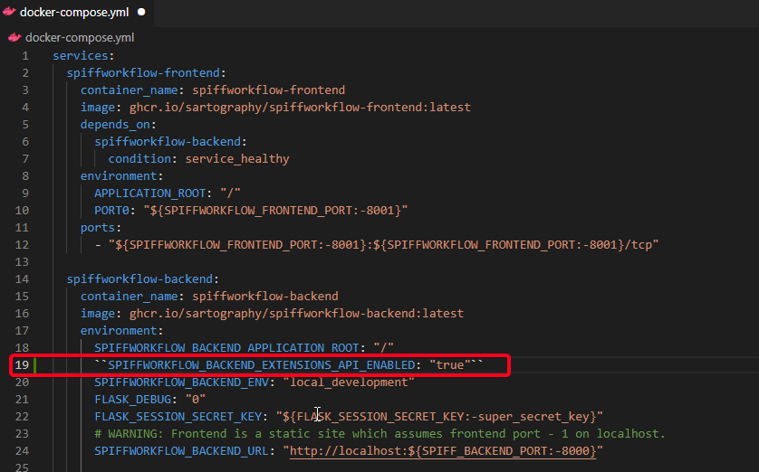
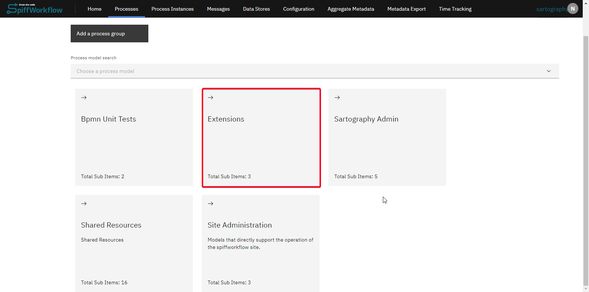
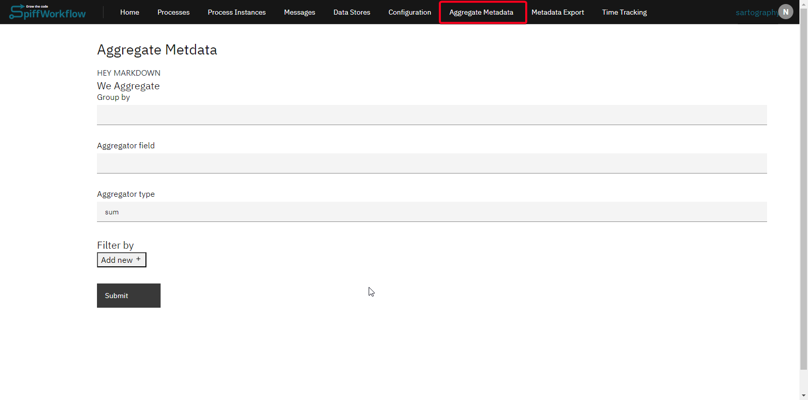

# Extensions

Extensions in SpiffArena provide a mechanism to augment the software with custom features or functionalities. By leveraging extensions, users can implement functions or features not present in the standard offering. This powerful feature ensures adaptability to various business needs, from custom reports to specific user tools.

Here are some of key aspects of using Extensions:
-   Extensions are implemented within a process model repository.
    
-   Once an extension is created, it becomes accessible via the top navigation bar.
    
-   Extensions are universal. Once added, they will be visible to all users and are not user-specific.

-   Configuration for the extensions can be found and modified in the `extension-uischema.json` file.



## Getting Started with Extensions

### Environment Variable Activation

To utilize extensions, the environment variable must be set to true. This variable activates the extensions feature in the SpiffWorkflow backend. Here is the enviromental variable:
``SPIFFWORKFLOW_BACKEND_EXTENSIONS_API_ENABLED: "true"``

If SpiffWorkflow is being deployed using Docker Compose, add the environment variable under the selected section of your `docker-compose.yml` file as shown in screenshot:



### Creating an Extension
After enabling the extensions from the backend, you can create extensions in the SpiffArena front end. To create your own custom extension, you have to go through following steps:

-   Navigate to the process model repository where extensions are to be implemented.


    
-   Create the `extension-uischema.json` file. If you want to modify existing extension, you can change the layout as well in existing models.


    
-   To add a new extension with navigation, incorporate the navigation function within this JSON file. For instance, we are taking an example of agregate metadata extension:

``` json
{
    "navigation_items": [{
        "label": "Aggregate Metadata",
        "route": "/aggregate-metadata"
        }
    ],
    "routes": {
        "/aggregate-metadata": {
            "header": "Aggregate Metdata",
            "api": "aggregate-metadata",
            "form_schema_filename": "we-aggregate-schema.json",
            "form_ui_schema_filename": "we-aggregate-uischema.json",
            "markdown_instruction_filename": "we-aggregate-markdown.md",
            "results_markdown_filename": "we-aggregate-results-markdown.md"
        }
    }
}

```
The provided JSON structure seems to describe a configuration for a web application or a user interface that involves navigation and data aggregation. Here's a breakdown of the key components:

1. `navigation_items`: This is an array containing navigation items for the application's navigation menu. In this case, there's only one item:
   - `"label"`: The label or display text for the navigation item is "Aggregate Metadata".
   - `"route"`: The route or URL associated with the navigation item is "/aggregate-metadata". This suggests that clicking on this navigation item would take the user to a page related to aggregated metadata.

2. `routes`: This is an object that defines routes within the application. In this case, there's only one route defined:
   - `"/aggregate-metadata"`: This is the URL route that corresponds to the previously mentioned navigation item. The details for this route are:
     - `"header"`: The header or title for the page associated with this route is "Aggregate Metadata".
     - `"api"`: This likely refers to an API endpoint that is used to retrieve or manipulate aggregated metadata.
     - `"form_schema_filename"`: The filename "we-aggregate-schema.json" likely points to a JSON schema that describes the structure of the data to be submitted through a form on the "Aggregate Metadata" page.
     - `"form_ui_schema_filename"`: The filename "we-aggregate-uischema.json" likely points to a UI schema that specifies how the form elements on the page should be rendered and arranged.
     - `"markdown_instruction_filename"`: The filename "we-aggregate-markdown.md" likely points to a Markdown file containing instructions or guidance for the user when interacting with the "Aggregate Metadata" page.
     - `"results_markdown_filename"`: The filename "we-aggregate-results-markdown.md" likely points to a Markdown file where the results of the aggregation process will be displayed or explained.

This route has associated components such as a header, API endpoint, form schema, form UI schema, instructions in Markdown format, and a results display in Markdown format, all related to the process of aggregating metadata.

-   Deploy your changes and ensure the environment variable is activated to see your extensions in the top navigation bar and start adding new features to SpiffArena.



# Use Cases

If your organization has specific needs not catered to by the standard SpiffArena features, you can use extensions to add those features.  

Here are some of the use cases already implemented by our users:
-   Implementing a time tracker.
-   Creating custom reports tailored to your business metrics.
-   Incorporating arbitrary content into custom pages using markdown.
-   Creating and accessing tailor-made APIs.
-   Rendering the output of these APIs using jinja templates and markdown.

Extensions in SpiffArena offer a robust mechanism to tailor the software to unique business requirements. By setting the appropriate environment variables and using the provided schema files, organizations can expand the system's functionalities with ease.