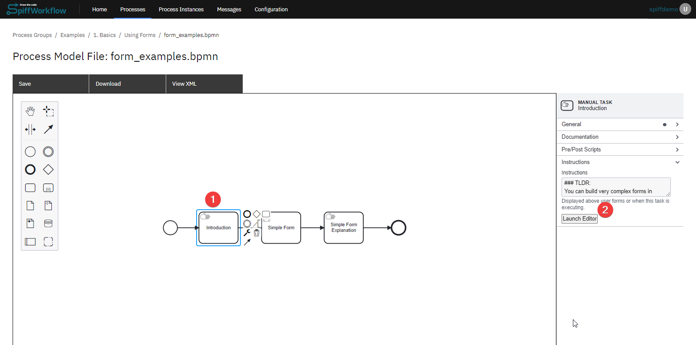
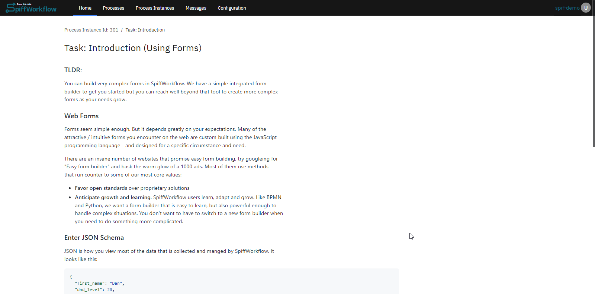
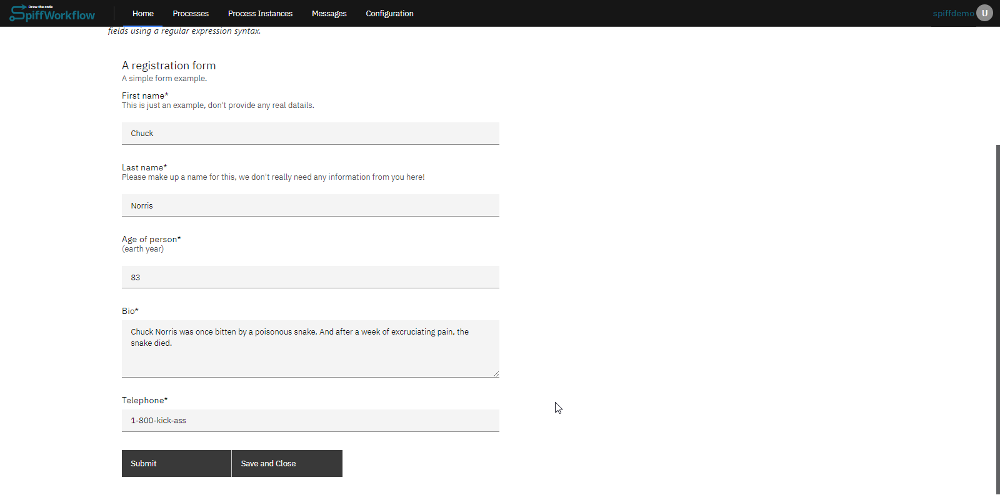
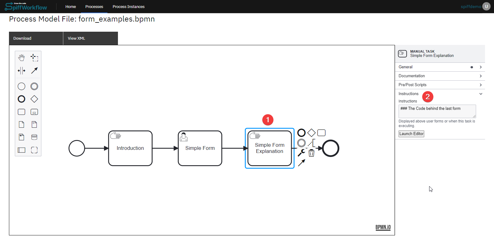
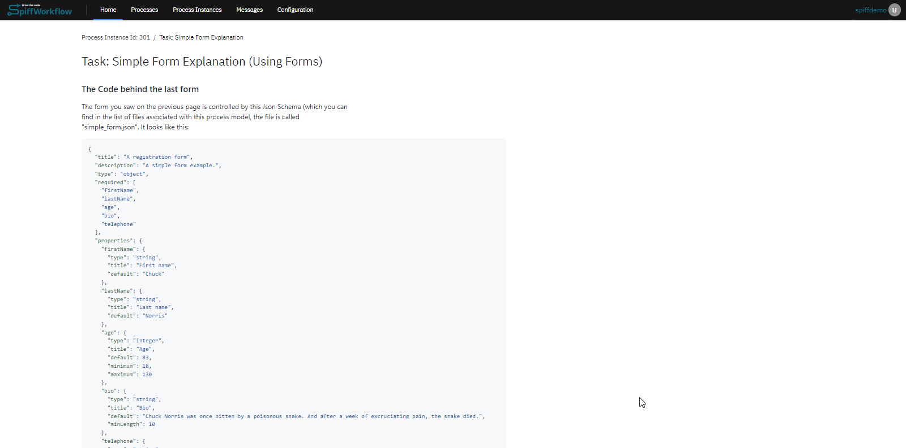

# Using Forms

This feature allows you to create custom forms for collecting and 
managing data within your workflows. Whether you need a simple 
feedback form or a complex multi-step form, SpiffArena provides you 
with the tools to build and integrate forms seamlessly.

With SpiffArena's form builder, you can start with basic form elements 
and gradually add more advanced components as your form requirements 
evolve. 
Let's dive in and explore the possibilities of creating forms in 
SpiffArena.

## Instructions on Creating Forms

Forms play a crucial role in capturing data, and SpiffArena offers a 
powerful form-building capability. Here are the ways to create forms:

1. Leveraging JSON Schema

JSON Schema is an standard for describing the structure of 
data in a JSON file. JSON Schema forms the foundation for building 
forms in SpiffArena.

To simplify the form creation process, we leverage the React JSON 
Schema Form (RJSF) library. RJSF is a powerful tool that uses JSON 
Schema as its basis. It enables you to create dynamic and interactive 
forms with ease. The RJSF library is open source, free to use, and 
follows the principles of open standards.

Please note that while this guide provides a basic understanding of 
JSON Schema and RJSF, there is much more to explore. We encourage you 
to refer to the official 
[RJSF documentation](https://rjsf-team.github.io/react-jsonschema-form/docs/) for comprehensive details 
and advanced techniques.

2. Using Form Builder

An alternative approach to creating JSON code is to utilize the form 
builder feature, which allows you to easily create various fields 
without the need for writing JSON manually. 

However, it's important to 
note that the form builder may have certain limitations in terms of 
features and may not be as powerful as using the JSON editor directly. 

While the form builder provides convenience and simplicity, using the 
JSON editor offers greater flexibility and control over the form 
structure.

## Basic Example for Using Forms
Now that you have a grasp of how to create forms in SpiffArena using 
JSON Schema and RJSF, it's time to put your knowledge into action. 
Lets cover the example of using forms process model in the basics.

The BPMN diagram initiates with a start event, which is followed by a 
manual task aimed at providing a comprehensive understanding of web 
forms and the various approaches to displaying them. 

The expected output of the form during the process execution can be 
observed in the attached image.

Moving forward, the diagram incorporates a user task specifically 
designed for form display. Within the properties panel of the user 
task, two essential files are included: a JSON Schema (containing the 
form description in RSJF format) and a UI Schema (outlining the rules 
for displaying the form based on the RSJF schema). 

The anticipated output of the form when the process is executed can be 
visualized in the attached image.

Following that, a manual task is included, offering a simple form 
explanation. As users submit the form, the manual task will display 
the respective explanation.

An attached image provides an overview of the expected form output 
during the process execution.

## SpiffArena react-jsonschema-form enhancements

SpiffArena has enhanced the capabilities of react-jsonschema-form to provide users with more dynamic and flexible form-building options.

### Dynamic Enumerations

Dynamic enumerations allow you to provide users with a list of options (in a select / dropdown) that can change based on variables in the process instance.
This feature is useful when you want to present users with choices based on an external data source or based on something that happened while the process was running.
To implement dynamic enumerations, update the list of enumeration values by setting a variable in task data.
In a script task, that would look like this:

    fruits = [
        {
            "value": "apples",
            "label": "Apples"
        },
        {
            "value": "oranges",
            "label": "Oranges"
        },
        {
            "value": "bananas",
            "label": "Bananas"
        }
    ]

Instead of using a script task to define the options directly, you could request information from a user using a form, access an API, or query an external database.

Then use json like this (note the `options_from_task_data_var:fruits`) when defining the form in order to pull information from the variable called `fruits` that you defined in task data:

    {
        "title": "Dropdown list",
        "description": "A dropdown list with options pulled form existing Task Data. IMPORTANT - Add 'fruits' to Task Data before using this component!!!",
        "type": "object",
        "properties": {
            "favoriteFruit": {
                "title": "Select your favorite fruit",
                "type": "string",
                "anyOf": [
                    "options_from_task_data_var:fruits"
                ]
            }
        }
    }

### Serious Checkbox Validation

Checkbox validation ensures that checkboxes, especially required boolean fields, are properly validated.
By default, react-jsonschema-form only triggers validation when a checkbox field is left undefined.
This enhancement allows you to enforce validation for checkboxes with default values of `false` to support scenarios like "I have read the EULA" checkboxes.
To use checkbox validation, mark your boolean field required.
This will force the value to be `true` (the checkbox must be checked) before the form can be submitted.

### Regex Validation

Regex validation allows you to validate text input fields based on regular expressions.
This is useful when you need to ensure that user inputs match a specific pattern or format, such as email addresses or phone numbers.

- In your JSON schema, include a "pattern" property with a regular expression pattern that defines the valid format for the input field.

### Date Range Selector

The date range selector allows users to select a range of dates, such as a start and end date, within a form.
You will use this feature when building forms that involve specifying date intervals.

Use a date range selector by creating a form field using the following structure:

Example for json schema:

    "travel_date_range": {
        "type": "string",
        "title": "Travel Dates",
        "pattern": "\\d{4}-\\d{2}-\\d{2}:::\\d{4}-\\d{2}-\\d{2}",
        "validationErrorMessage": "You must select Travel dates"
    },

Example for UI schema:

    "travel_date_range":{
        "ui:widget": "date-range",
        "ui:help": "Indicate the travel start and end dates"
    },

### Date Validation When Compared to Another Date

Date validation when compared to another date allows you to ensure that a date field meets certain criteria concerning another date field.
For instance, you can require that a date must be equal to or greater than another date within the form.

- To implement date validation compared to another date, use the your JSON schema and specify the date field to compare with using the "minimumDate" property with a format like "field:field_name:start_or_end."

- "start_or_end" can be either "start" or "end".
You can choose to use end if the reference field is part of a range.

This is an example where end_date must be after start_date:

    "end_date": {
      "type": "string",
      "title": "End date",
      "format": "date",
      "minimumDate": "field:start_date"
    }

These enhancements provide you with more flexibility and control when building forms in SpiffArena.
By using these features, you can create dynamic, validated forms that enhance the user experience and support your business processes effectively.
