# Using Forms

This feature allows you to create custom forms for collecting and managing data within your workflows.
Whether you need a simple feedback form or a complex multi-step form, SpiffArena provides you with the tools to build and integrate forms seamlessly.

With SpiffArena's form builder, you can start with basic form elements and gradually add more advanced components as your form requirements evolve.
Let's dive in and explore the possibilities of creating forms in SpiffArena.

## Instructions on Creating Forms

Forms play a crucial role in capturing data, and SpiffArena offers a powerful form-building capability.
Here are the ways to create forms:

1. Leveraging JSON Schema

JSON Schema is a standard for describing the structure of data in a JSON file.
JSON Schema forms the foundation for building forms in SpiffArena.

To simplify the form creation process, we leverage the React JSON Schema Form (RJSF) library.
RJSF is a powerful tool that uses JSON Schema as its basis.
It enables you to create dynamic and interactive forms with ease.
The RJSF library is open source, free to use, and follows the principles of open standards.

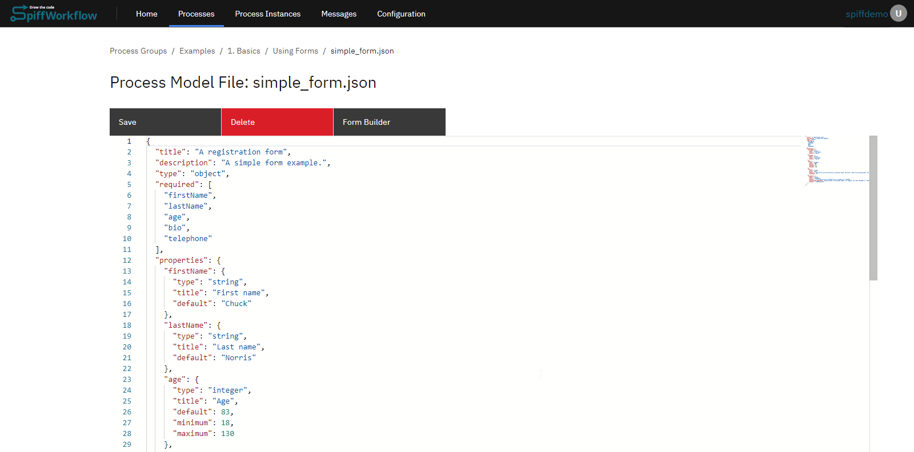

Please note that while this guide provides a basic understanding of JSON Schema and RJSF, there is much more to explore.
We encourage you to refer to the official [RJSF documentation](https://rjsf-team.github.io/react-jsonschema-form/docs/) for comprehensive details and advanced techniques.

2. Using Form Builder

An alternative approach to creating JSON code is to utilize the form builder feature, which allows you to easily create various fields without the need for writing JSON manually.

However, it's important to note that the form builder may have certain limitations in terms of features and may not be as powerful as using the JSON editor directly.

While the form builder provides convenience and simplicity, using the JSON editor offers greater flexibility and control over the form structure.

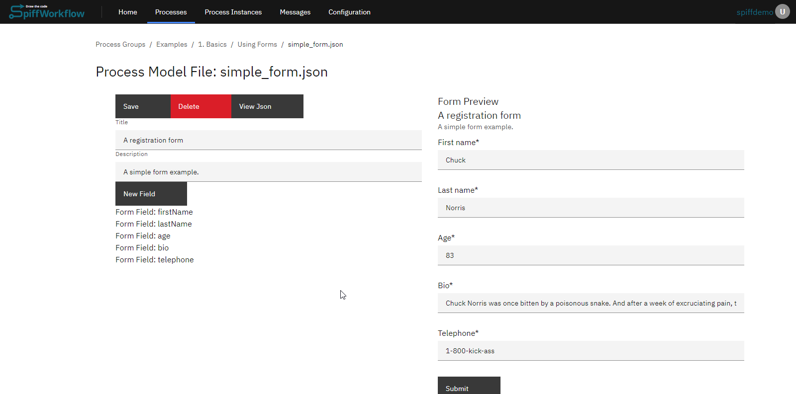

3. Creating Forms from BPMN Editor

To create forms inside the editor, we utilize user tasks within the BPMN file.
Upon creating a new BPMN file, open it to access the editor.

**Initiating the Form Editor**

- In the editor, proceed to the "Web form" section. Navigate to the "Web form" section. If starting from scratch, launch the editor and name your file (e.g., "demo"). After saving, it will automatically generate three essential files for us: a schema, UI settings, and some example data.

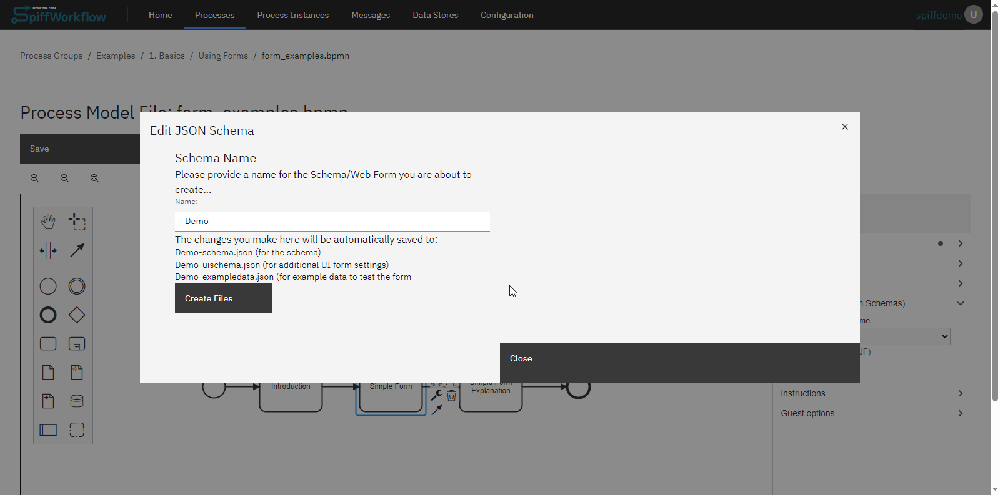

**Understanding the Three Core Files**

- **JSON Schema**: This file describes the form. It allows you to define titles, property names, and more. As you make changes in this file, they will reflect in the form preview window. This schema outlines the properties or data points you aim to collect.
  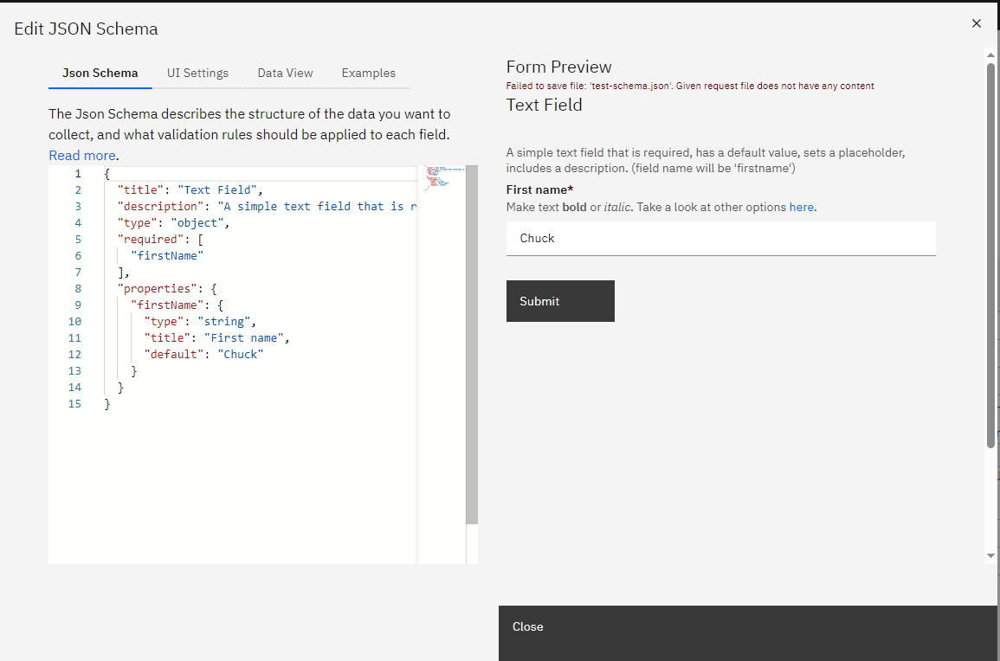

- **UI Settings**: This file offers customization options for your form. You can edit descriptions, titles, and more. Changes made here are reflected in real-time on the form.
  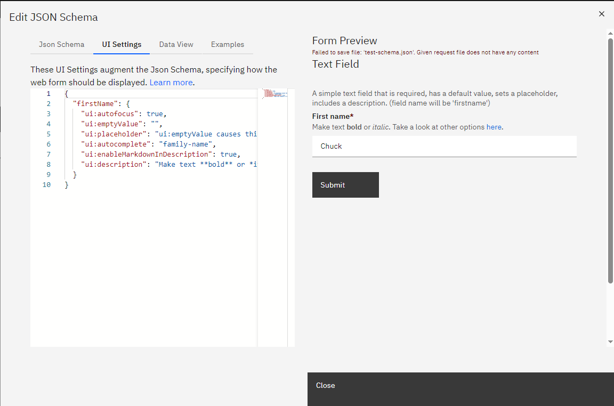

- **Data View**: This section displays the data users input into the form. It provides a preview of what will be captured when the form is submitted. Both the data view and the form stay synchronized, ensuring consistency.
  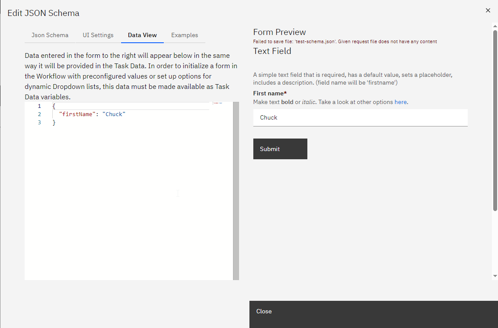

**Adding and Customizing Form Elements**

You can add existing templates to add elements to your form, such as text areas, checkboxes, and date selectors.
Each element can be further customized in the JSON schema and UI settings.
For instance, you can set the UI widget correctly for each element, ensuring it appears as intended on the form.

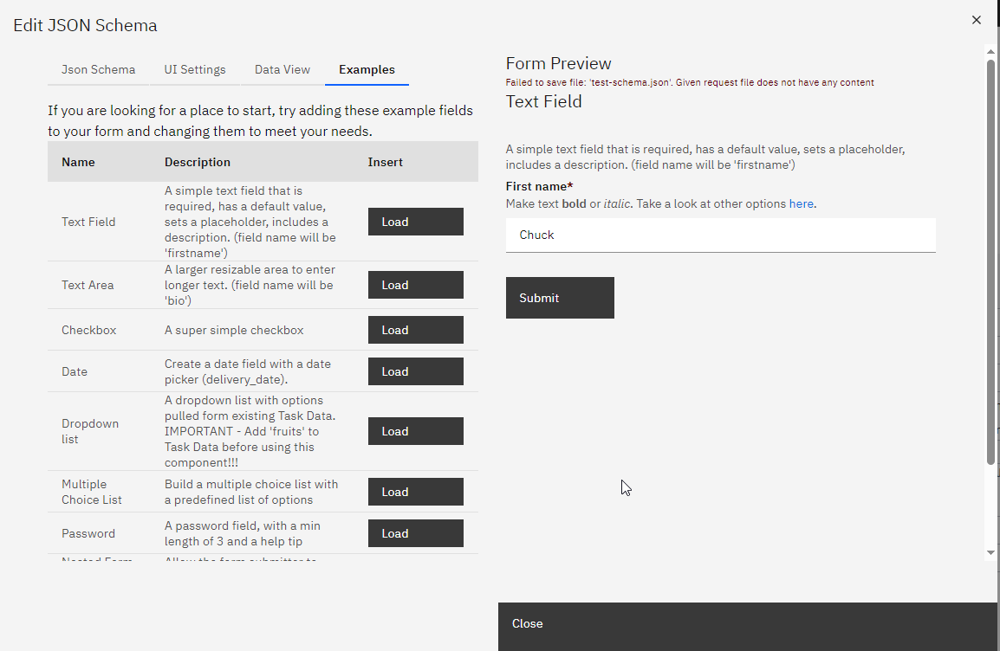

## SpiffArena react-jsonschema-form enhancements

SpiffArena has enhanced the capabilities of react-jsonschema-form to provide users with more dynamic and flexible form-building options.

### Dynamic Enumerations

Dynamic enumerations allow you to provide users with a list of options (in a select/dropdown) that can change based on variables in the process instance.
This feature is useful when you want to present users with choices based on an external data source or based on something that happened while the process was running.
To implement dynamic enumerations, update the list of enumeration values by setting a variable in task data.
In a script task, that would look like this:

    fruits = [
        {
            "value": "apples",
            "label": "Apples"
        },
        {
            "value": "oranges",
            "label": "Oranges"
        },
        {
            "value": "bananas",
            "label": "Bananas"
        }
    ]

Instead of using a script task to define the options directly, you could request information from a user using a form, access an API, or query an external database.

Then use JSON like this (note the `options_from_task_data_var:fruits`) when defining the form in order to pull information from the variable called `fruits` that you defined in task data:

    {
        "title": "Dropdown list",
        "description": "A dropdown list with options pulled from existing Task Data. IMPORTANT - Add 'fruits' to Task Data before using this component!!!",
        "type": "object",
        "properties": {
            "favoriteFruit": {
                "title": "Select your favorite fruit",
                "type": "string",
                "anyOf": [
                    "options_from_task_data_var:fruits"
                ]
            }
        }
    }

### Serious Checkbox Validation

Checkbox validation ensures that checkboxes, especially required boolean fields, are properly validated.
By default, react-jsonschema-form only triggers validation when a checkbox field is left undefined.
This enhancement allows you to enforce validation for checkboxes with default values of `false` to support scenarios like "I have read the EULA" checkboxes.
To use checkbox validation, mark your boolean field required.
This will force the value to be `true` (the checkbox must be checked) before the form can be submitted.

### Regex Validation

Regex validation allows you to validate text input fields based on regular expressions.
This is useful when you need to ensure that user inputs match a specific pattern or format, such as email addresses or phone numbers.

- In your JSON schema, include a "pattern" property with a regular expression pattern that defines the valid format for the input field.

### Date Range Selector

The date range selector allows users to select a range of dates, such as a start and end date, within a form.
You will use this feature when building forms that involve specifying date intervals.

Use a date range selector by creating a form field using the following structure:

Example for JSON schema:

    "travel_date_range": {
        "type": "string",
        "title": "Travel Dates",
        "pattern": "\\d{4}-\\d{2}-\\d{2}:::\\d{4}-\\d{2}-\\d{2}",
        "validationErrorMessage": "You must select Travel dates"
    },

Example for UI schema:

    "travel_date_range":{
        "ui:widget": "date-range",
        "ui:help": "Indicate the travel start and end dates"
    },

### Date Validation When Compared to Another Date

Date validation when compared to another date allows you to ensure that a date field meets certain criteria concerning another date field.

#### Minimum date validation

For instance, you can require that a date must be equal to or greater than another date within the form.

- To implement date validation compared to another date, use your JSON schema and specify the date field to compare with using the "minimumDate" property with a format like "field:field_name:start_or_end."

- "start_or_end" can be either "start" or "end".
  You can choose to use "end" if the reference field is part of a range.

This is an example where the end_date must be after the start_date:

    "end_date": {
      "type": "string",
      "title": "End date",
      "format": "date",
      "minimumDate": "field:start_date"
    }

These enhancements provide you with more flexibility and control when building forms in SpiffArena.

#### Maximum date validation

Maximum date validation in relation to another date allows you to set constraints on a date field to ensure that it falls on or before another specified date within the form.
This type of validation is particularly useful for setting deadlines, end dates, or the latest possible dates that are contingent on other dates in the workflow.

To apply maximum date validation in your JSON schema, use the `maximumDate` property and specify the field to compare with, using the format `field:field_name`.
This ensures that the date chosen does not exceed the referenced field's date.

Here’s an example where `delivery_date` must be on or before `end_date`:

```json
"delivery_date": {
  "type": "string",
  "title": "Delivery Date",
  "format": "date",
  "maximumDate": "field:end_date"
}
```

If the referenced field is a date range, and you want to validate against the end of that range, the same `field:end_date` reference can be used, as the `maximumDate` will intuitively apply to the end of the range.

These schema configurations provide a robust framework for ensuring date fields in forms maintain logical consistency and adhere to process requirements.
Utilizing maximum date validation, you can prevent dates from exceeding a certain threshold, which is essential for managing project timelines, delivery schedules, or any scenario where the latest permissible date is a factor.

By incorporating these validations into SpiffWorkflow forms, you can create interactive forms that automatically enforce business rules, improving data quality and user experience.

#### Date Validation Scenario: Enforcing Minimum and Maximum Date Constraints

#### Scenario Overview

Workflow processes often require the enforcement of minimum and maximum date constraints to align with operational timelines or project deadlines.
This scenario demonstrates the configuration of both `minimumDate` and `maximumDate` validations within a form, ensuring that selected dates fall within a specific period defined by other date fields in the workflow.

#### JSON Schema Configuration:

The "test-maximum-date-schema.json" process model outlines a form structure that includes fields for `end_date`, `delivery_date`, and `delivery_date_range`, each with constraints on the earliest and latest dates that can be selected.

```json
{
  "title": "Date",
  "description": "Test Maximum Date",
  "type": "object",
  "properties": {
    "end_date": {
      "type": "string",
      "format": "date",
      "title": "End Date"
    },
    "delivery_date": {
      "type": "string",
      "title": "Preferred Delivery Date",
      "minimumDate": "today",
      "maximumDate": "field:end_date"
    },
    "delivery_date_range": {
      "type": "string",
      "title": "Preferred Delivery Date Range",
      "minimumDate": "today",
      "maximumDate": "field:end_date"
    }
  }
}
```

#### Field Descriptions:

- **End Date**: The final date by which all activities should be completed.
- **Preferred Delivery Date**: A single date indicating when the delivery of a service or product is preferred, bounded by today's date and the `end_date`.
- **Preferred Delivery Date Range**: A span of dates indicating an acceptable window for delivery, constrained by today's date and the `end_date`.

#### Implementation in SpiffWorkflow Forms:

The schema enforces the following rules:

- The `Preferred Delivery Date` cannot be earlier than today (the `minimumDate`) and not later than the `end_date` (the `maximumDate`).
- The `Preferred Delivery Date Range` must start no earlier than today and end no later than the `end_date`.

### Display Fields Side-By-Side on Same Row

When designing forms, it's often more user-friendly to display related fields, such as First Name and Last Name, side by side on the same row, rather than stacked vertically.
The `ui:layout` attribute in your form's JSON schema enables this by allowing you to specify how fields are displayed relative to each other, controlling the grid columns each field occupies for a responsive design.

#### Form Schema Example:

Define your form fields in the JSON schema as follows:

```json
{
  "title": "Side by Side Layout",
  "description": "Demonstrating side-by-side layout",
  "type": "object",
  "properties": {
    "firstName": { "type": "string" },
    "lastName": { "type": "string" },
    "notes": { "type": "string" }
  }
}
```

#### `ui:layout` Configuration:

The `ui:layout` attribute accepts an array of objects, each representing a conceptual "row" of fields.
Here's how to use it:

```json
{
  "ui:layout": [
    {
      "firstName": { "sm": 2, "md": 2, "lg": 4 },
      "lastName": { "sm": 2, "md": 2, "lg": 4 }
    },
    { "notes": {} }
  ]
}
```

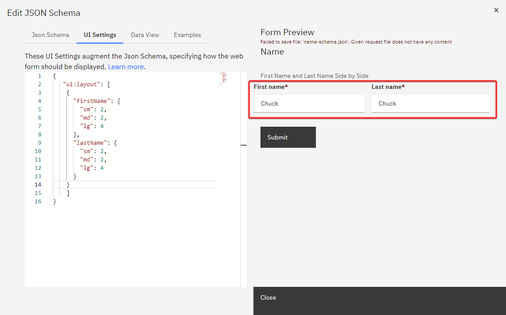
#### Key Points:

- **Layout Design**: The `ui:layout` specifies that `firstName` and `lastName` should appear side by side. Each field's size adjusts according to the screen size (small, medium, large), utilizing grid columns for responsive design.
- **Responsive Columns**: Values (`sm`, `md`, `lg`) indicate the number of grid columns a field should occupy, ensuring the form remains functional and visually appealing across devices.
- **Simplified Configuration**: If column widths are unspecified, the layout will automatically adjust, providing flexibility in design.

#### Example Illustrated:

In this case, we are saying that we want the `firstName` and `lastName` in the same row, since they are both in the first element of the `ui:layout` array.
We are saying that the `firstName` should take up 4 columns when a large display is used.
The `lastName` also takes up 4 columns, so the two of them together fill up the whole row, which has 8 columns available for large displays.
Medium displays have 5 columns available, and small displays have 4.
If you just specify a `uiSchema` like this, it will figure out the column widths for you:

    {
      "ui:layout": [
        {
          "firstName": {},
          "lastName": {}
        }
      ]
    }

By leveraging the `ui:layout` feature, you can design form layouts that are not only functional but also enhance the user experience, making your forms well-organized and accessible across various screen sizes.

### Display UI Help in Web Forms

When designing web forms, it's essential to provide users with contextual help to ensure they understand the purpose and requirements of each field.
This guidance can be achieved by adding help text to specific form fields.

To add help text to a web form field, use the following format:

```json
"field_name": {
  "ui:help": "Your help text here"
}
```

The text specified in the `"ui:help"` attribute will be displayed inside the form when the process starts, providing users with the necessary guidance.

#### Example:

Consider a form with two fields: `form_num_1` and `system_generated_number`.
Here's how you can add help text to the `form_num_1` field and make the `system_generated_number` field read-only:

```json
{
  "form_num_1": {
    "ui:autofocus": true,
    "ui:help": "Pick whatever # you want!"
  },
  "system_generated_number": {
    "ui:readonly": true
  }
}
```

In the example above:

- The `form_num_1` field will automatically be focused when the form loads (due to the `"ui:autofocus": true` attribute).
- The help text "Pick whatever # you want!" will be displayed for the `form_num_1` field.

**Output**:
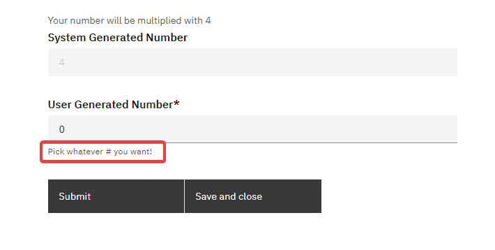

By incorporating such help texts, you can enhance the user experience and ensure that users fill out the form correctly.

### Markdown Widget for rjsf Forms

The **Markdown Widget** enhances rjsf forms by allowing users to input and preview markdown text directly within the form.

To incorporate the markdown widget into your rjsf form, follow these steps:

1. **Create a Text Field**: In your rjsf form JSON schema, define a standard text field where you want the markdown content to be entered.

2. **Update the uiSchema**: For the text field you've created, add the following line to its uiSchema to specify the markdown widget:

```json
"ui:widget": "markdown"
```

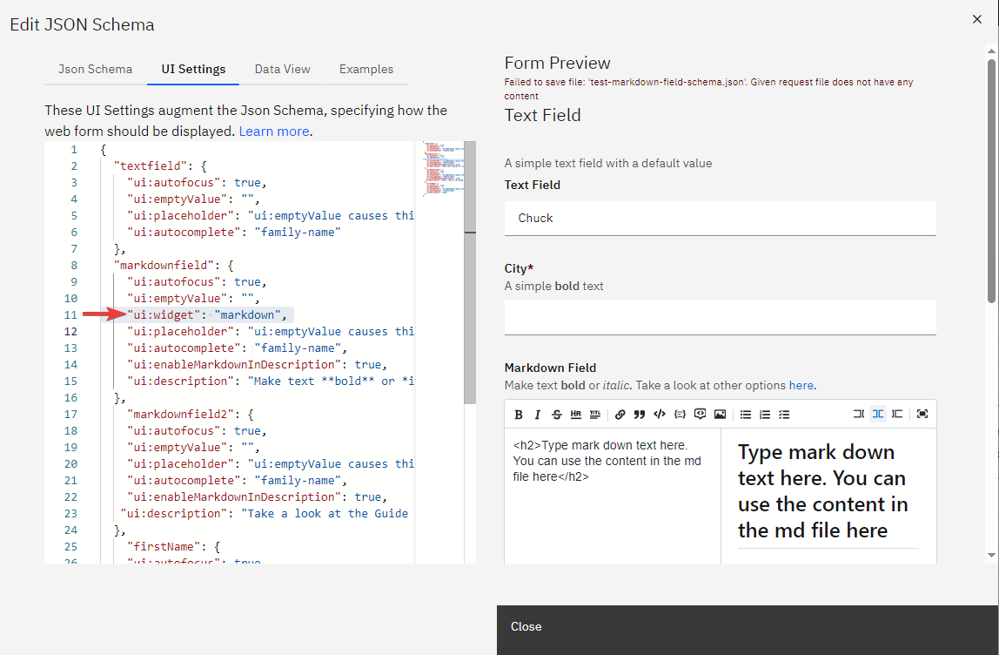

### Numeric Range Field

#### Overview

The `NumericRangeField` component is a new feature in `spiffworkflow-frontend` that allows users to input numeric ranges.
This component is designed to work with JSON schemas and provides two text inputs for users to enter minimum and maximum values for a given numeric range.

#### JSON Schema Example

Below is an example JSON schema that includes the numeric range field:

```json
{
  "title": "Example Schema",
  "type": "object",
  "properties": {
    "numericRange": {
      "type": "object",
      "title": "Numeric Range",
      "minimum": {
        "type": "number",
        "title": "Minimum Value"
      },
      "maximum": {
        "type": "number",
        "title": "Maximum Value"
      }
    }
  }
}
```

This schema defines a numeric range object with `min` and `max` properties, both of which are required.

#### UI Schema Example

```json
{
  "numericRange": {
    "ui:field": "numeric-range"
  }
}
```

#### Validation

This will automatically validate that the max value cannot be less than the min value.

### Adding a New Button for Repeating Sections in Forms

Nested forms or repeating sections are designed to collect an array of objects, where each object represents a set of related information.
For instance, in a task management form, you might need to collect multiple tasks, each with its title and completion status.

This structure can be represented in the form's schema as follows:

```json
{
  "title": "Nested Form / Repeating Section",
  "description": "Allow the form submitter to add multiple entries for a set of fields.",
  "type": "object",
  "properties": {
    "tasks": {
      "type": "array",
      "title": "Tasks",
      "items": {
        "type": "object",
        "required": ["title"],
        "properties": {
          "title": {
            "type": "string",
            "title": "Title",
            "description": "Please describe the task to complete"
          },
          "done": {
            "type": "boolean",
            "title": "Done?",
            "default": false
          }
        }
      }
    }
  }
}
```

**Form Preview**:

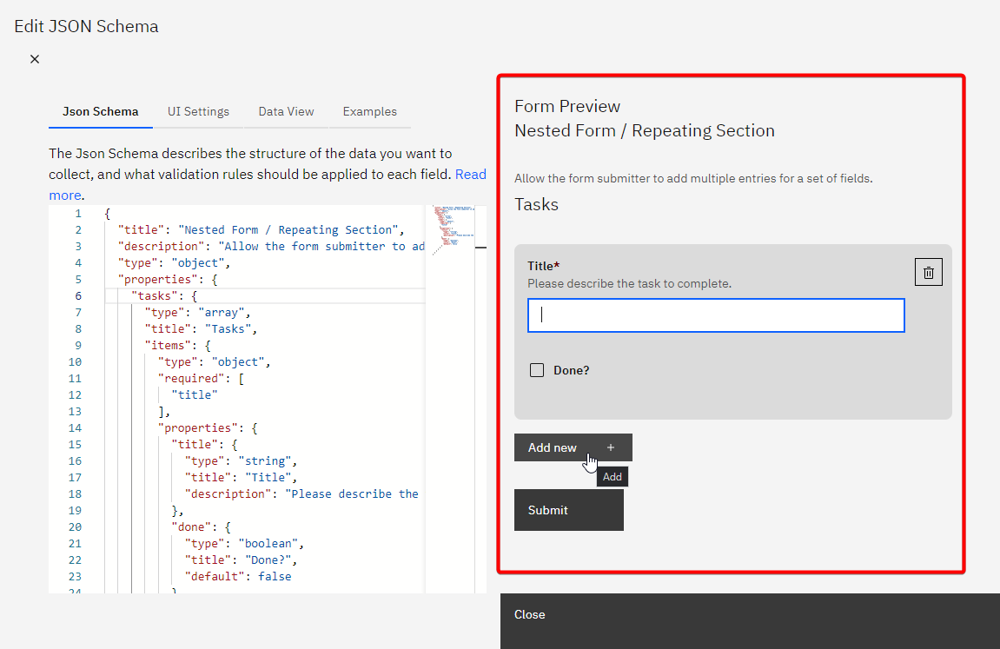

By using this feature, you can effectively implement new buttons for nested forms or repeating sections, improving the form's usability for collecting multiple related entries from users.

### Character counter

To give the user feedback about how they are doing in terms of staying within the limits imposed by the field, you can display a character counter.

#### JSON Schema Configuration

To do this, your JSON schema must contain a string with a `maxLength`, like this:

```json
{
  "title": "String with character counter",
  "type": "object",
  "properties": {
    "my_hot_string": {
      "type": "string",
      "maxLength": 100
    }
  }
}
```

#### UI Schema Configuration

Your UI Schema will need a `ui:options` specifying `counter: true`, like this:

```json
{
  "my_hot_string": {
    "ui:options": {
      "counter": true
    }
  }
}
```
