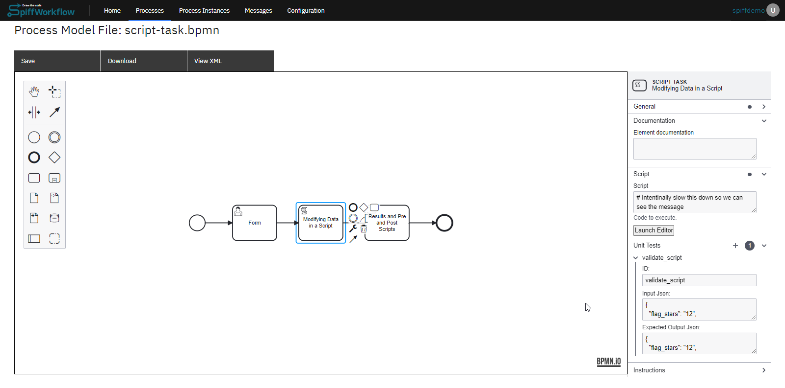
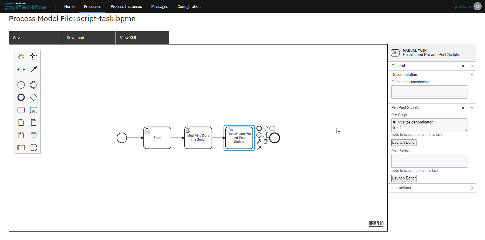

# Script Tasks

Writing scripts refers to the process of creating custom code or scripts to enhance the functionality and automation of a software application or system.

In SpiffArena, the scripting language used for writing scripts is Python, a widely used programming language.

Python offers a rich array of libraries, frameworks, and tools that facilitate script development, making it a popular choice for implementing custom logic and automation.

Let's explore an example of a Script Task in our basics section:

1. **Start Event and User Task - "Form"**

The process starts with a Start Event, followed by a User Task named "Form".

Users fill out the form, and the three values from the form are passed to the subsequent task, which is a Script Task.

2. **Script Task to collect data**

In the Script Task, we have created a script that collects three variables from the form and calculates a score based on certain conditions.

The score is then stored in the "score" variable.

Let's delve into how we configured the script tasks:



**Step 1**: With the script task selected, you will notice the properties tab.

**Step 2**: Within the properties tab, there should be a field where you can write or edit a script.

You can paste or write your script in this field.

Here's the script we added for this example:

```python
if flag_stars.lower().strip() == "twelve":
    num_correct += 1
elif int(flag_stars) == 12:
    num_correct += 1

if "nile" in longest.lower():
    num_correct += 1

if "curie" in woman_nobel.lower():
    num_correct += 1

score = int(num_correct / 3 * 100)
```

**Step 3**: After adding the script, the next step is to configure unit tests.

Within the unit tests section, there are fields to add test inputs and outputs.

```json
// Test Inputs
{
  "flag_stars": "12",
  "longest_river": "nile",
  "woman_nobel": "curie"
}

// Test Outputs
{
  "flag_stars": "12",
  "longest": "nile",
  "num_correct": 3,
  "score": 100,
  "woman_nobel": "curie"
}
```

Now, we have configured our script task with a script and unit tests.

3. **Pre Scripts and Post Scripts**

After the Script Task, we have a Manual Task with a pre-script and instructions to display the score.



- **Pre-script** is added as an example.

While you can have tasks that are dedicated scripts, it can become a bit noisy, and we want our diagrams to convey a clear sense of the business logic and rules.

For this reason, it is also possible to add scripts to all Task types - using Pre and Post Scripts.

This manual task contains a pre-script that also calculates PI using Leibniz’s formula.

Here is the pre-script:

```python
# Initialize denominator
k = 1

# Initialize sum
s = 0

for i in range(1000000):

    # even index elements are positive
    if i % 2 == 0:
        s += 4/k
    else:

        # odd index elements are negative
        s -= 4/k

    # denominator is odd
    k += 2

pi = s
del(k)
```

- **Post Scripts** are also available on most task types, but they execute AFTER the task is completed.

These are great for user forms where you want to modify and clean up the form results before moving on to the next task.

## What can you do and not do in Script Tasks?

- Keywords and operands can be used without restrictions
- SpiffArena uses RestrictedPython under the hood, which allows certain ['safe names' from the collection of builtins](https://github.com/zopefoundation/RestrictedPython/blob/master/src/RestrictedPython/Guards.py#L27C5-L28C7)
- SpiffArena extends this list with [additional 'global names' (builtins and modules)](https://github.com/search?q=repo%3Asartography%2Fspiff-arena+symbol%3ACustomBpmnScriptEngine&type=code)
- When you store variables in script tasks, be aware that these will be added to the process context. As such, they must be JSON serializable. This means that you can't store sets, for example. If you run into another example that is worth documenting, please submit a documentation pull request.

## Custom functions available to script tasks

Please see the [implementing files themselves](https://github.com/sartography/spiff-arena/tree/main/spiffworkflow-backend/src/spiffworkflow_backend/scripts) for the details.

| Function Name                          | Description                                                                                                                                                    |
| -------------------------------------- | -------------------------------------------------------------------------------------------------------------------------------------------------------------- |
| delete_process_instances_with_criteria | Deletes process instances that match the provided criteria.                                                                                                    |
| get_all_permissions                    | Gets all permissions currently in the system.                                                                                                                  |
| get_current_task_info                  | Returns information about the current task.                                                                                                                    |
| get_current_user                       | Returns the current user.                                                                                                                                      |
| get_data_sizes                         | Returns information about the size of task data.                                                                                                               |
| get_encoded_file_data                  | Returns the encoded file data. This is a very expensive call.                                                                                                  |
| get_env                                | Returns the current environment (e.g., testing, staging, production).                                                                                          |
| get_frontend_url                       | Returns the URL to the frontend.                                                                                                                               |
| get_group_members                      | Returns the list of usernames of the users in the given group.                                                                                                 |
| get_last_user_completing_task          | Returns the last user who completed the given task.                                                                                                            |
| get_localtime                          | Converts a Datetime object into a Datetime object for a specific timezone.                                                                                     |
| get_process_initiator_user             | Returns the user that initiated the process instance.                                                                                                          |
| get_secret                             | Returns the value for a previously configured secret.                                                                                                          |
| get_task_data_value                    | Checks if a given value is in task data and returns its value. If it does not exist or is None, it returns the default value.                                  |
| get_toplevel_process_info              | Returns information about the currently running process.                                                                                                       |
| get_url_for_task_with_bpmn_identifier  | Returns the URL to the task show page for a task with the given BPMN identifier. The script task calling this MUST be in the same process as the desired task. |
| get_user_properties                    | Gets the user properties for the current user.                                                                                                                 |
| markdown_file_download_link            | Returns a markdown format string for a file download link.                                                                                                     |
| refresh_permissions                    | Adds permissions using a dictionary.                                                                                                                           |
| set_user_properties                    | Sets given user properties on the current user.                                                                                                                |
| times_executed_by_user                 | Returns the number of times the user has started an instance of the current process model.                                                                     |
| user_has_started_instance              | Returns a boolean indicating if the user has started an instance of the current process model.                                                                 |
