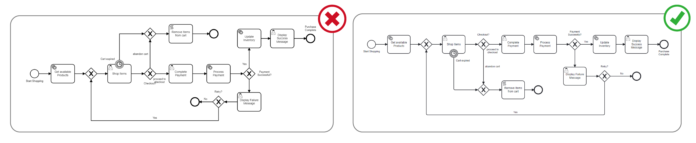
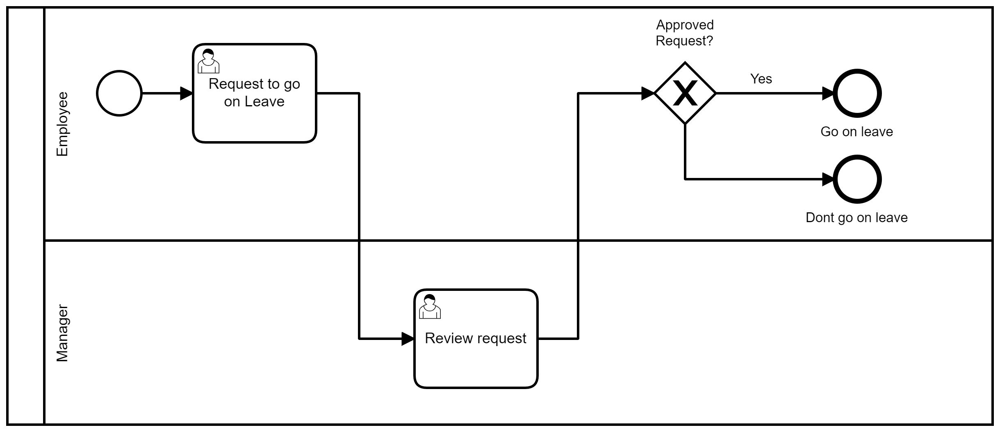
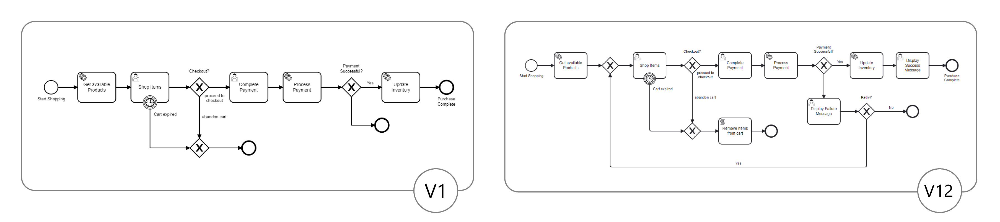
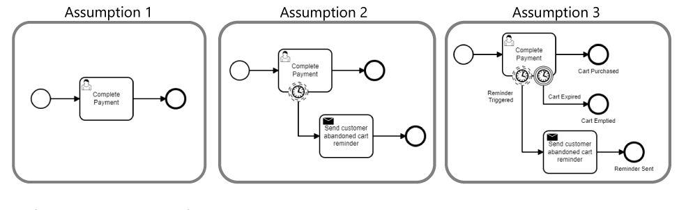

# How to Create a BPMN Diagram

Starting to model a business process can indeed be a challenging task, especially when multiple departments and users are involved.
Here are some helpful tips to guide you through the process and create effective process models:

**Understand BPMN Symbols:**
Begin by thoroughly understanding the meaning and usage of each BPMN symbol.
This will ensure that you use the symbols correctly to represent the various elements of your business process.
Refer to the [Learn Basics](../appendices/bpmn_terminology.md) section to learn more about each symbol.

Grouping them together can create a mind map that's easy to remember.

- Flow Objects
- Connecting Objects
- Swimlanes
- Artifacts

**Model Left to Right:**
Follow the convention of modeling from left to right.
Represent your main process flow, also known as the "Happy Path," at the top in a straight line.
Then, depict alternative scenarios and exceptional cases leading to the bottom.
This makes the process flow easier to comprehend.

**Choose Descriptive Names:**
Use clear and human-readable names for activities, events, and gateways in your process.
Utilize action verbs to represent activities effectively.
Start the task name with an action-oriented verb that indicates what needs to be done in the task.
For example, "Approve Request," "Review Documents," "Send Invoice," etc.

**Start with High-Level Overview:**
Beginning with a high-level overview of the process provides a clear understanding of the overall flow and allows for the identification of major process components before delving into finer details.
By breaking the process down into smaller subprocesses or call activities with different levels of detail, the model becomes more manageable and easier to comprehend.
This approach enables the use of placeholders where you are unclear about what the process looks like, allowing for flexibility in filling in missing information as it becomes available.
It also facilitates the focus on specific sections, preventing feeling overwhelmed by the complexity of the entire process.
This systematic approach to process modeling ensures that essential aspects are adequately captured while providing room for further refinement.

**Include Exception Handling:**
Model not only the primary process flow 'Happy Path' but also the exception handling and error recovery paths.
This makes the process model more robust and prepares stakeholders for potential challenges.

**Use Lanes for Roles and Responsibilities:**
Utilize swimlanes (pools and lanes) to clearly define the roles and responsibilities when there are different departments or individuals involved in the process.
This visual representation will help demonstrate the interactions and handoffs between role players, enhancing the understanding of their involvement throughout the process.

**Embrace Iterative Approach:**
Creating a perfect model on the first attempt is unlikely.
Embrace an iterative approach, and be prepared for continuous improvement.
Analyze what went wrong in your initial attempts and refine your model accordingly.
Understand that your process model is not static.
It will evolve over time, and there will always be room for improvement.
Stay open to finding better ways to represent the process as you gain more insights.

**Make Note of Assumptions and Possible Challenges:**
During the modeling process, it is essential to clearly document any assumptions made, especially when you may not have complete knowledge of user behavior or real-life process dynamics.
By documenting these assumptions, you provide context and ensure transparency when sharing the model with others.
Remember to verify these assumptions during real-life testing to validate their accuracy and adjust the model accordingly.

**Example:**
Initially, we assumed that every customer going to checkout would complete their payment.
However, in reality, we observed that customers often abandoned their carts without completing the purchase.
To address this issue, we implemented an email reminder to prompt customers to return and complete their purchase.
While this approach improved the number of abandoned carts, it didn't completely resolve the problem.
Upon further analysis, we recognized that certain customers might never return, leading us to make the decision to automatically close their carts.
This action ensures that our inventory accurately reflects the available items and helps maintain inventory accuracy.

**Involve Team Members and Stakeholders:**
Collaborate with relevant team members and stakeholders, including process owners, subject matter experts, and end-users, throughout the modeling process.
Their insights and feedback are valuable in creating a comprehensive and accurate representation of the process.

**Leave No One Behind:**
Ensure that each case reaches a conclusive outcome.
Implement timers to manage actions or decisions within specific time frames, enabling progress through the process despite delays or inactivity.
Additionally, utilize intermediate events, such as message events, signal events, or error events, to capture specific occurrences during the process.
These events guide the process towards a conclusion and allow for the cancellation of instances from within the process or through external triggers.
