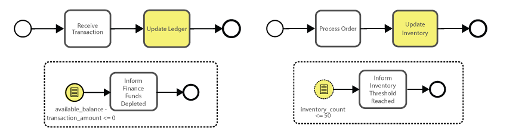
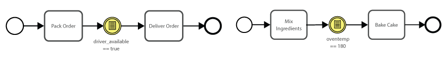
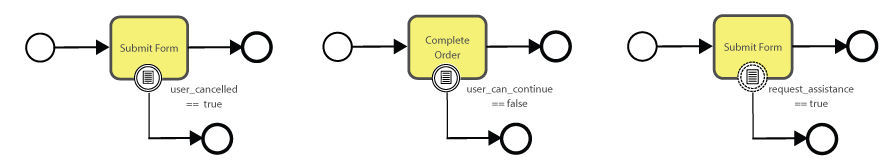
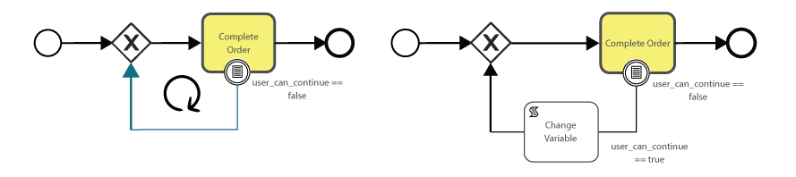
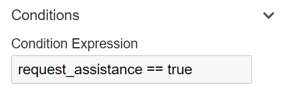

# Conditional Event

A Conditional Event is a type of event that activates based on the evaluation of a condition, typically expressed as a Boolean expression (true or false).
Conditional Events depend on the state or value of process variables that are part of the process context.
They continuously evaluate the given condition and act when the condition is met.

```{admonition} Note
⚠  The variable(s) evaluated in the condition should typically be initialized with a default value, often set to false.
This ensures it doesn't trigger prematurely.
Thus, it remains evaluated as false until the specified condition turns true.
Importantly, this variable needs to be accessible within the process context.
```

**Reasons to Use a Conditional Event:**

- A Conditional Event is ideal for processes where decision-making is based on data or state changes.
- They allow processes to adapt and respond dynamically to changing conditions within the system.

## Start Conditional Event


A Start Conditional Event marks the beginning of a process or a sub-process, triggered when a specific condition is fulfilled, or in other terms, when the condition evaluates to true.

**Example:**



**Conditional Start Event (interrupting):**
In the first scenario, as a transaction is being processed, funds are withdrawn from a ledger.
If this withdrawal results in a negative ledger balance, a certain condition is triggered, stopping the entire process.
This is crucial because we can't proceed with a payment if there aren't sufficient funds.

**Conditional Start Event (non-interrupting):**
In the subsequent scenario, as an online order is placed by a customer, our inventory count gets adjusted.
Should this count descend beneath a set threshold, an alert is activated, signaling the warehouse to replenish stocks.
Our goal is to maintain an uninterrupted shopping experience for the customer, yet it's important to inform relevant staff when our inventory nears depletion.

## Intermediate Conditional Event


An Intermediate Conditional Event serves as a gate or checkpoint within the flow of a process.
The process flow will proceed once the attached condition evaluates to true.
Additionally, a Boundary Event can be associated with specific tasks or sub-processes, acting as an interrupter based on certain conditions.
This ensures that certain actions are taken or the process is redirected when particular circumstances arise.

**Example:**



**Conditional Intermediate Catch Event:**
Once an order is packed and ready for shipping, it doesn't necessarily imply immediate delivery.
The delivery process hinges on the availability of a driver.
If no driver is available at the moment, we must patiently await notification of one becoming available.

In a bakery, pastries are made in bulk.
However, they can only be put in the oven when it reaches the necessary temperature.
While one might consider using a timer to gauge readiness (and it's not entirely wrong to do so), a timer only measures the elapsed time since activation.
It can't determine the actual temperature inside the oven.
Given that our pastries need a specific temperature for baking, only when this condition is met can we proceed to place them in the oven.

**Example:**



**Conditional Boundary Event (interrupting):**
Boundary events allow us to redirect our processes based on shifts in certain conditions.
It's wise to consider such a strategy since it's unrealistic to expect every process to proceed without hiccups.
Therefore, planning for alternative pathways becomes essential.

Imagine a user in the midst of completing a form suddenly opting to cancel the process.
Or consider a scenario where a user is finalizing an order, only to find that due to a changed condition, the desired product is no longer available.
In such cases, the interrupting event ensures we don't proceed on the originally planned course because the order will not be fulfilled.
Instead, we shift and use the alternative route to inform the user that the intended process can't progress further, order more stock, or place the user on a list to be notified when the product becomes available again.

**Conditional Boundary Event (non-interrupting):**
It's also beneficial in scenarios where there's no need to disrupt the initial workflow, like when receiving a change request.
The task still requires completion, but there's an additional remark or modification we must be mindful of.

**Best Modeling Practices:**



When utilizing a condition to loop back to a previous stage, it's crucial to highlight that the condition should be reset to evaluate as false once again.
If not adjusted, the condition might activate immediately when the instance revisits the task, potentially causing an infinite loop.
Always revert the condition to its default state to ensure appropriate behavior.

## Conditional Event Configuration

| 💻 Form                                                                | ⌨ Field Input                                         | 📝 Description                                                                      |
| ---------------------------------------------------------------------- | ------------------------------------------------------ | ----------------------------------------------------------------------------------- |
|                                    | **Name:** Request Assistance                           | A descriptive name given to the element, providing a human-readable label or title. |
|                                        | **ID:** Example - request_assistance                   | An identifier used to uniquely identify the element within the BPMN model.          |
|  | **Conditional Expression:** request_assistance == true | Set the expression that needs to be evaluated to take action.                       |

```{admonition} Note
⚠  When configuring the conditional expression, ensure there's such a variable in your process context.
```
