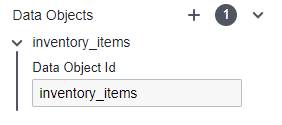

# Data Objects

In BPMN (Business Process Model and Notation), a data object represents the information or data used and produced by activities within a business process.
It signifies the data elements or artifacts that are relevant to the process and provides a means to model the flow of data through the process.
They aid in elucidating the data flow and dependencies within the process, thus making it more straightforward to comprehend how information is utilized and transformed throughout the process execution.

**Reasons to use data objects:**

- To represent and manage data within a business process.

- When it's necessary to make a specific reference to data being used.

- When dependencies exist between tasks or activities based on shared data.

- When data changes within a process.

- If data needs to be stored or retrieved for use in a process.

## Data Object Types

### Data Input

This represents the data or information that is needed as an input to initiate or carry out a specific task or process.
BPMN input defines the data elements that must be provided or available for the task to be performed.

### Data Output

This signifies the data or information that is created or generated as a result of executing a task or process.
BPMN output describes the data elements that are produced or altered during the execution of the task.

### Data Object Reference

A Data Object in BPMN typically signifies a particular piece of information or a data entity that is exchanged or manipulated during the course of a business process.
It can represent both physical and digital data.
Examples of Data Objects include documents, forms, reports, databases, or any other data entity relevant to the process.

## Data Input Configuration

| 💻 Form | ⌨ Field Input | 📝 Description |
| --- | --- | --- |
|  | **Name:** Update Customer Information | An identifier used to uniquely identify the element within the BPMN model. |
|  | **ID:** Example - updateCustomerInformation | A descriptive name given to the element, providing a human-readable label or title. |
|  | **Element Documentation:** URL, Raw Data, Plain Text | Additional information or documentation related to the element, such as URLs, plain text, or raw data. |
|  | **Element Documentation:** inventory_items | Enter an existing data object ID |
