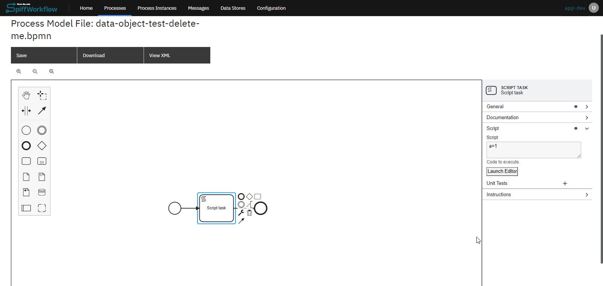

# Data Objects

In BPMN (Business Process Model and Notation), a data object represents the information or data used and produced by activities within a business process.
It signifies the data elements or artifacts that are relevant to the process and provides a means to model the flow of data through the process.
They aid in elucidating the data flow and dependencies within the process, thus making it more straightforward to comprehend how information is utilized and transformed throughout the process execution.

**Reasons to use data objects:**

- To represent and manage data within a business process.

- When it's necessary to make a specific reference to data being used.

- When dependencies exist between tasks or activities based on shared data.

- When data changes within a process.

- If data needs to be stored or retrieved for use in a process.

## Data Object Types

### Data Input

This represents the data or information that is needed as an input to initiate or carry out a specific task or process.
BPMN input defines the data elements that must be provided or available for the task to be performed.

### Data Output

This signifies the data or information that is created or generated as a result of executing a task or process.
BPMN output describes the data elements that are produced or altered during the execution of the task.

### Data Object Reference

A Data Object in BPMN typically signifies a particular piece of information or a data entity that is exchanged or manipulated during the course of a business process.
It can represent both physical and digital data.
Examples of Data Objects include documents, forms, reports, databases, or any other data entity relevant to the process.

## Data Input Configuration

| 💻 Form | ⌨ Field Input | 📝 Description |
| --- | --- | --- |
|  | **Name:** Update Customer Information | An identifier used to uniquely identify the element within the BPMN model. |
|  | **ID:** Example - updateCustomerInformation | A descriptive name given to the element, providing a human-readable label or title. |
|  | **Element Documentation:** URL, Raw Data, Plain Text | Additional information or documentation related to the element, such as URLs, plain text, or raw data. |
|  | **Element Documentation:** inventory_items | Enter an existing data object ID |

## Handling Sensitive Data Using Data Objects

Handling sensitive data, such as credit card numbers and passwords, requires careful management to ensure security and privacy.
This documentation outlines the process of creating and managing sensitive data objects within SpiffWorkflow, along with setting appropriate permissions.

### Process Breakdown

#### 1. Identifying Sensitive Data
- Determine what constitutes sensitive data within your workflow.
This could include personal information, financial details, or confidential business information.

#### 2. Data Object Creation and Script Task Integration

- **Script Task Setup**: Develop a script task that interacts with the data object.
The script should be designed to handle the sensitive data securely, ensuring it's not exposed or logged inadvertently.
- **Data Object Creation**: Create a data object in the workflow to store the sensitive data.
This object acts as a container for the data, separating it from the main workflow logic.

#### 3. Assigning Data Categories

- **Categorization**: Assign a specific category to the data object that reflects its sensitive nature.
For example, categories like `confidential` or `private` or the name of the field can be used.

#### 4. Implementing Access Controls

- **Permission Rules**: Establish permission rules, using a Decision Model and Notation (DMN) table or another mechanism as described under [Admin and Permissions](/DevOps_installation_integration/admin_and_permissions.md).
This step involves specifying who can access the sensitive data.
- **Access Restrictions**: Define the access level (e.g., read, write, deny) for different user groups or roles.
For instance, you might restrict read access to certain groups while denying it to others.
- **URL-Based Permissions**: Use URL patterns to enforce permissions.
For example, a URL pattern like `/process-data/confidential/*` can be used to control access to all data objects categorized as confidential.

### Example: Steps to Handle Sensitive Data

#### 1. Creating a Script Task with Sensitive Data
- **Initial Setup**: Start by creating a script task where the script sets a variable (e.g., `a=1`).
This variable `a` could represent sensitive data like a credit card number.
- **Execution**: Run the task to observe the value of `a`.

#### 2. Converting to a Data Object

- **Data Object Creation**: Create a data object and name it (e.g., `a`).
Link this data object to the script task and set the data object ID to `a`.
- **Assign a Category**: Assume the data object represents a credit card number.
Assign a category to this data object, such as `creditcards`.
- **Visibility**: The credit card data is visible until permissions are set to restrict access.

- **Process Execution**: Upon running the process, the value of the data object will be `1`.

#### 3. Setting Permissions with DMN Table

- **Access Control**: To control who can see the credit card data, you could set permissions in a DMN Table.
- **Permission Configuration**: Set the following permissions:
  - `permission_groups` to `"everybody"`
  - `permissions` to `"DENY:read"`
  - `permission_urls` to `"/process-data/creditcards/"`

#### 4. Implementing Restricted Access

With these permissions, access to the credit card data is denied to everyone, ensuring that no unauthorized individuals can view this sensitive information.

By following these steps, SpiffWorkflow users can securely handle sensitive data within their processes.
The combination of data objects, categorization, and precise permission settings ensures that sensitive information like credit card numbers is protected and accessible only to those with the necessary authorization.
