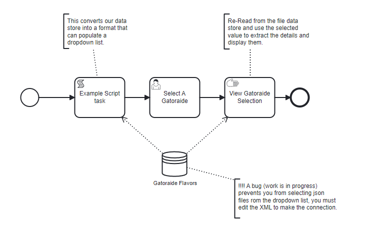

# Data Stores

 

A Data Store is a BPMN construct that represents a storage location where data is stored and retrieved and can be accessed among multiple process instances, including for different process models.
It can represent a database, file system, or any other storage mechanism.

## When to use

You might use a Data Store when it is not sufficient for data to be accessible in just a single process instance, but it needs to be shared across process instances.
If you a have a use case where you need to store data and access it from multiple different process instances, you could also consider using a Service Task to contact a database external to SpiffWorkflow, either via a database library in a connector or using a database via API.
All of these mechanisms work well in SpiffWorkflow, so the choice will depend on your storage and performance requirements.

## Types of Data Store
### KKV Data Store in BPMN

Key-Key-Value (KKV) Data Stores extend the traditional key-value model by introducing an additional key layer. This structure enables more complex and hierarchical data storage solutions, making them particularly suited for BPMN (Business Process Model and Notation) processes that manage multifaceted data relationships.

- **Structure**: A KKV data store organizes data into two levels of keys before reaching the actual value, e.g., `Genre -> Movie -> Attributes`. This structure is particularly beneficial for categorizing and accessing nested data efficiently.

- **Use Cases**: Ideal for scenarios requiring rich, structured data access within workflows, such as managing inventories, categorizing user profiles, or handling complex hierarchical data like the provided movies example.

#### BPMN Integration

Integrating KKV data stores within BPMN diagrams involves modeling tasks that interact with the data store for CRUD (Create, Read, Update, Delete) operations. 

Here's how to depict such interactions using a BPMN example focused on movie data management:

### BPMN Example: Movie Data Management

#### Process Overview


1. **Start Event**: Initiates the movie data management workflow.

2. **Script Task: Populate Data Store**
    - Uses a script to populate the "Movies" data store with detailed information about characters in various movies, demonstrating the KKV structure (Director -> Movie -> Character Attributes).

3. **Script Task: Extract Single Record**
    - Retrieves specific movie details from the "Movies" data store.
    - A script extracts information about "Django Unchained" using the KKV path, illustrating how to access nested data.
    - **Script**: `django = movies["Quentin Tarantino"]["Django Unchained"]`

5. **Script Task: Insert A Single Record**
    - Adds a new movie entry to the data store under a different key.
    - Demonstrates adding an entry for a Wes Craven movie to the "Movies" data store, showcasing how new data can be structured and inserted.
    - **Script**:
     ```python
     movies["Wes Craven"]["Swamp Thing"] = [
       {"name": "Dr. Alec Hollard", "actor": "Ray Wise", "description": "whatever"}
     ]
     ```

6. **End Event**: Marks the completion of the workflow.
After running the process, You can view the new movies data in data store:


#### Modeling Data Store Interactions

- **Data Store Reference**: Each script task interacts with a "Movies" data store, specified in the task's properties. The data store's KKV nature is indicated, allowing for structured data access and manipulation.
  
- **Selection of Data Source**: In the properties section of the tasks, the "Movies" data store is selected as the datasource, highlighting how BPMN tasks can be explicitly linked to specific data stores for operations.

### JSON Data Store

In BPMN (Business Process Model and Notation), incorporating a JSON file as a data store offers a versatile method for managing structured data throughout a process. A structured file or set of files that uses the JSON format to store data in a hierarchical key-value pair system. This approach is particularly beneficial for BPMN processes requiring access to configurable, structured data without needing a connection to a database.

#### JSON Data Store: Gatorade Flavors

Before detailing the process flow, it's crucial to introduce the JSON data store structure used in this example:

```
[
    {
        "name": "Glacier Freeze",
        "color": "#C0C0C0",
        "description": "Icy, refreshing citrus flavor"
    },
    {
        "name": "Fierce Grape",
        "color": "#AA77CC",
        "description": "Bold and intense grape flavor"
    },
    ...
    {
        "name": "X-Fruit Fusion",
        "color": "#D0DBFF",
        "description": "Mystery blend of multiple fruit flavors"
    }
]
```

This JSON array contains various Gatorade flavors, each with attributes for `name`, `color`, and `description`, serving as the data store for the BPMN process.

#### BPMN Example: Gatorade Flavors



1. **Start Event**: Triggers the workflow for Gatorade flavor selection.

2. **Script Task: Populate Dropdown List**
    - Convert the Gatorade flavors from the JSON data store into a format suitable for a dropdown list.
    - **Script**: 
     ```python
     gator_select = []
     for flavor in gatoraide_flavors:
         gator_select.append({
             "label": flavor["name"],
             "value": flavor["name"]
         })
     ```
    This task creates an array `gator_select` with objects formatted for dropdown list usage from the `gatoraide_flavors` array.

3. **User Task: Select A Gatorade**
    - Use a dropdown list for users to select their Gatorade flavor.
    - **Form Configuration**:
     ```json
     {
       "title": "",
       "description": "The dropdown list below is built from data read in from a JSON file.",
       "type": "object",
       "properties": {
         "selected": {
           "title": "Select your flavor of Gatorade",
           "type": "string",
           "anyOf": [
             "options_from_task_data_var:gator_select"
           ]
         }
       }
     }
     ```
     - The JSON schema defines the structure for the user form, sourcing options from the `gator_select` array.

4. **Manual Task: View Gatorade Selection**
    - **Pre-Script**: Matches the user-selected flavor to its full details in the `gatoraide_flavors` array.
     ```python
     for flavor in gatoraide_flavors:
         if flavor["name"] == selected:
             selected_flavor = flavor
     ```
    -  Displays "You selected:", followed by the detailed description of the selected flavor.

**Output**:


By integrating a JSON data store within a BPMN process, workflows can dynamically manage and interact with structured data. 