# Error Events

Error Events in Business Process Model and Notation (BPMN) are pivotal in managing exceptions and errors that occur within business process workflows.
These events enable processes to handle errors gracefully, ensuring that workflows are robust, resilient, and capable of addressing unforeseen issues efficiently.
Below, we delve into the types of Error Events, offering definitions and enriched context for their practical applications.

## Types of Error Events

### 1. Error Start Event


The Error Start Event triggers the start of a subprocess in reaction to an error identified in a different process or subprocess.
It is a specialized event used to initiate error handling workflows dynamically.

**Reason to Use**:
- **Modular Error Handling**: Separates error handling logic into dedicated subprocesses, improving process organization and maintainability.
- **Reusability**: Allows for the reuse of error-handling subprocesses across multiple parent processes.
- **Focused Recovery Strategies**: Enables the development of targeted recovery strategies for specific errors, enhancing error resolution effectiveness.

**Example**:

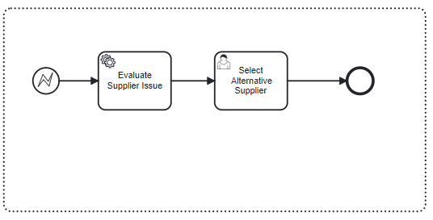

In an automated supply chain system, an Error Start Event initiates a "Supplier Notification" subprocess when inventory restocking fails due to supplier issues, triggering actions such as alternative supplier selection and impact analysis.

```{admonition} Note
⚠ The start event needs to be in an **event subprocess** to be selected.
```

### 2. Error Intermediate Event/Error Boundary Event


An Error Boundary Event is attached to an activity, such as a service task, and is designed to catch errors that occur during the execution of that activity, allowing for an immediate transition to an error handling flow.

Positioned within the normal flow of a process, this event signifies where an error might occur and is used to programmatically signal an exception, thereby throwing the error to be caught by an Error Boundary Event or an Error End Event.

**Reason to Use**:
- **Error Escalation**: Facilitates the escalation of critical errors that cannot be resolved within the current process context.
- **Process Integrity**: Maintains the integrity of the business process by preventing the continuation of flawed executions.
- **Comprehensive Error Management**: Ensures that unresolvable errors within subprocesses are properly managed.
- **Clarity in Process Design**: Enhances the readability and understandability of the process model by explicitly marking potential error points.

**Example**:

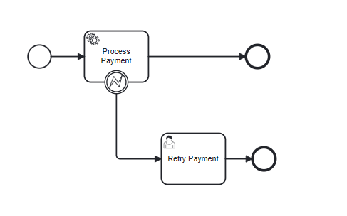

In a customer order workflow, when payment is initiated, a "Process Payment" service task interacts with an external gateway.
An attached Error Boundary Event catches errors like "Payment Gateway Timeout" or "Payment Declined."
For timeouts, the process redirects to "Retry Payment," allowing another attempt or urging the customer to use a different method.
This setup ensures efficient error handling, guiding the process toward resolution based on the error type.

### 3. Error End Event


This event marks the termination of a process path due to an error, signaling that the workflow cannot proceed beyond this point due to the encountered issue, and propagates the error to the parent process for further handling.

**Reason to Use**:
- **Error Escalation**: Signals the termination of the current process due to an error, enabling parent processes or higher-level error handling mechanisms to take over.
- **Process Integrity**: Ensures that flawed process executions do not continue, maintaining the integrity and reliability of the overall workflow.
- **Clear Error Messaging**: Provides a clear mechanism for signaling errors, enhancing the traceability and manageability of process errors.

**Example**:


In a retail inventory management workflow, an End Error Event within a stock replenishment subprocess indicates the detection of an "Out of Stock" condition for a critical product that cannot be immediately resolved.
This error propagates to the main inventory management process, prompting a temporary pause in sales operations for the affected product.

## Example 1: Error Boundary Events in SpiffArena

In this example, we're modeling a process in BPMN that involves fetching employee data from an external HR system (BambooHR) and handling potential errors using an Error Boundary Event.
This process begins with a simple task and moves through a service task designed to interact with the BambooHR API, with specific error handling in place.

### Process Overview:

1. **Start Event**:

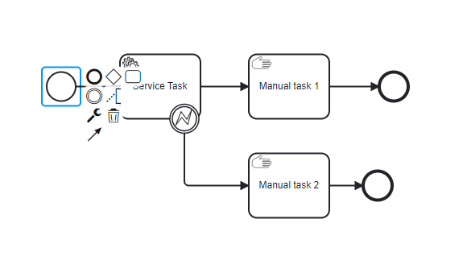

The process kicks off with an action that requires fetching specific employee details.

2. **Service Task - Fetch Employee Data**:

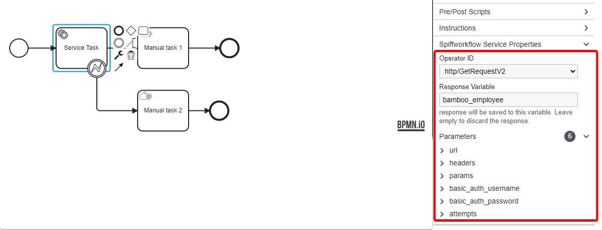

   - **Configuration**: This task is configured to make an HTTP GET request to the BambooHR API to retrieve employee information.
     - **Operator ID**: `http/getrequestV2`, indicating the operation type and version.
     - **Parameters**: The URL is set to `https://api.bamboohr.com/api/gateway.php/statusresearchdemo/v1/employees/113`, with headers accepting JSON, and parameters requesting the first and last names of the employee.
       Authentication is provided via basic auth, with a specified API key (`BAMBOOHR_API_KEY`) and password.
     - **Attempts**: Configured to retry the operation twice in case of failure.

3. **Error Handling Setup**:

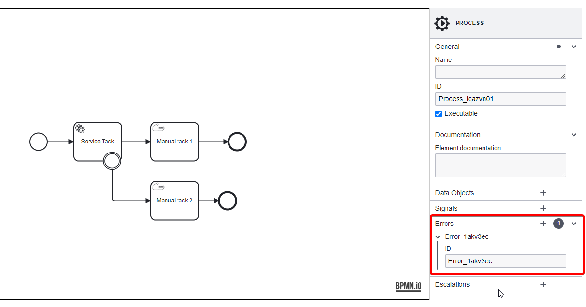

Prior to the service task's execution, one potential error ID is defined as `Error_1`.

4. **Error Boundary Event**:

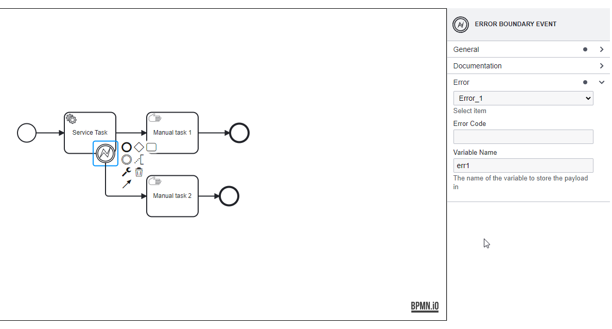

Attached to the service task, this event catches `Error_1`, setting an alternative path for error handling.
The error details are stored in a variable named `err1`.

5. **Manual Tasks for Error Handling and Success Path**:

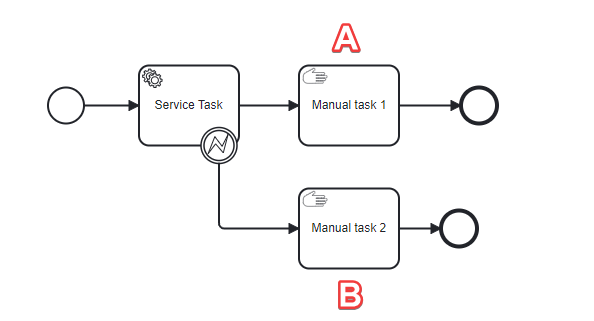

**A**. **No Errors Path**: If the service task executes without encountering the predefined errors, the process flows to a **Manual task 1** where the fetched employee data can be further processed or reviewed.

**B**. **Invalid Schema Error Path**: Triggered by the Error Boundary Event, this path leads to a **Manual Task 2** designed to address or mitigate the specific schema validation issue identified during the API call.

Both paths conclude with an End Event, signifying the process's completion regardless of the outcome (successful data retrieval or error handling).

### Explanation:

The process starts when a department manager requests the details of an employee for performance evaluation.
The service task activates, attempting to fetch the requested data from BambooHR.
If the data retrieved does not match the expected schema—perhaps due to an API update or misconfiguration—the Error Boundary Event triggers, diverting the process to a corrective task.

Here, an IT specialist might investigate the schema issue, adjust the service task's parameters, or manually retrieve the required information.
Concurrently, the successful execution path without errors would lead directly to the HR department for immediate use of the employee data, streamlining departmental operations and decision-making.

This BPMN example highlights the utility of Error Boundary Events in ensuring process resilience, especially when integrating external services.

## Example 2: Error Boundary Events in Subprocess

In this example, we're outlining a BPMN process that demonstrates how to handle errors within an expanded subprocess and subsequently manage the error through an Error Boundary Event.

### Process Description:

1. **Start Event**:

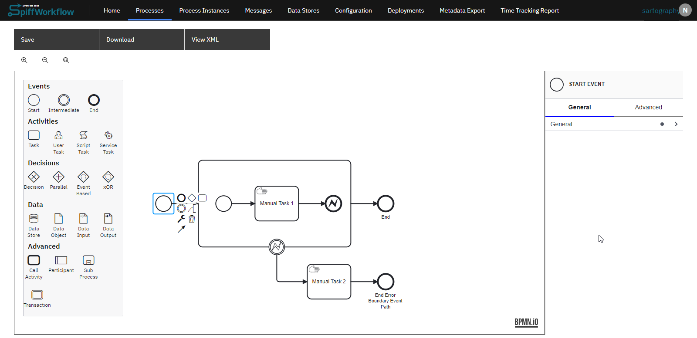

The process is triggered by a user action or system event, setting the stage for a sequence of tasks.

2. **Expanded Subprocess**:

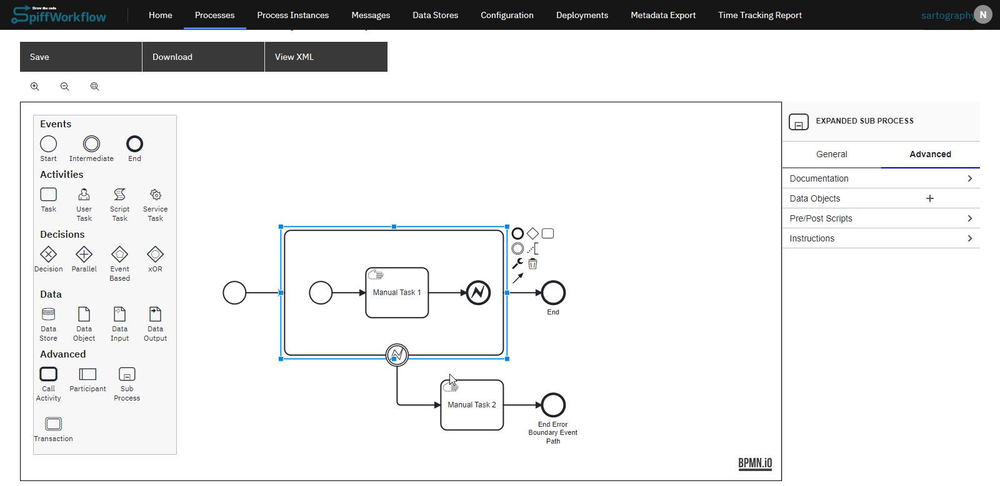

This element encapsulates a more detailed process flow within itself, starting with its own Start Event and comprising several tasks.
The **Start Event** marks the beginning of the subprocess.
Next, the **Manual Task 1** represents an initial activity within the subprocess that could be anything from data entry to review by a human operator.
Then the Error End Event is used to throw an error within the process.
The setup of the error end event is:

- **Error ID Setup**

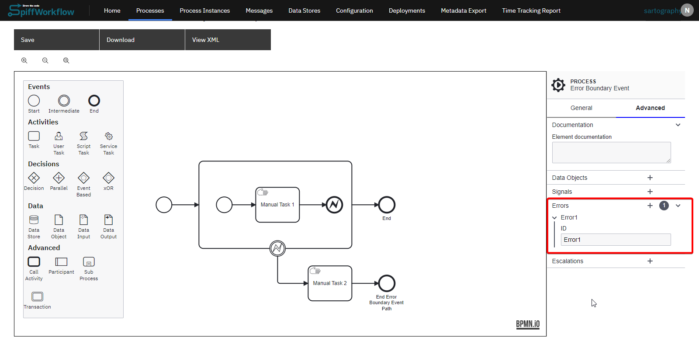
Before proceeding further, an error ID (Error1) is defined in the process.

- **Configure Properties**:

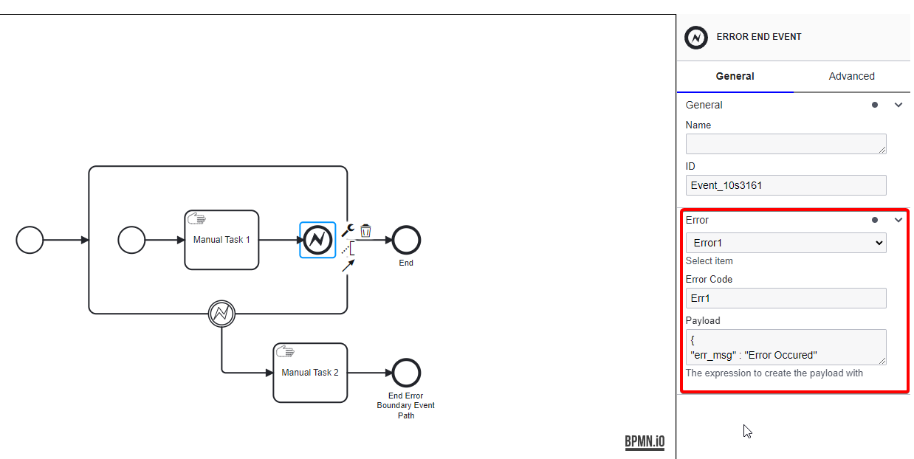

Configured to represent the occurrence of Error1, with an error code "Err1" and a payload detailing the error message (`{ "err_msg" : "Error Occurred"}`).

3. **Error Boundary Event**:

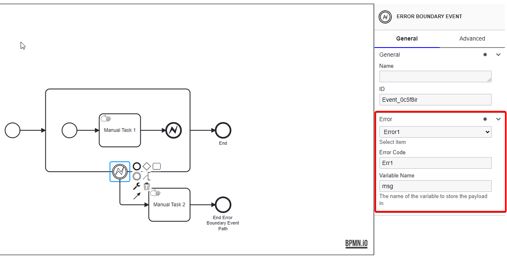

Attached to the Expanded Subprocess, an Error Boundary Event is designed to catch Error1 emanating from the subprocess, particularly from the Error End Event.
The error caught is identified by the code "Err1", and its details are captured in a variable named `message`.

4. **Manual Task**

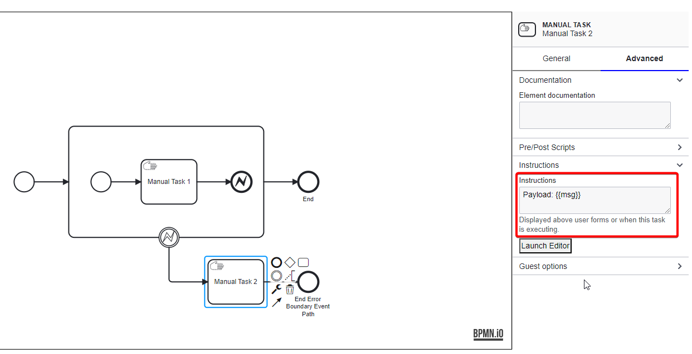

**Manual Task 2** is attached to this Error Boundary Event, with its instructions including the usage of the error message payload (`{{msg}}`), indicating a step to address or respond to the error condition.

5. **End Events for Expanded Subprocess**:

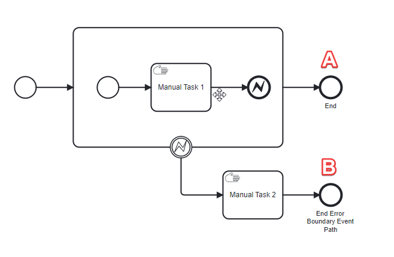

**A**. Beyond the boundary event's error handling path, the subprocess connects to a main End Event, indicating the normal conclusion of the subprocess activities if no errors occur.

**B**. An End Event follows Manual Task 2, suggesting the conclusion of the error handling path with specific actions taken based on the error encountered.

This example demonstrates the utility of expanded subprocesses for detailed internal workflows, coupled with Error Boundary Events for effective error detection and handling, ensuring processes remain uninterrupted and resilient against anticipated issues.

### Conclusion

Error Events in BPMN offer a nuanced approach to managing errors within business processes.
By defining Error Start, End, and Boundary Events, BPMN provides process designers with the tools necessary to anticipate, signal, and handle errors efficiently.
