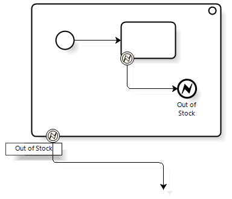

# Error Events

Error Events in Business Process Model and Notation (BPMN) are pivotal in managing exceptions and errors that occur within business process workflows. These events enable processes to handle errors gracefully, ensuring that workflows are robust, resilient, and capable of addressing unforeseen issues efficiently. Below, we delve into the types of Error Events, offering definitions and enriched context for their practical applications.

## Types of Error Events

### 1. Error Start Event


The Error Start Event triggers the start of a subprocess in reaction to an error identified in a different process or subprocess. It is a specialized event used to initiate error handling workflows dynamically.

**Reason to Use**: 
- **Modular Error Handling**: Separates error handling logic into dedicated subprocesses, improving process organization and maintainability.
- **Reusability**: Allows for the reuse of error handling subprocesses across multiple parent processes.
- **Focused Recovery Strategies**: Enables the development of targeted recovery strategi   es for specific errors, enhancing error resolution effectiveness.

**Example**: 


In an automated supply chain system, an Error Start Event initiates a "Supplier Notification" subprocess when inventory restocking fails due to supplier issues, triggering actions such as alternative supplier selection and impact analysis.

```{admonition} Note
⚠ The start event needs to be in an **event sub process** to be selected..
``` 

### 2. Error Intermediate Event/Error Boundary Event


An Error Boundary Event is attached to an activity, such as a service task, and is designed to catch errors that occur during the execution of that activity, allowing for an immediate transition to an error handling flow.

Positioned within the normal flow of a process, this event signifies where an error might occur and is used to programmatically signal an exception, thereby throwing the error to be caught by an Error Boundary Event or an Error End Event.

**Reason to Use**: 
  - **Error Escalation**: Facilitates the escalation of critical errors that cannot be resolved within the current process context.
  - **Process Integrity**: Maintains the integrity of the business process by preventing the continuation of flawed executions.
  - **Comprehensive Error Management**: Ensures that unresolvable errors within subprocess.
  - **Clarity in Process Design**: Enhances the readability and understandability of the process model by explicitly marking potential error points.

**Example**: 


In a customer order workflow, when payment is initiated, a "Process Payment" service task interacts with an external gateway. An attached Error Boundary Event catches errors like "Payment Gateway Timeout" or "Payment Declined." For timeouts, the process redirects to "Retry Payment," allowing another attempt or urging the customer to use a different method.This setup ensures efficient error handling, guiding the process toward res olution based on the error type.


### 3. Error End Event


This event marks the termination of a process path due to an error, signaling that the workflow cannot proceed beyond this point because of the encountered issue, and propagates the error to the parent process for further handling.

**Reason to Use**: 


**Example**: 



In a retail inventory management workflow, an End Error Event within a stock replenishment subprocess indicates the detection of an "Out of Stock" condition for a critical product that cannot be immediately resolved. This error propagates to the main inventory management process, prompting a temporary pause in sales operations for the affected product.

### Conclusion

Error Events in BPMN offer a nuanced approach to managing errors within business processes. By defining Error Start, Intermediate, End, and Boundary Events, BPMN provides process designers with the tools necessary to anticipate, signal, and handle errors efficiently. This layered approach to error management not only enhances process resilience but also contributes to clearer, more maintainable workflow designs.