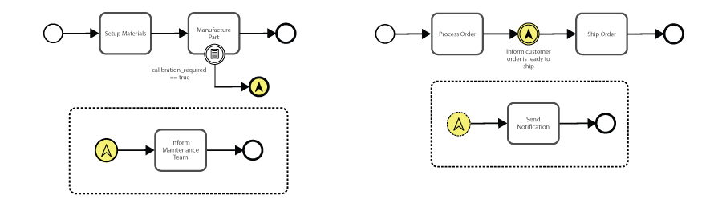
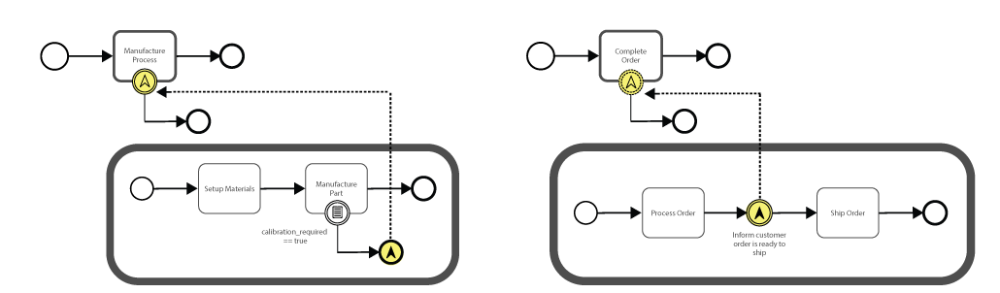
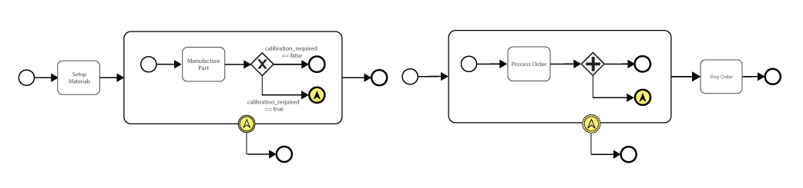
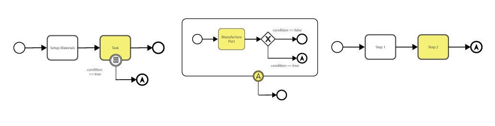
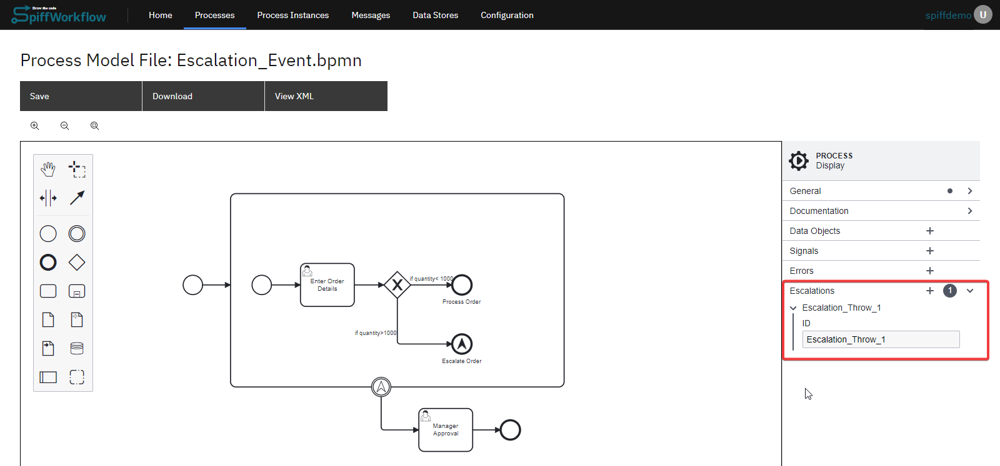
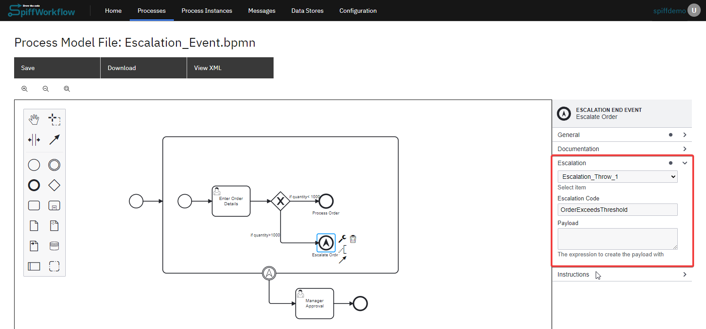
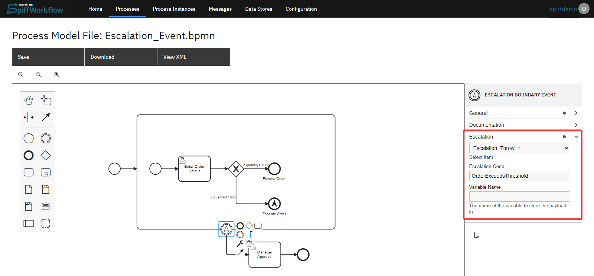

# Escalation Event

An Escalation Event in BPMN symbolizes a situation where an issue or condition within a process requires attention at a higher level or a different domain.
This event acts as a mechanism to raise awareness or invoke intervention.

```{admonition} Note
⚠  Escalation Events are similar to signals; however, they differ in their application.
An escalation represents a one-to-one relationship, whereas a signal event embodies a one-to-many relationship.
```

**Reasons to Use an Escalation Event:**

- Communicate to a subprocess or an upper (parent) process
- Provide a structured way to handle exceptions, ensuring processes remain fluid despite interruptions

## Start Escalation Event


A Start Escalation Event indicates the beginning of a sub-process, triggered explicitly by an escalation from another process or activity.

```{admonition} Note
⚠  Escalation Events are typically used in scenarios where the standard process flow is disrupted, and involvement from other actors becomes essential for resolution.
They are mostly used to communicate from a subprocess to an upper process.
```

**Example:**



**Escalation Start Event (interrupting):**
In a production environment, if a machine malfunctions frequently or requires calibration, the issue might be escalated to a specialized technical team.
This team then initiates a comprehensive diagnostic process to identify and fix the root cause.

**Escalation Start Event (non-interrupting):**
After a customer's order is processed, a non-interrupting escalation event is triggered.
This event sends a notification to the customer that their order is being prepared for shipment.
The key feature of this event is that it is non-interrupting, which means the notification to the customer does not halt the process of moving the order to the shipping phase.
It allows for parallel processing to allow the process to continue seamlessly to the next step.

## Intermediate Escalation Event


An Intermediate Escalation Event serves as a mechanism within a process flow to raise an escalation.
This could be due to an exception, a delay, or any condition that requires intervention.
As a Boundary Event, it can also be associated with specific tasks or sub-processes, highlighting the need for escalation if certain criteria are met.

**Example:**



In the same BPMN scenario, escalations can be managed at a higher level in the process hierarchy through a boundary escalation event.
This method involves placing the escalation event on the border of the parent process activity.

**Escalation Boundary Event (interrupting):**
When the machine manufacturing a part requires calibration, it can be escalated to a parent process where a process is followed to notify or handle the alternate path by catching the throw event (Escalation End Event) from its child process.

**Escalation Boundary Event (non-interrupting):**
The same can be done for our order processing scenario.
A non-interrupting escalation event is caught by the parent process, alerting the customer that their order is ready for shipment.
This boundary event operates in tandem with the core process, updating the customer in real-time while maintaining uninterrupted progression to shipping.
This parallel processing ensures that there are two active instances within the workflow hierarchy, with one instance continuing the child process and the other managing customer communication on the parent level.

```{admonition} Note
⚠  A call process is generally employed for processes that can be repeated across different scenarios or use cases.
```

**Example:**



**Escalation Boundary Event (interrupting):**
In the given scenario, utilizing a subprocess can lead to the desired outcome similarly.
A gateway is used to assess whether a machine needs calibration.
With only one potential result from this evaluation—calibration being necessary—the escalation event is captured at the boundary of the subprocess.
In this case, since there is a single active process instance, the non-interrupting characteristic of the event does not impact the process's flow.

**Escalation Boundary Event (non-interrupting):**
In a subsequent setup, a parallel gateway launches two simultaneous paths.
While one path proceeds with the shipment as usual, the other leverages parallel processing to update the customer.
The update is facilitated through a non-interrupting boundary event within a subprocess, which ensures the shipment process continues uninterrupted.

```{admonition} Note
⚠  The same end result was achieved by three different use cases for the escalation events.
The choice of event type should be based on the particular application and context, as this will inform the most appropriate design decision for your process.
```

## End Escalation Event


In our earlier examples, we demonstrated how to use throw and catch events.
The End Escalation event functions similarly to the Intermediate Throw Escalation event, with the key distinction being its occurrence at the end of a particular pathway.
It's important to note that the End Escalation event doesn't always signify the termination of the entire process.
Particularly in scenarios involving non-interrupting events, the process instance may continue independently even after the escalation event is triggered.

**Example:**



In this scenario, we observe an End Escalation following a Boundary Event.
This thrown End Escalation can be intercepted by the boundary event of a Call Activity or at the start of a sub-process, as shown in previous examples on this page.
In another example, we see an End Escalation event being thrown within a sub-process and caught at the sub-process's boundary.
The application of the last example aligns with the first, where the escalation can be intercepted either on a Call Activity or at the beginning of a sub-process.
It's crucial to remember that whether a process is created or terminated in these contexts depends on whether non-interrupting or interrupting events are utilized.

## Configuring Escalation Events Properties

Setting up an escalation event within a workflow in SpiffWorkflow involves defining both the escalation trigger (throw event) and the point where the escalation is handled (catch event).

Here's how to set up these components:

**Define the Escalation ID**: Determine the task or process stage where an escalation might need to be triggered due to exceptional circumstances and decide on a unique identifier for your escalation event.



```{admonition} Note
⚠  In the above example, the escalation ID is created with `Escalation_Throw_1`.
```

**Define the Intermediate Throw Escalation Event**:
Add an Intermediate Throw Escalation Event immediately after the task identified.
Select the escalation ID and create a unique **escalation code**.



```{admonition} Note
⚠  The escalation code is essential for matching the throw event with its corresponding catch event.
Example: `OrderExceedsThreshold`.
```

**Define the Escalation Catch Event**:
This can be a boundary event attached to a task where the escalation should be caught and handled, or an intermediate event in the workflow where the escalation process converges.

For a boundary catch event, attach it to the task designated to handle the escalation.
For an intermediate catch event, place it at the appropriate point in the process flow.



```{admonition} Note
⚠  Ensure this matches exactly with the code assigned to the throw event to ensure proper linkage.
Example: `OrderExceedsThreshold`.
```

**Set Additional Properties (Optional)**:
You may need to set additional properties for the escalation event, such as:

- **Payload/Variables**: Configuring any data or process variables that should be passed along with the escalation for handling by the catch event.
- **Documentation**: Providing details on when the escalation should be triggered and how it should be handled.

After setting up the escalation event, test the workflow to ensure the escalation is triggered under the right conditions and that the catch event handles it as expected.
