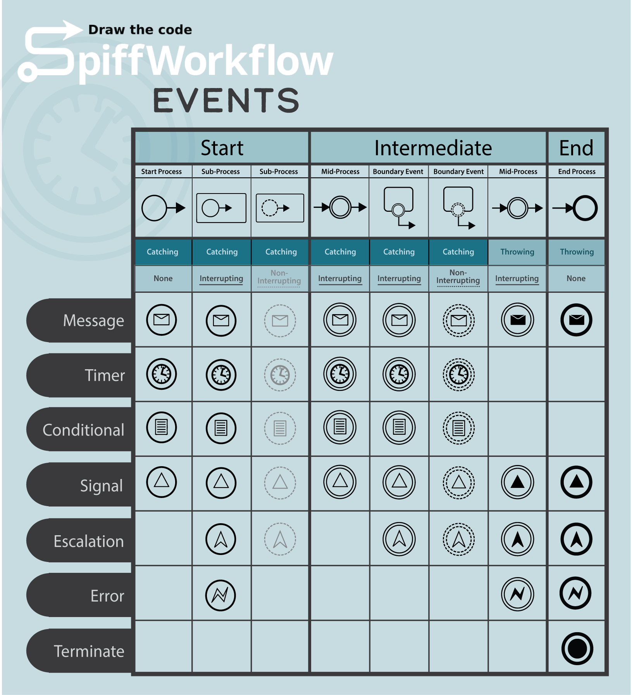

# Events

Events are specific occurrences that dictate the flow or outcome of processes.
They are visually represented by circles.
Based on their position and function, events are categorized as: Start Events, Intermediate Events, or End Events.


Start Events initialize a process and have no incoming flows.
Intermediate Events represent something happening during the process and can have both incoming and outgoing flows.
End Events signify the conclusion of a process and don't have outgoing flows.

**Event Types:**

- Message Events
- Timer Events
- Conditional Events
- Signal Events
- Error Events
- Escalation Events
- Compensation Events
- Link Events
- Terminate Events

We will delve into the various event types, exploring their categorizations and applications.
It's vital to note that not every type of event is suitable for all variations; there are specific rules and guidelines governing their use.
As highlighted in the table, there are distinct limitations.
For instance, while you cannot initiate a primary process with an escalation event, it's entirely permissible to kickstart a subprocess with such an event.
To adhere to BPMN standards, it's crucial to consult and follow the provided guide.
Always ensure that your processes and diagrams conform to these accepted norms.



## Start Event


Start events signify the beginning of a specific process and can consist of catch, timer, or conditional events.
They do not possess any incoming sequence flows.

**Reasons to Use a Start Event:**

- Whenever you want to initiate a new process or sub-process.
- To indicate the cause or reason why a particular process starts.
  This could be anything from a message from another process to a specific time condition.

## Intermediate Event


An Intermediate Event takes place between the beginning and the conclusion of a process.
They can either wait for a specific occurrence (such as receiving a message), initiate an occurrence (like dispatching a message), or pause until a condition is fulfilled or a designated time elapses.

**Reasons to Use an Intermediate Event:**

- To represent events that happen between the start and end of a process.
- To indicate waiting for something to happen before the process can move forward.
  For instance, waiting for approval in an order processing system.
- When the process itself needs to send out a signal or a message to another process.
- To depict delays or time conditions, like "Wait for 5 days after sending an invoice."
- For boundary events, which are attached to activities to indicate potential interruptions or additional conditions directly linked to that activity

## End Event


End events signify the end of a particular process.
Once this event is reached, the process stops, and no further activities within this process will be executed.

**Reasons to Use an End Event:**

- To signify the conclusion of a process or sub-process.
- To denote an outcome or result of a process.
  For example, an end event might signal that an order has been approved or rejected.
- When a particular process or activity needs to be terminated prematurely.

## Interrupting Events vs Non-Interrupting Events

Interrupting Events halt the current process or activity they're associated with and divert the flow based on the event.
Non-Interrupting Events allow the current process or activity to continue its execution, and the event initiates a parallel flow without disruption.

### Interrupting Events


When an interrupting event is triggered, it interrupts the flow of the process or activity it's attached to.
Once triggered, the current activity or process is halted, and the process flow directed by the interrupting event is taken up.

**Reasons to Use an Interrupting Event:**

- In the case of an error, where the current activity cannot proceed further and an exception flow needs to be initiated.
- When an alternative flow should immediately replace the main flow, like when a timer goes off, indicating a timeout.


**Example:**
Think of a scenario where a manager is given a specific duration to assess a request.
If the manager fails to complete the evaluation within this timeframe, an interrupting timer will activate, ceasing the ongoing process and initiating a different one.
The original task is no longer accessible; instead, the situation has shifted.
The provided example demonstrates the same function, but one is with an interrupting start event, while the other is with an interrupting boundary event.

### Non-Interrupting Events


When a Non-Interrupting event is triggered, it does not halt or disrupt the main activity it's attached to.
Instead, the process or activity continues its execution in parallel with the event's associated flow.

**Reasons to Use a Non-Interrupting Event:**

- To initiate parallel activities without disturbing the primary flow, like sending periodic reminders while still waiting for a main task to complete.
- When you want to monitor situations without interrupting the main flow, such as watching for specific signals or messages.


**Example:**
Consider the previous example, but instead of terminating the initial review task when the time elapses, a Non-Interrupting Event is triggered, creating another thread.
A reminder is sent to the manager about the outstanding review without disturbing the primary review process.
The original task proceeds uninterrupted.
This scenario exemplifies the use of a Non-Interrupting Event, where the primary process and reminder notification operate in parallel.
Both actions stay active throughout their execution.

### Throw vs. Catch Events

Throw Events actively generate or send messages, signals, or events.
Catch Events passively wait or listen for messages, signals, or events to be received.

## Throw Event


Throw events are used to "send" or "throw" a particular type of event.
In BPMN, when we talk about a throw event, we're generally discussing an activity or a situation where a specific signal, message, or error is being generated or sent out.
It is the trigger, initiating an action.

```{admonition} Note
⚠ Boundary Events are always catch events and cannot act as throw events.
They wait for signals to guide them towards an alternative route, whether it's interrupting or non-interrupting.
```

**Reasons to Use a Throw Event:**

- To send a message to another process.
- To signal an error in a particular part of the process.
- To indicate the raising or sending of a specific event or signal to other parts of the process or even to other processes.


**Example:**
Imagine a situation where, as soon as the manufacturing of an item begins, a signal is sent to trigger a notification to another department or a customer.
This signal conveys that the production task has either commenced or concluded.
The throw event is immediate, causing no interruptions or delays in the main process.
It's crucial to recognize that there are numerous approaches to catching or receiving this notification signal.

## Catch Event


Catch events are used to "receive" or "catch" a particular type of event.
In BPMN, when we refer to a catch event, we're talking about a point in the process where it's waiting for or listening to a specific event from another process or activity.
It is the listener, awaiting a trigger.

```{admonition} Note
⚠ End Events are always throw events and cannot act as catch events.
They serve as triggers to initiate subsequent processes or actions.
```

**Reasons to Use a Catch Event:**

- To wait for a message from another process.
- To catch or handle an error.
- To wait for a specific signal or event to be triggered before proceeding.


**Example:**
The reception of an event can take place in various ways.
Drawing from the previous example, the event can be caught at the inception of a sub-process within the same primary process.
Alternatively, it could be captured at the start of an entirely distinct process.
Moreover, it can also be seized by a boundary event of another task, provided that this task is active when the event is thrown, allowing it to be intercepted by its corresponding boundary event.
It can also be caught in the middle of a process (refer to the last example in the Non-Boundary Events section).

## Boundary vs. Non-Boundary Events

Boundary and Non-Boundary Events are pivotal in determining how certain events and activities are placed, handled, and how they interact with other elements in a process.

### Boundary Event


Boundary events are attached to specific activities in a BPMN diagram, representing something that could happen while the activity is being executed.
If the boundary event gets triggered, it can interrupt or not interrupt the attached activity, depending on its type.

**Reasons to Use a Boundary Event:**

- To handle exceptions or specific situations that might occur during the execution of an activity.
- To capture intermediate events that can interrupt (or sometimes not interrupt) the main flow of an activity.
- To depict certain conditions under which the process should take an alternative path.


**Example:**
In our initial scenario where a manager needs to approve or review a submission, employing a timer as a start event impacts the entire workflow.
This implies that if this timer is triggered, a different process will kick off, regardless of where the main process currently stands.
On the other hand, when we utilize boundary events, we can confine the timer's influence to a specific task, subprocess, or call-activity.
This approach grants us greater precision over the timer's scope, as it only applies to the particular task or subprocess it's linked to, and the timer only initiates when the first task within its designated scope begins.
Note that a boundary event can be interrupting or non-interrupting.

## Non-Boundary Event


Non-boundary Events stand alone in the BPMN process flow.
They aren't attached to any activity, and they represent something that happens between activities.
Unlike boundary events that are attached to tasks or sub-processes.

**Reasons to Use a Non-Boundary Event:**

- To depict events that occur independently of specific activities, such as timers or messages that are awaited.
- To showcase events that affect the current flow but aren't tied to a particular task or activity.


**Example:**

Consider a manufacturing scenario.
If we want to initiate a separate process before starting the manufacturing task, we deploy an intermediate signal event.
This event's role is specifically to trigger a distinct process.
Unlike a start event, if a boundary catch event isn't active—meaning there's no active instance waiting at that signal event, the thrown signal won't be caught, and the separate process remains unused.
If our goal is to schedule the manufacturing to kick off at a specific time, say 6 pm, or delay it for a short while, we can represent this with a timer.
The workflow will pause at this event until the timer's conditions are satisfied.
Conditions function as gatekeepers.
For instance, the process will halt until the 'production_sheet_signed' variable evaluates as true, indicating the production sheet has been signed and manufacturing can commence.
The concept mirrors that of messages and signals.
A message, much like a signal, will only be caught in an intermediate event if there's an instance at the ready in the associated catch event.

```{admonition} Note
⚠ Remember the key distinction between signals and message events is that while messages adhere to a one-to-one correspondence, signals can potentially relate to multiple recipients in a one-to-many fashion.
```
