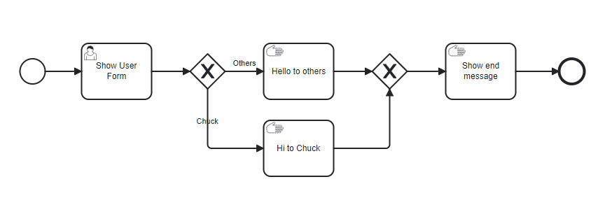
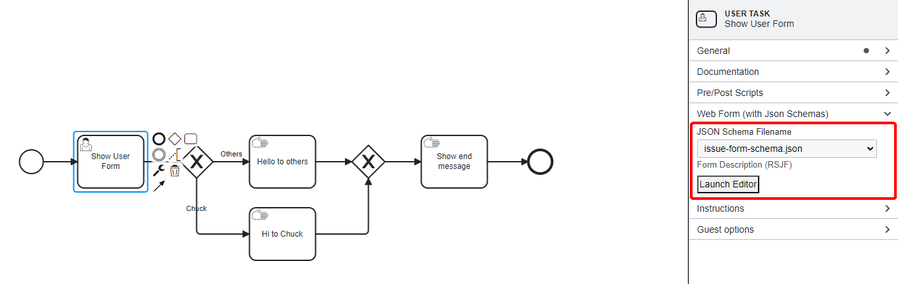
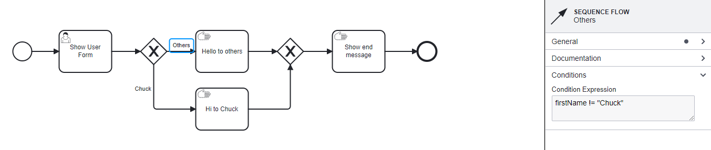
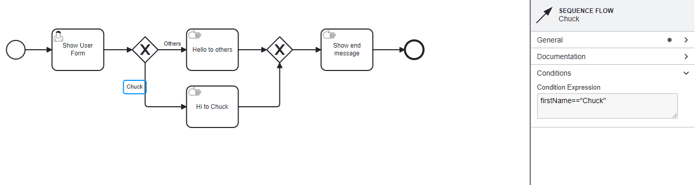
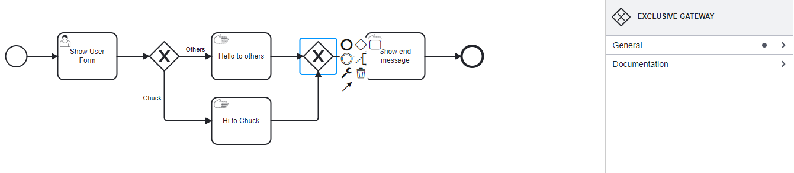
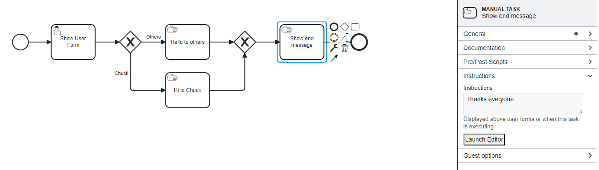

# Exclusive Gateways Example

## Overview

Exclusive Gateways in BPMN serve as decision points that dictate the flow of a process based on conditional logic.
This example demonstrates the use of an Exclusive Gateway to manage conditional routing following user input from a form.

## Process Steps



1. **User Task: Show User Form**


- **Purpose**: Captures user data which influences pathway decisions.
- **Form Configuration**:
     ```json
     {
       "title": "First Name Required",
       "type": "object",
       "required": ["firstName"],
       "properties": {
         "firstName": {
           "type": "string",
           "title": "First name",
           "default": "Chuck"
         }
       }
     }
     ```
   - **Role**: Collects inputs that determine the execution path through the Exclusive Gateway.

2. **Exclusive Gateway**: Evaluates the `firstName` property from the form to decide the subsequent pathway.

    **Sequence Flows**:

    **a**. **Others**: Leads to a general greeting for users not named "Chuck."

    
    
    **For 'Others' Sequence Flow**:
    - **Condition Expression**: `firstName != "Chuck"`
    - Goes to **Manual Task**: "Hello to Others" displays a greeting to non-Chuck users.

    **b**. **Chuck**: Directs to a personalized greeting for users named "Chuck."

    
    
    **For 'Chuck' Sequence Flow**:
    - **Condition Expression**: `firstName == "Chuck"`
    - Goes to **Manual Task**: "Hi to Chuck" delivers a custom greeting to users named Chuck.

3. **Exclusive Gateway Merge**: Merges the paths from manual tasks: "Hello to Others" and "Hi to Chuck," continuing to the next unified step in the process.



4. **Manual Task: Show End Message**: Concludes the interaction by displaying a closing message and displays "Thank you for your participation, {{firstName}}."



After the manual task, marks the completion of the process through the end event.

Therefore, Exclusive Gateways are critical in BPMN for managing decisions within the workflow that require conditional logic based on user input or other process variables.

They ensure that the process flow is correctly directed based on specific conditions, preventing incorrect executions and ensuring that the process adapts dynamically to varying inputs.
