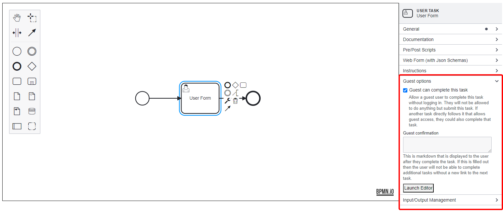
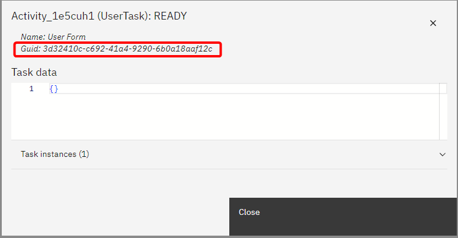
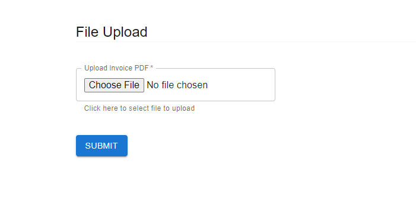

# Guest User Task
The Guest User Task feature in SpiffArena allows users who are not logged into the system to complete specified human tasks. This functionality enhances accessibility and usability, enabling a broader range of users to interact with the process models without requiring an account.

## Key Features

- **Task Accessibility**: Allows guest users to complete tasks marked as "allow guest" in the process model.
- **Direct Navigation**: Guests can access tasks via a constructed URL, eliminating the need for login credentials.
- **Security Measures**: Guests are redirected to the login screen if they attempt to navigate away from the task page, ensuring secure access control.

## Testing Instructions

To verify the functionality of the Guest User Task feature, follow these steps:

1. **Create a Process Model**:

Design a process model that includes a manual or user task. Ensure you check the **"allow guest"** checkbox.



2. **Start the Process Model**:

Initiate the process model using the same user account that created it.

3. **Access the Task GUID**:

Navigate to the process instance show page and retrieve the GUID of the human task.



4. **Construct the Access URL**:

Create a URL in this format:
     ```
     [domain]/public/tasks/[process_instance_id]/[task_guid]
     ```
     
Replace `[domain]`, `[process_instance_id]`, and `[task_guid]` with appropriate values.

5. **Test as a Guest User**:

Open an incognito or private browsing window (not logged into Spiff). Navigate to the constructed URL. Confirm that the guest user can complete the task.


The Guest User Task feature improves usability for non-logged-in users by allowing them to complete designated tasks seamlessly. 