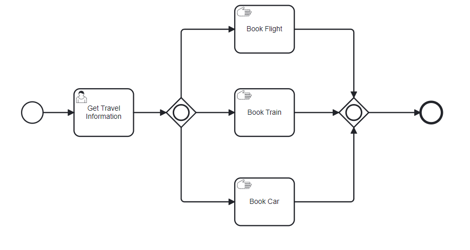
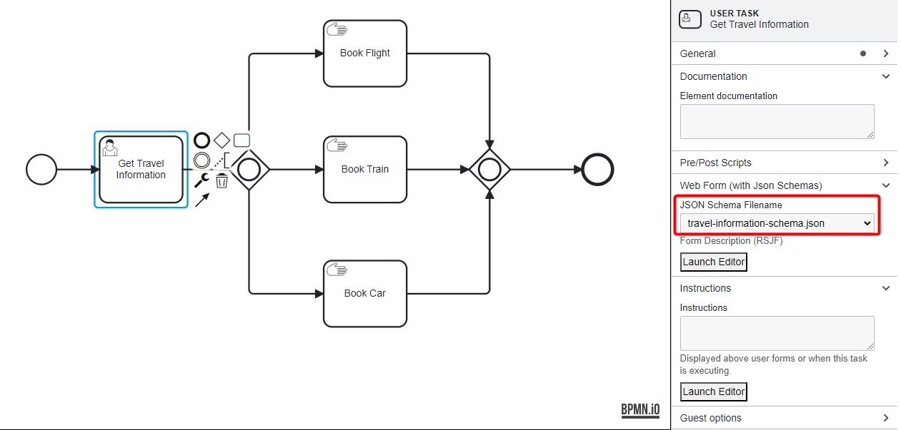

# Inclusive Gateway Example

This BPMN example outlines the process of making travel arrangements using an inclusive gateway, which allows for multiple paths to be executed concurrently based on certain conditions. The inclusive gateway can be used in any scenario where multiple paths should be executed concurrently, but the specific paths that should be taken are determined by the process instance itself (by a user selecting the paths, or by a Service Task API, etc).

## Process Flow



1. **User Task: Get Travel Information**: The user task collects the travel preferences of the user regarding different modes of transportation.

   
   **Form Details**:

   ```json
   {
     "title": "Travel Information",
     "description": "Tell us about your travel information. Journey includes:",
     "properties": {
       "air_travel": {
         "type": "boolean",
         "title": "Air Travel",
         "default": false
       },
       "rail_travel": {
         "type": "boolean",
         "title": "Rail Travel",
         "default": false
       },
       "road_travel": {
         "type": "boolean",
         "title": "Road Travel",
         "default": false
       }
     },
     "required": []
   }
   ```

   Users provide their travel preferences by selecting whether they require air, rail, or road travel. This information will dictate the subsequent paths of the process.

2. **Inclusive Gateway (Split)**
   The inclusive gateway evaluates the input from the travel information form. Based on the user's selections, one or more paths can be activated simultaneously:

   - **Path 1**: If "air_travel" is true, proceed to book a flight. **Manual Task: Book Flight** activated if the user selected air travel. This task involves steps to book a flight.
   - **Path 2**: If "rail_travel" is true, proceed to book a train. **Manual Task: Book Train** activated if the user selected rail travel. This task involves steps to book a train ticket.
   - **Path 3**: If "road_travel" is true, proceed to book a car. **Manual Task: Book Car** activated if the user selected road travel. This task involves steps to book a car rental.

3. **Inclusive Gateway (Join)**
   This gateway merges the paths that were activated in the split. Regardless of how many paths were taken (one, two, or all three), the process will converge here once all active paths are completed.

After inclusive merge, the end task marks the completion of the travel booking process. After this task, all selected travel arrangements have been booked, and the process ends.

This inclusive gateway setup is ideal for scenarios where multiple actions might be required based on a user's choice, such as planning a trip involving different modes of transportation. In this example, it ensures that all necessary arrangements are handled concurrently and efficiently, enhancing the user's experience by streamlining the booking process.

By employing inclusive gateways, the process adapts dynamically to the user's specific needs without requiring separate processes or redundant tasks for different combinations of travel modes.

