# Understanding the terminology

## BPMN and SpiffWorkflow

Business Process Model and Notation (BPMN) is a diagramming language for specifying business processes.
BPMN bridges the gap between business and IT, creating a shared process language for both parties.

BPMN efficiently depicts the details of process behaviors in a diagram.
The precision of its meaning allows it to describe the technical details that control process execution in an automation engine.
SpiffWorkflow enables you to create code to execute a BPMN diagram directly.

By using SpiffWorkflow, a client can create the BPMN diagram and have their product work without the need for you to modify the Python code, thus improving response and turnaround time.

## Flow Objects

Flow objects are divided into three groups: Events, Gateways, and Tasks.

### Events

Events, represented by circles, describe occurrences during a process.
There are three main types of events in business process modeling: start events, intermediate events, and end events.

| **Event** | **Symbol**| **Description** |
|-----------|-----------|-----------------|
| Start Event  |     | Signals the first step of a process.                                                                                |
| Intermediate Event |           | Represents any event that occurs between a start and end event.                                                                                                |
| End Event   |        | Signals the final step in a process.                                 |

### Gateways

Gateways represent decision points in a process.
Based on certain conditions or rules, they determine which path the process will follow.
There are various types of gateways:

| **Gateway**   | **Symbol**| **Description** |
|---------------|-----------|-----------------|
| Exclusive Gateway       |     | Evaluates the state of the business process and, based on the condition, diverges the flow into one or more mutually exclusive paths.                                                                                    |
| Event-based Gateway          |           | An event-based gateway is similar to an exclusive gateway in that both involve one path in the flow. However, with an event-based gateway, you evaluate which event has occurred, not which condition has been met.                                                                                                 |
| Inclusive Gateway        |         | An inclusive gateway diverges the process flow into one or more flows.                                                                          |
| Complex Gateway |  | Complex gateways are used only for the most intricate flows in the business process. They use words instead of symbols and thus require more descriptive text. |

### Tasks

Tasks represent activities or work that needs to be done as part of a process.
They can either be manual tasks that require human intervention or automated tasks that are performed by systems or applications.

| **Task**   | **Symbol**                                                | **Description**                                                                                                                                                                                    |
|---------------|------------------------------------------------------------------------------------------------|----------------------------------------------------------------------------------------------------------------------------------------------------------------------------------------------------|
| Service       | 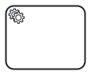       | A task that utilizes a Web service, an automated application, or other types of service to complete the task.                                                                                          |
| Send          |         | A task that sends a message to another pool. The task is completed once the message has been sent.                                                                                                   |
| Receive       |      | A Receive Task indicates that the process has to wait for a message to arrive in order to continue. The task is completed once the message has been received.                                        |
| User          |  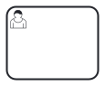       | A User Task denotes that a human performer completes the task with the help of a software application.                                                                                            |
| Manual        | 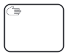      | A Manual Task is a task performed without the aid of any business process execution engine or application.                                                                             |
| Business Rule |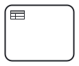| A Business Rule Task provides a mechanism for a process to supply input to a Business Rules Engine and then obtain the output provided by the Business Rules Engine. |
| Script        | 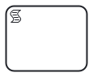       | A Script Task defines a script that the engine can interpret.                                                                                   |
| Call Activity        | 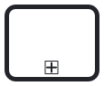        | A call activity allows you to call and invoke another process as part of this process.                                                                                   |
| Sub-Process        | 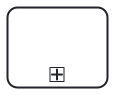        | Sub-processes allow you to collapse and expand tasks to convey information quickly.                                                                                   |

## Connecting Objects

Connecting objects are lines that connect BPMN flow objects.
Three different types exist: sequence flows, message flows, and associations.

| **Connecting Objects**   | **Symbol**                                                | **Description**                                                                                                                                                                                    |
|---------------|------------------------------------------------------------------------------------------------|----------------------------------------------------------------------------------------------------------------------------------------------------------------------------------------------------|
| Sequence Flow Symbol       | 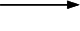       | Connects flow objects in the proper sequential order.                                                                                        |
| Message Flow Symbol          |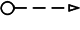         | Represents messages sent from one process participant to another.                                                                                           |
| Association Symbol       |      | Illustrates relationships between artifacts and flow objects.                                          |

## Artifacts

Artifacts are used to provide additional information or documentation within a process.
They include data objects (which represent information or data needed for the process), annotations (which provide explanatory or descriptive text), and groups (which are used to visually group related elements).

| **Artifact**   | **Symbol**                                                | **Description**                                                                                                                                                                                    |
|---------------|------------------------------------------------------------------------------------------------|----------------------------------------------------------------------------------------------------------------------------------------------------------------------------------------------------|
| Data Object       |
        | Data objects can represent data input to the process, data resulting from the process, or data that needs to be collected.                                                                                         |
| Data Storage          |         | Data storage facilitates the storage or access of data associated with a business model. If your process produces any data, it will become necessary to store that data.                                                                                           |
| Group       | 
      | Groups organize tasks or processes that are significant in the overall process.                                          |
| Annotation          | 
 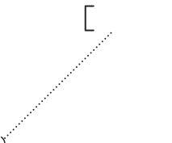       | Annotations allow you to describe the business process and flow objects in greater detail.                                                                                            |

## Swimlanes

Swimlanes are used in a BPMN diagram to organize aspects of a process.
They visually group objects into lanes, with each aspect of the process added to a separate lane.

These elements can be arranged either horizontally or vertically.
Not only do swimlanes organize activities into separate categories, but they also reveal delays, inefficiencies, and the individuals responsible for each step in a process.

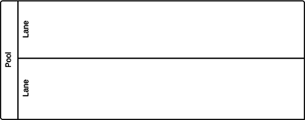
