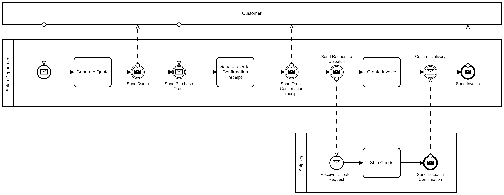
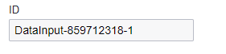
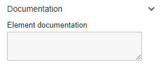
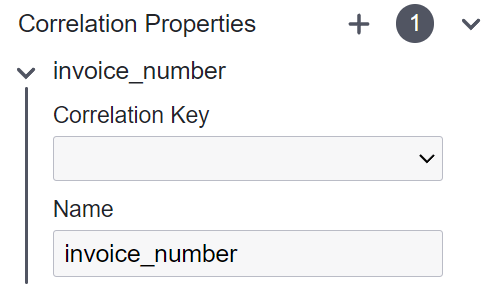
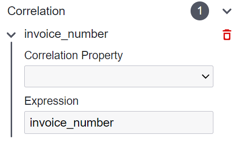

# Message Event

A Message Event acts as a channel for the exchange of information between different process participants or external systems.
While it might be tempting to associate "message events" with emails, their scope extends beyond digital correspondence.
They signify the transmission of information between various process components, whether within the same process or across different processes.


**Reasons to Use a Message Event:**

- Message Events model scenarios where processes interact with external entities or systems for information exchange.
- They initiate specific actions by sending or receiving an event within the process flow.
- Visually, they illustrate communication among various participants or across different pools and lanes.
- They clarify how data or events are shared, fostering collaboration among different business process components.

## Start Message Event


A Message Start Event serves as a starting point for a process, activated specifically by a message received from another process or external system.


In the given example, a process can be initiated either by a message from an external system or by capturing a throw event from another process.

```{admonition} Note
In a subsequent example, it's clarified that message events can span multiple BPMN diagrams and are not confined solely to lanes and pools as illustrated in the initial example.
```

## Intermediate Message Throw Event


An Intermediate Throw Event sends a message from within the process to a receiver.
When the process execution reaches this event, it triggers a message event that can be captured by a corresponding Message Catch Event in another process or by an external system.


In the example provided, once a quote is finalized, the sales team forwards a formal quotation.
Similarly, upon receiving a purchase order from the customer, the sales department generates an order confirmation receipt and sends it to the customer.

## Intermediate Message Catch Event


An Intermediate Catch Event is used to wait for and capture a specific message from another source.
Once activated upon receiving the designated message, it allows the process flow to continue from that point onward.
It's crucial to understand that the process instance remains in a waiting state until triggered by another source or process.
This fundamental distinction sets Intermediate Catch Events apart from Intermediate Throw Events, as Catch Events exclusively await external triggers, while Throw Events initiate those triggers.


Alternatively, Message Events can be utilized beyond the confines of pools and lanes.
The process outlined in the previous section can be split into two distinct BPMN files without affecting its functionality, as demonstrated in the example above.

```{admonition} Note
⚠ It should be noted that, in this situation, connectors cannot visually represent the link between the throw and catch events. Further in this document, the topic of correlation is discussed to clarify how these events are interconnected.
```

In the given example, there are two Intermediate Catch Events.
One waits for confirmation from the customer, and the other depends on the shipping department's verification of dispatch before producing the invoice.
Without feedback from both the customer and the shipping department at this stage, the process instance won't move to the subsequent step.

```{admonition} Note
⚠ While it is generally true that most Throw Events have corresponding Catch Events, it is not an absolute rule. The need for a Catch Event alongside a Throw Event varies depending on the specific scenario and the requirements of the process. There may be cases where a Throw Event initiates an action without requiring a subsequent Catch Event to capture its effects. The decision to use a Catch Event in conjunction with a Throw Event is determined by the requirements of the particular process.
```

## End Message Event


This type of event signifies the completion of a process and indicates that a message is sent to an external recipient to notify them of the process's conclusion.
It serves as the endpoint of the process and sends a message when the process reaches this event.



Please note that the End Event, when using pools, signifies the conclusion of the process within that specific pool, but it does not necessarily indicate the end of the entire process.
In the provided example, the final step involves sending the customer an invoice.
Prior to this, the last step for the shipping department was to send a confirmation.

```{admonition} Note
⚠ Start Events mark the initiation point of a process. Intermediate Events occur during the course of the process, throwing, capturing, and reacting to specific occurrences or messages from external sources or other processes. On the other hand, End Events denote the conclusion of the process, signifying its termination or reaching a final state.
```

## Correlation

A singular Throw Message Event corresponds exclusively to a single active Catch Message Event.
This correlation is one-to-one, unlike Signal Events that could be sent to multiple active Signal Catch Events.
It is important to configure the correlation of the Catch and Throw Events.

## Message Event Configuration

Three separate configurations need to be completed.

- Collaboration
- Throw Message Event
- Catch Message Event

**Default configuration:**

| 💻 Form | ⌨ Field Input | 📝 Description |
| ------------------------------------------------------------- | --- | --- |
|  | **Name:** Place Order | A descriptive name given to the element, providing a human-readable label or title. |
|  | **ID:** Example - send_invoice | An identifier used to uniquely identify the element within the BPMN model. |
|  | **Element Documentation:** URL, Raw Data, Plain Text | Additional information or documentation related to the element, such as URLs, plain text, or raw data. |

**Collaboration:**


The identical configuration must be applied to every BPMN diagram if messages extend across multiple diagrams.

| 💻 Form | ⌨ Field Input | 📝 Description |
| --- | --- | --- |
|  | **Correlation Keys:** order | A correlation key is a unique identifier or attribute used to establish a connection or relationship between message events (it can be likened to the shared subject between them). It is possible to have multiple correlation keys for a process. |
|  | **Correlation Properties:** invoice_number | The correlation property is what differentiates each key instance from another, and it's the defining attribute that sets them apart. For instance, if "order" is selected as the correlation key, a property like "invoice_number" could be used to distinguish each order instance from another. Keep in mind that this variable should be incorporated within the context of the process instance. |
|  | **Messages:** order_approval, order_dispatch, etc. | Messages are established for each message pair (Throw and Catch Message Events). This setup will be utilized to configure the events, linking the associated occurrences together. |

**Throw Message Event:**

| 💻 Form | ⌨ Field Input | 📝 Description |
| --- | --- | --- |
|  | **Message:** order_approval | This input isn't an open-text field; instead, it provides a dropdown list populated by the Messages configured in the preceding Collaboration section. |
|  | **Payload:** order_amount | The Payload can include a variable, holding unique information specific to the instance, or in this scenario, the order. |
|  | **Correlation:** invoice_number | Select the correlation that can identify the distinct property distinguishing one process instance from another. |

**Catch Message Event:**

The connected catch event is configured in precisely the same manner as the throw event.

| 💻 Form | ⌨ Field Input | 📝 Description |
| --- | --- | --- |
|  | **Message:** order_approval | This input isn't an open-text field; instead, it consists of a dropdown list populated by the Messages configured in the preceding Collaboration section. |
|  | **Variable Name:** order_amount | The Variable Name can include a variable, holding unique information specific to the instance, or in this scenario, the order. |
|  | **Correlation:** invoice_number | Select the correlation that can identify the distinct property distinguishing one process instance from another. |
