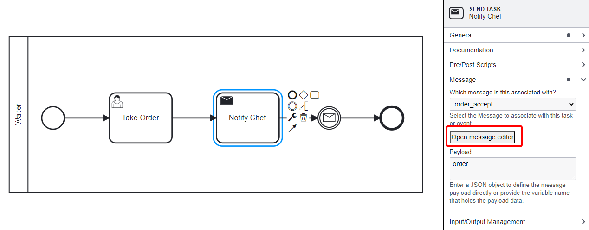
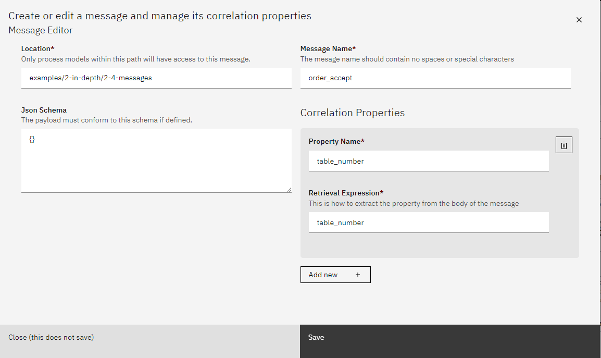
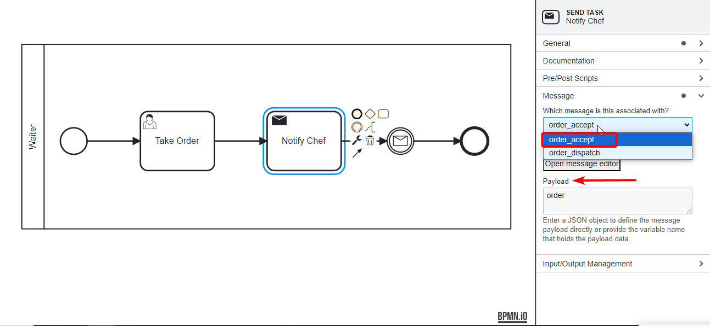
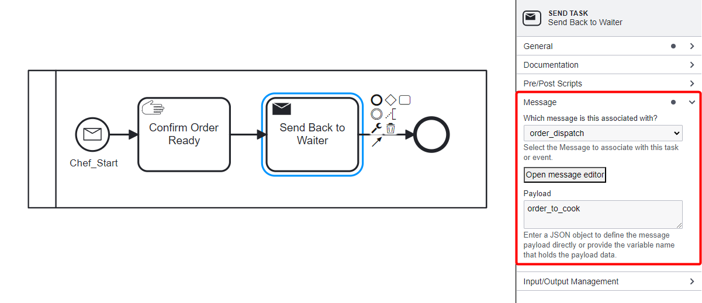
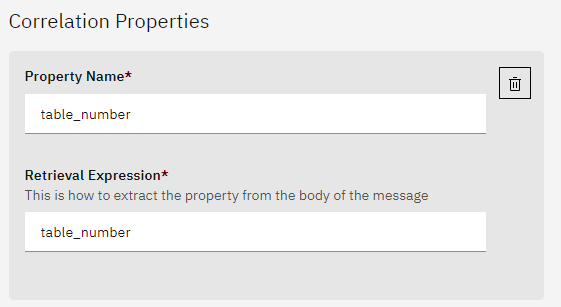

# Configuring Messages and Correlation Properties

Messages play a critical role in allowing processes to communicate with each other. Messages are not only used to transfer data between processes but also to trigger events or tasks, making BPMN workflows dynamic and flexible. 

Below, we provide a step-by-step guide on configuring messages, adding correlation properties, and setting up communication between different processes. We will use the restaurant scenario where the Waiter and Chef communicate via messages.

## How to Configure Messages
In this example, we'll create a scenario where a **Waiter** takes an order and communicates it to the **Chef** using BPMN messages. The Chef then prepares the meal and sends a message back to the Waiter once the order is ready. This illustrates the use of messages, correlation properties, and their configuration in SpiffWorkflow.

**Scenario Overview**:
- **Waiter Process**: Takes an order, sends it to the Chef.
- **Chef Process**: Receives the order, prepares it, and notifies the Waiter when it's ready.
- **Messages**:
  1. `order_accept`: Sent by the Waiter to the Chef, containing order details.
  2. `order_dispatch`: Sent by the Chef to the Waiter, notifying that the order is ready.

### 1. Creating a Message in SpiffWorkflow

Each message you define in a BPMN model can carry a payload (data) and have correlation properties that link it to specific process instances.

To create a new message:
1. **Access the Message Editor**:

Click on a **Send Task** or **Message Event** in your process model. Under the **Message** tab, select "Open Message Editor".

2. **Define the Message**:

   - **Message Name**: Give your message a unique name (e.g., `order_accept`, `order_dispatch`). This should not contain spaces or special characters.
   - **Location**: Define the path where this message will be accessible. Only process models within this path will have access to the message.
   - **JSON Schema**: If you need the message to conform to a specific data format, you can define a JSON schema here. The payload must match this schema if specified.
   - **Define Correlation Properties**: Correlation properties are used to ensure that the correct message is sent and received by the right process instance. In our example, we use `table_number` as the correlation property.
        - **Property Name**: Specify the property that will act as the correlation property (e.g., `table_number`).
        - **Retrieval Expression**: Define how the property will be extracted from the message body. For example, if the message payload has an attribute `table_number`, the retrieval expression should be set to `table_number`.

4. **Save** the message configuration.

### 2. Associating Messages with BPMN Tasks

Once the message is defined, it can be associated with tasks or events within a process model.

For instance, in our **Waiter** process:
- **Send Task: Notify Chef**: This task sends the `order_accept` message to the Chef.
  - Open the **Message** tab in the task configuration. Select the **order_accept** message from the drop-down.
  - In the **Payload** section, specify the data variable that holds the payload (e.g., `order`).
  
  

In our **Chef** process:
- **Message Start Event**: The process is initiated when the `order_accept` message is received.
  - Open the **Message** tab in the Start Event configuration. Select the **order_accept** message.
  - In the **Variable Name** section, specify the variable where the payload will be stored (e.g., `order_to_cook`).

### 3. Setting Correlation Properties in Messages

To ensure that messages are delivered to the correct process instance, correlation properties are used. These properties act as keys to match the right sender and receiver of the message.

- In the Waiter process, the message `order_accept` is sent with a payload containing `table_number`. Since this message triggers the Chef process via a message start event, correlation is not required at this stage. The message simply starts a new instance of the Chef process without needing to reference any ongoing process instances. 

- In the Chef process, when the chef sends a response message (`order_dispatch`) back to the waiter, the correlation property ensures that the message is directed to the correct waiter process.

- Correlation becomes relevant only for ongoing communication between processes, such as when the Chef sends a response back to the Waiter process using the order_dispatch message, ensuring the message is directed to the correct process instance.

By using messages and correlation properties, you can effectively manage communication between multiple BPMN processes. This ensures that the right data reaches the right process at the right time, allowing for dynamic and responsive workflows. 