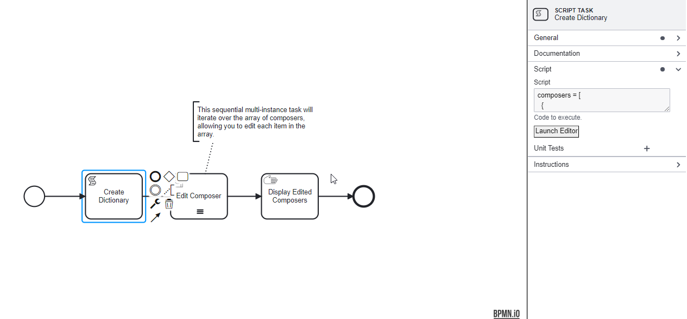

# Multi-instance Tasks

Multi-instance tasks in BPMN (Business Process Model and Notation) are a powerful tool for modeling processes that require repetitive actions over a collection of items.
These tasks automate the iteration over a list, array, or collection, executing the specified activity for each element within.
Multi-instance tasks can be configured to run either in parallel, where all instances are executed simultaneously, or sequentially, where each instance is executed one after the other.

## **Sequential Execution**

Tasks are executed one after another, ensuring that each task instance begins only after the previous one has completed.
In the case of a sequential multi-instance activity, the instances are executed one at a time.
When one instance is completed, a new instance is created for the next element in the input collection.


## **Parallel Execution**

All instances of the task are launched simultaneously, allowing for concurrent processing of the collection elements.
In the case of a parallel multi-instance activity, all instances are created when the multi-instance body is activated.
The instances are executed concurrently and independently of each other.


## Components of Multi-Instance Tasks

Multi-instance tasks comprise several key properties that define their behavior:

```{image} ./images/multiinstance_properties.png
:width: 230px
:align: right
```

1. **Input Collection**: Specifies the array or collection over which the task iterates.
Each element in the collection serves as input for a task instance.

2. **Output Collection**: Collects the outcomes from all task instances into a single collection, enabling aggregation of results.
Don't use this property when Loop Cardinality is specified.

3. **Loop Cardinality**: Defines the exact number of times the task should iterate.
This is used when the number of instances is known ahead of time and is fixed.
Don't use this property when Output Collection is specified.

4. **Input Element Variable**: Represents each element in the input collection during an iteration, allowing for individual processing.

5. **Output Element Variable**: Captures the result of each task instance, contributing to the output collection.

6. **Completion Condition**: An optional condition that, when evaluated as true, can prematurely terminate the iterations.

## Example: Using Multi-Instance Tasks for Dynamic Iteration

This example outlines a BPMN process that demonstrates the use of a multi-instance task to iterate over and modify elements within a collection.

Specifically, the process manages a list of composers, their names, and genres, showcasing the dynamic handling of data through script and manual tasks.

### Process Overview:

1. **Start Event**: Marks the initiation of the process.

2. **Script Task - Create Dictionary**: This task initializes a list (array) of dictionaries, each representing a composer with their name and associated genre.
The script effectively sets up the data structure that will be manipulated in subsequent steps of the process.



**Script**:

```python
    composers = [
       {"composer": "Johann Sebastian Bach", "genre": "Baroque"},
       {"composer": "Ludwig van Beethoven", "genre": "Classical/Romantic"},
       {"composer": "Wolfgang Amadeus Mozart", "genre": "Classical"}
     ]
```

3. **Multi-Instance Task - Edit Composer**: This task is configured as a multi-instance task that iterates over the `composers` array created by the previous script task.
It allows for the editing of each composer's information within the array.


**Properties Configuration**:

- **Input Collection**: The `composers` array to iterate over.
- **Input Element**: Each element in the collection is referenced as `c` during the iteration.
- **Output Collection**: The modified `composers` array, reflecting any changes made during the iteration.
- **Form Attachment**: A web form defined by `composer-schema.json` is attached to facilitate the editing of composer details within the web interface.

```{admonition} Note
⚠ The completion condition and output element are left unspecified, indicating that the task completes after iterating over all elements in the input collection without additional conditions.
```

4. **Manual Task - Display Edited Composers**: This task presents the edited list of composers and their genres, using a loop to display each composer's name and genre in the format provided.


**Instructions**:

```python
     
     * **{{c.composer}}**:   {{c.genre}}
     
```

This templating syntax iterates over the `composers` array, displaying each composer's name and genre in a formatted list.

5. **End Event**: Signifies the successful completion of the process instance, after the list of composers has been edited and displayed.

### Summary:

This multi-instance example in a BPMN process highlights the capability to dynamically handle collections of data through scripting and manual tasks.
By iterating over a list of composers, allowing for the editing of each item, and finally displaying the edited list, the process demonstrates how data can be manipulated and presented in a structured workflow, showcasing the flexibility and power of BPMN for data-driven processes.

```{admonition} Note
If a data object is to be used within a multi-instance subprocess, ensure that it is created within the subprocess itself.
This practice prevents scope and reference issues that can lead to data inconsistencies and errors during the execution of multiple instances.
This ensures that each instance of the subprocess has its own unique and correct reference to the data object.
```

### Loops

Standard loops in Business Process Model and Notation (BPMN) are a fundamental mechanism to model repetitive tasks within a workflow.
These loops allow for the execution of a specific task or sequence of tasks repeatedly until a predefined condition is met, mirroring traditional loop constructs found in programming languages.

### Key Concepts


1. **Loop Marker**: A visual indicator (a small loop symbol) placed at the bottom center of an activity to denote that the activity is subject to repeated execution.

2. **Loop Condition**: A Boolean expression evaluated before or after each iteration of the loop.
The loop continues as long as this condition evaluates to true.

3. **Loop Maximum**: An upper limit on the number of iterations a loop can execute, preventing infinite looping and ensuring process termination.

### Implementing a Standard Loop

To model a standard loop in BPMN, determine the activity or sequence of activities that need to be executed repeatedly.
The next steps are:

1. **Configure the Loop Characteristics**:
   - Add the loop marker to the activity symbol.
   - Define the loop condition within the activity’s properties.
   This condition dictates the continuation of the loop.

2. **Loop Execution**:
   - The process engine evaluates the loop condition.
   If true, the looped activity is executed.
   - After execution, the loop condition is re-evaluated to decide whether another iteration is required.

### Example: Incrementing a Counter

Consider a process designed to increment a counter variable until it reaches a specific value.
This scenario is effectively managed using a standard loop in BPMN.

#### Process Overview


1. **Start Event**: Initiates the workflow.

2. **Script Task - Initialize Counter**: Initializes a counter variable, `counter`, to 0 and Script: `counter = 0;`

3. **Script Loop Task - Increment Counter**: Implement the Script Loop Task with a loop marker and configure the loop condition (`counter < 10`) and increment script (`counter = counter + 1;`).
The process engine will increment the `counter` by 1 on each iteration.


The task is marked with a loop indicator, and the loop condition ensures the task repeats until `counter` reaches 10.

4. **End Event**: Marks the completion of the process once the loop condition is no longer satisfied.

This example illustrates the use of a standard loop in BPMN to model repetitive actions within a workflow, showcasing how loops can automate iterative tasks based on dynamic conditions.
