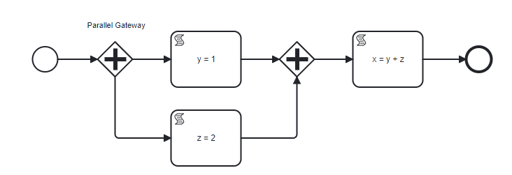
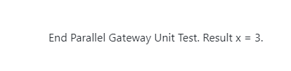

# Parallel Gateways Example

## Overview

This example illustrates the use of parallel gateways in BPMN models to manage and synchronize concurrent tasks effectively.

Parallel gateways are powerful BPMN elements that split a process flow into multiple independent flows, allowing for the simultaneous execution of tasks, and later merging these flows to ensure coordination before moving forward.

### Process Steps

1. **Parallel Gateway (Split)**: After the start event, the gateway divides the main flow into two separate paths, enabling tasks to be processed in parallel.

2. **Sequence Flow 1: Script Task [y = 1]**: Assigns the value `1` to variable `y`. This script task initializes variable `y` and demonstrates setting a simple variable in one branch of the parallel flow.

3. **Sequence Flow 2: Script Task [z = 2]**: Similar to the first script task, this operation assigns the value `2` to variable `z`. It functions concurrently with the first script task, demonstrating the capability of the BPMN model to handle multiple operations at the same time.

4. **Parallel Gateway (Merge)**: This merging gateway reunites the divergent paths after independent task completion, ensuring all parallel processes are complete before moving forward. It acts as a critical checkpoint in the process to synchronize and consolidate data from multiple sources, ensuring that no task moves forward until all parallel tasks have concluded.

5. **Script Task [x = y + z]**: Computes the sum of `y` and `z` and assigns it to variable `x`.
   - **Script**: `x = y + z`
   - This script task demonstrates the aggregation or combination of results from parallel tasks, highlighting how data from independent branches can be combined.

After the script task, signal the successful completion of the process with the End Event.

**Output**:
After running the task, it will compute and show the result:

