# Pools and Lanes

A Pool represents a participant and can be seen as a self-contained process.
This participant can be an internal entity (e.g., a department within a company) or an external entity (e.g., a customer or another company).
Lanes are helpful in highlighting which specific role or department is responsible for certain activities or tasks in a process.
A process can have one or more Pools, each with one or more Lanes.

**Reasons to Use Pools and Lanes:**

- They visually represent distinct participants in a process, such as various departments, organizations, or systems.
- They help depict interactions between separate business entities, like a buyer-seller dynamic.
- They provide a clear overview of communication between different participants.
- They categorize tasks or activities based on specific roles.
- They bring structure and organization to complex diagrams that involve multiple roles, departments, or stakeholders.


## Pools

A Pool can be configured as an "Empty Pool" (collapsed) or an "Expanded Pool".
You can choose the desired configuration 🔧 from the element's options after dragging it onto your diagram.

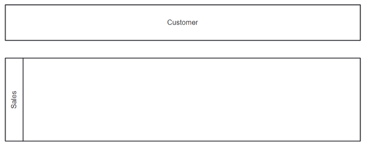

Empty Pools are used to represent role players in cases where a specific process is neither known nor required, but the interaction points remain valuable.
They serve to illustrate the engagement of certain entities without detailing their internal processes, for example, we don't know a customer's specific process but it matters when we interact with them to complete our process.

Conversely, Expanded Pools are employed when the processes are known and hold relevance within the diagram's context.

## Lanes

Lanes group activities within a single Pool, usually signifying different roles or departments.


Lanes are incorporated into Pools when the roles they represent belong to the same entity.
However, if a process doesn't logically fit within the same Pool, like those for different organizations or businesses, it's more appropriate to represent it as a separate Pool rather than another Lane.


## Configuration


**Collapsed (Empty) Pool configuration:**

Configuring an "Empty Pool" (collapsed) to represent an external entity such as a customer.

| 💻 Form | ⌨ Field Input | 📝 Description |
| --- | --- | --- |
| 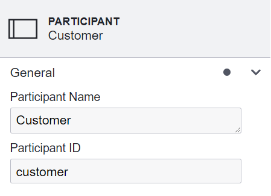 | **Participant Name:** Sales, **Participant ID:** sales, | A clear and descriptive name serves as a human-readable label or title for the participant. Additionally, a unique ID is essential to distinguish the participant from other participants. |
| 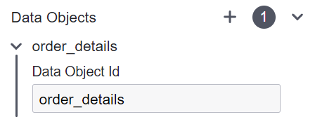 | **Data Objects:** order_details | Create or Reference a Data Object to store information for sharing between entities. |

**Expanded Pool configuration:**

Setting up an "Expanded Pool" requires referencing the process, in contrast to the setup of an empty pool.

| 💻 Form | ⌨ Field Input | 📝 Description |
| --- | --- | --- |
| 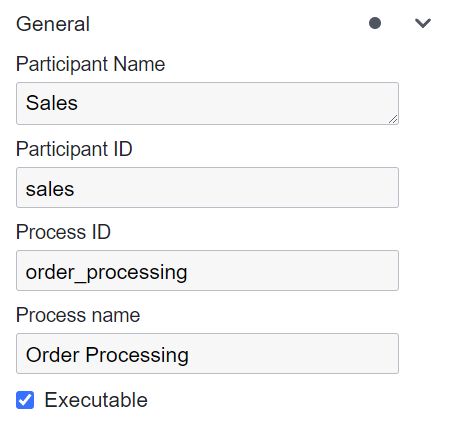 | **Participant Name:** Sales, **Participant ID:** sales,  **Process ID:** process_order, **Process Name:** Process Order | A clear and descriptive name serves as a human-readable label or title for both the participant and the process. Additionally, a unique ID is essential to distinguish both the participant and the process from others. |
|  | **Data Objects:** order_details | Create or Reference a Data Object to store information for sharing between entities. |

**Collapsed Pool configuration:**

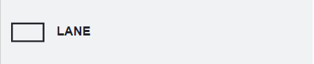

Remember that each pool requires Lane configuration, even if it contains just a single Lane.


| 💻 Form | ⌨ Field Input | 📝 Description |
| --- | --- | --- |
| 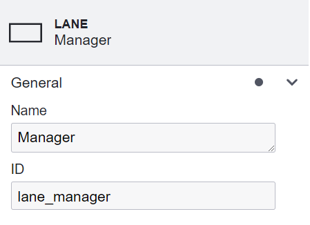 | **Name:** Manager | A concise and descriptive label that accurately represents the owner and role of the Lane. |
|  | **ID:** lane_manager | A distinct ID to differentiate each Lane, especially when there are multiple. |
---
### Example: Using Lanes and Pools for Petty Cash Request Process
This example demonstrates the application of Lanes and pools in a BPMN diagram, specifically designed to handle a petty cash request process within an organization. 

The process is structured around different tasks allocated to lane and pools, emphasizing role-based access and task execution.


#### BPMN Diagram
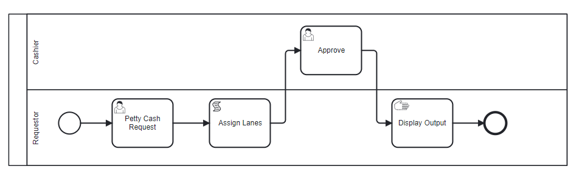

**Process Flow:**   

1. **Start Event**: The workflow kicks off with a start event signaling the initiation of a petty cash request.

2. **User Task: Petty Cash Request**: This task uses a form to collect petty cash requests, including the requested amount and the reason for the request.

    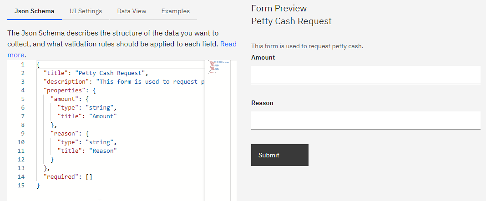

The process transitions from the Requester Lane to the Cashier Lane within the Cashier Pool for approval.

3. **User Task: Approve Petty Cash**: In this task, cashiers review and approve the petty cash request, recording the approver’s name for accountability.

    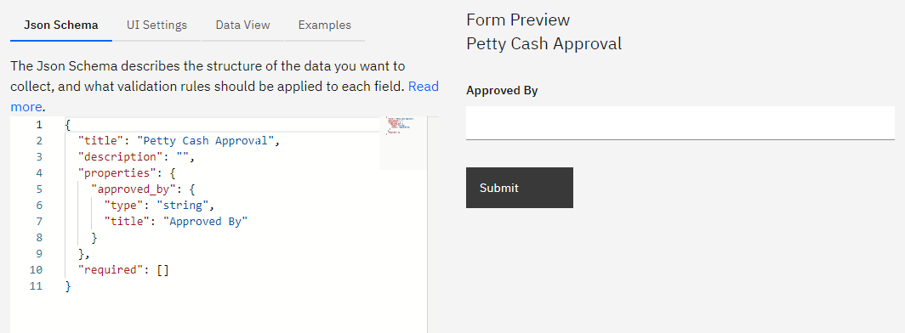

After approval, the workflow returns to the Requester Lane for final confirmation and display of the approval outcome.

4. **Manual Task: Display Output**:

**Display Message**:

```markdown
Your petty cash request for {{amount}} has been approved by {{approved_by}}
```
This message informs the requester of the approval status, including the approved amount and the name of the approver. After manual task, marks the end of the process.

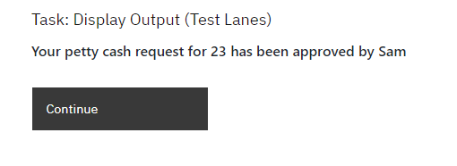


This BPMN diagram effectively uses Lanes and pools to structure a petty cash request process, ensuring that responsibilities are clearly assigned and the workflow is logically organized.

---
### Assigning Lane Owners

### Assigning Lane Owners in BPMN Workflows

Assigning lane owners correctly in BPMN workflows is important for ensuring that tasks are routed to the appropriate personnel or departments within an organization. 

Lets discuss the methods for assigning lane owners:

#### Methods to Assign Lane Owners:
1. **Using Script Tasks**:
   - Script tasks enable dynamic assignment of lane owners within the workflow. You can specify the lane owners directly in the workflow logic, ensuring that tasks are routed correctly based on current operational needs or specific conditions.
   - **Example**:
     ```python
     # Script task to assign lane owners
     lane_owners = {
         "Reviewer": ["alex@sartography.com", "madhurya@sartography.com"]
     }
     ```
   - This script explicitly sets who the lane owners are for the 'Reviewer' lane. The names provided in the dictionary map directly to the users responsible for this lane.

2. **Assigning User Groups**:
   - In cases where script tasks are not used for direct assignments, lane owners can be specified by utilizing predefined user groups within DB. 
   - **How to Configure User Groups**:
     - User groups can be assigned in the system configuration, often in a YAML file, which defines which users belong to specific groups. More information [in admins and permissions section](https://spiff-arena.readthedocs.io/en/latest/DevOps_installation_integration/admin_and_permissions.html#setting-up-admin-in-config-yaml)

     - **Example YAML Configuration**:
       ```yaml
       groups:
         admin:
           users:
             - sam@spiffworkflow.org
             - trent@spiffworkflow.org
         reviewers:
           users:
             - malala@spiffworkflow.org
             - oskar@spiffworkflow.org
       ```
   - This configuration shows how different user roles, such as admins and reviewers, are populated with specific users.

#### Practical Application in a BPMN Model:
In a typical BPMN workflow, lane assignments are crucial for managing who performs various tasks within the process. For example, a process might involve several departments or roles, each represented by a lane in the workflow model.

- **Start of the Process**
  - The process begins and an initial script task sets the lane owners. Below BPMN model effectively demonstrates a comprehensive workflow leading to a dynamic assignment of reviewers in the "Script Task: Get Reviewers"

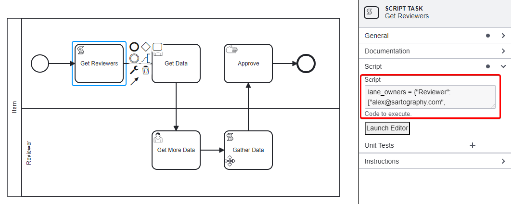

- **Task Execution**:
  - As tasks are executed, the workflow engine checks the `lane_owners` dictionary to determine which users are responsible for tasks in specific lanes.
  - If a lane owner is set using a script task, as shown in the example, tasks in that lane appear on the designated users' interfaces.
  - If no explicit assignment is provided, the engine queries the group name to determine potential task owners from DB.


```{admonition} Note
⚠ Specifying a user group in the `lane_owners` dictionary in script task does not require it to previously exist in the database. 
```