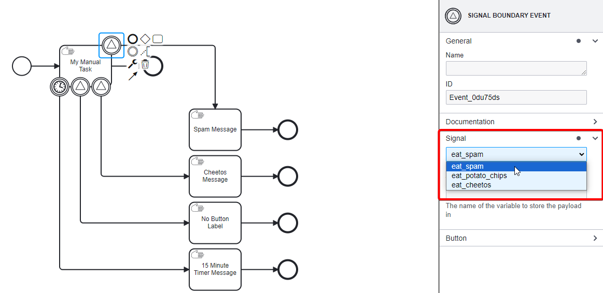
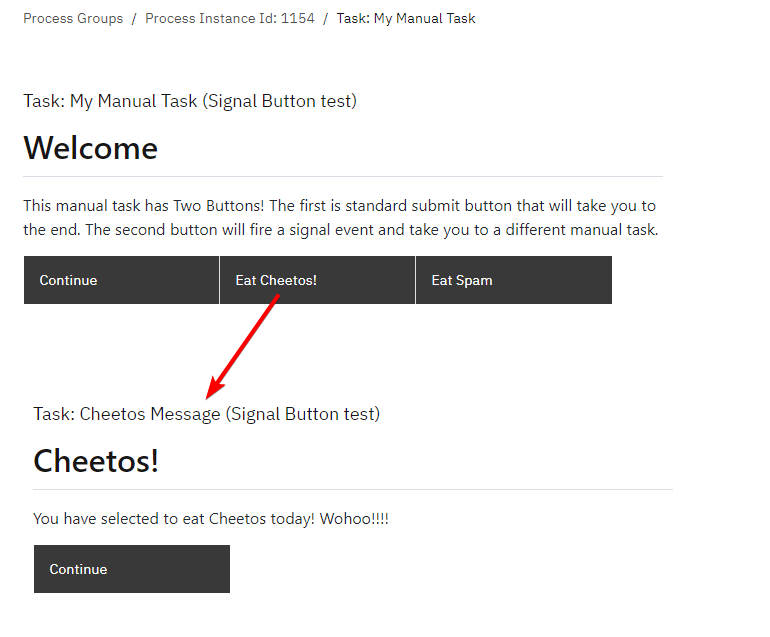

# Signal Event

A Signal Event is a type of event that provides a mechanism for communication across different processes.
Unlike messages that are sent from a specific sender to a specific receiver, signals are broadcast to multiple recipients.
When a signal is thrown, all active processes that are listening for that signal can catch and react to it.
Signals do not have any expectation of a response.
Once a signal is sent out, it does not wait for a reply.

 

**Reasons to Use a Signal Event:**

- A signal event is used to broadcast a message to multiple signal catch events.
- They are ideal for scenarios where a notification is important, but a reply or acknowledgment isn't necessary.
- Incorporating Signal Events in BPMN diagrams provides a versatile way to model complex inter-process interactions.
- Signal Events can trigger multiple other processes, effectively creating separate threads from a single instance. This allows for parallel processing.
- They can help synchronize multiple processes. For instance, different processes can wait for a common signal to proceed, ensuring they operate in tandem.

## Start Signal Event


A Start Signal Event serves as a starting point for a process or subprocess, triggered specifically by a signal broadcasted from another part of the system or even a different system entirely.


**Example:**
A Start Signal Event is especially valuable in situations where a parallel process needs to commence while the primary process continues.
Consider a production line in a factory where specific components are produced.
Some stages of this line must occur in sequence, but others can operate concurrently.
This parallel operation is what boosts the efficiency of a production line.
In the image above, two processes are started, meaning three processes will run in parallel.
With signals, one process can initiate another.
The power of a signal is its ability to launch multiple processes simultaneously because of its one-to-many relationship.
It's important to note that a Start Signal Event is typically activated by an intermediate or end throw signal event.

## Intermediate Signal Throw Event


An Intermediate Signal Throw Event is an event that happens in the middle of a process (not at the start or the end) and sends out a signal.
This can be caught by another process or a different part of the same process using a Signal Catch Event.


**Example:**
Using an Intermediate Throw Event aligns perfectly with the scenario illustrated earlier.
To give another example, think about placing an order.
Continuous communication with the customer throughout the order process is crucial.
However, there's no need to halt our process of fulfilling the order just to send a notification.
A more efficient approach is to run a parallel process specifically for notifications.
This way, if there's a hiccup in the communication process, it won't impede the primary order completion.
Implementing multiple threads to concurrently execute tasks for an instance, as seen when using intermediate signal events, boosts overall efficiency.

## Intermediate Signal Catch Event


An Intermediate Signal Catch Event waits for a specific signal to start or continue a process.
To "catch" means that this event is actively waiting or listening for that signal to be thrown from another part of the process or even from a different process.


**Example:**
To better understand the difference between a start event and an intermediate event, let's examine a manufacturing example.
Within this scenario, the intermediate catch event is a part of an ongoing process, unlike the start event which initiates a new process as seen in our previous example.
Picture two simultaneous processes, each crafting a distinct component.
The final assembly, however, is dependent on the completion of the first component.
Once the production of the second component is finalized, marked by a throw signal, the intermediate catch event pauses and awaits the readiness of the first component before proceeding further.
```{admonition} Note
⚠  In this example, it's crucial to highlight an underlying assumption: part two must always precede part one.
Should this sequence be reversed, the process would fail.
This is because the process necessitates the completion of part two, after which the instance is waiting at the catch event, ready to receive the throw event signaling the conclusion of part one.
This scenario highlights the importance of understanding the intricacies of each symbol when designing functional and reliable workflows.
```


**Example:**
Let's delve into an example distinguishing between interrupting and non-interrupting boundary catch events.
It's vital to recognize that a task must maintain an active instance for it to capture a throw signal via a related boundary event.
In the case of the interrupting event, both Task 1 and Task 2 will conclude.
This is apt for scenarios where, for instance, an order gets canceled, and the following tasks are rendered unnecessary.
Conversely, for the non-interrupting event (depicted on the right), while Task 2 is interrupted, Task 1 persists in its active state and concurrently, Task 3 gets activated.

## End Signal Event


This type of event signifies the end of a process or path and, at the same time, broadcasts a signal to other processes or process instances.


**Example:**

In an online shopping system, when a customer's payment is successfully processed, an End Signal Event can be triggered.
This signal initiates three distinct processes: (1) the "Send Notification" process alerts the customer of their successful purchase, (2) the "Pack Order" process prompts the warehouse team to prepare the item for dispatch, and (3) the "Schedule Delivery" process alerts logistics to arrange for the item's delivery.
In this manner, one event efficiently orchestrates a sequence of actions across multiple departments.


**Example:**
Signals are instrumental in coordinating workflows among varied processes, making certain that tasks adhere to a specified order.
Leveraging intermediate catch and throw events allows one process to temporarily halt until tasks in a different process are finished.
This is especially beneficial when certain stages can only commence after the completion of others — imagine the utility of such a system across multiple departments.

This example demonstrates how Signal Events, along with a Timer Boundary Event, can be orchestrated within a BPMN process to create conditional pathways based on user actions and timed events.
The process begins with a standard initiation and primarily revolves around the user's interaction with a manual task that offers multiple outcomes.

## Example: Using Signal Boundary Events as Buttons

This BPMN example showcases the flexibility of using Signal Events to create dynamic, user-driven process flows.

By incorporating manual tasks with multiple outcomes, signal-based routing, and automated timing controls, the example illustrates how complex decision logic and external system integration can be efficiently managed within a BPMN process.


### 1. **Start Event**:

Initiates the workflow, leading to the first and main manual task.

### 2. **Manual Task with Boundary Events**:

This task is unique in that it presents the user with distinct options in the form of buttons.
The default flow is a standard submission button that, when clicked, directs the workflow towards a conventional end.



Attached to **My Manual Task**, three Signal Boundary Events are set to listen for specific signals.
These signals determine the flow of the process after the second button is pressed.

- **Signal Boundary Event 1**:
Catches the signal for "eat_spam" and redirects the workflow to a Manual Task named "Spam Message".

- **Signal Boundary Event 2**:
Listens for the "eat_cheetos" signal, leading the process to a Manual Task labeled "Cheetos Message".

- **Signal Boundary Event 3**:
Designed to catch the "eat_potato_chips" signal, but uniquely does not lead to a user-accessible task under normal workflow conditions. 
This task, intended to be triggered externally (e.g., via an API call), emphasizes the capability of BPMN to integrate with external systems for event triggering.
```{admonition} Note
⚠  Before initiating the process, three signal event IDs must be configured: `eat_cheetos`, `eat_potato_chips`, and `eat_spam`.
These IDs are essential for the Signal Boundary Events to correctly identify and react to the signals triggered by user actions or external inputs.
```

#### **Timer Boundary Event**:

Attached to **My Manual Task**, this event is configured to trigger after a specific duration, automating the process flow if the user does not interact with the manual task within the given timeframe.
Notably, this event leads the process towards an alternative path or end without requiring user input.


### 3. **End Events**:

The process includes multiple End Events.
One is directly connected to **My Manual Task**, concluding the workflow if the first button is used.

The others are linked to the outcomes of the Signal Boundary Events and the Timer Boundary Event, ensuring that each possible path through the process reaches a defined conclusion.

### Output:

After starting the task, the signal buttons "Eat Cheetos" and "Eat Spam" will appear.
Clicking on any button will lead to the respective manual task.


