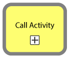
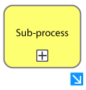

# Sub-Processes and Call Activities

Both sub-processes and call activities are useful for simplifying and organizing complex workflows by organizing workflows within a larger process. 

**Reasons to use a Sub-Processes or Call Activities:**

- Consolidate tasks that have either common features or collaboratively form a distinct functionality. For instance, a Notification Gateway, which includes script tasks and a service task, works together to construct and send a notification like an email.
  
- Group tasks where a boundary event can be efficiently applied to the entire group. For instance, instead of individually assigning a condition or timer to each task, all tasks can be included within a sub-process or call activity, where the condition or timer inherently applies to all contained tasks.

## Call Process

A call process is similar to a sub-process in that it encapsulates part of a workflow, but it is designed to be reused across multiple different processes. It's essentially a stand-alone process that can be "called" into action as required by other processes. Using a call process can help to eliminate redundancy and ensure consistent execution of the process steps.

**When to use a Call Process:**

- **Reusability** a certain set of activities is being reused in multiple main processes, it's a good idea to define it as a call process and reuse it whenever needed by calling the process.
  
- **Reduce Complexity:** If your main process is becoming too complex, breaking it down into smaller, more manageable call processes can make it easier to understand and maintain.
 
- **Version Control**: If a certain process may undergo changes over time but is used in multiple places, defining it as a call process allows you to make changes in one place and have those changes propagate to all instances where the process is used.

- **Delegation**: When different people or teams need to be responsible for the execution of tasks within a process, a call activity can be useful and can be assigned to the most appropriate person or team.

- **Access Control**: If a specific segment of a process isn't meant to be available to every user, converting it into a call process can aid in establishing access control over that particular process. Additional information about this can be found in the [Admin and Permission](../installation_integration/admin_and_permissions.md) section.

## Sub-processes

 

Sub-processes are generally employed within a single process, whereas a call activity has the advantage of being reusable across multiple processes. If the conditions that warrant the use of a call activity, such as reusability, aren't necessary, a sub-process is usually the preferred option. 

**When to use a sub process:**

- **Consolidate similar functionalities:** When you have a group of tasks that are closely related and work well together, but don't need to be used or replicated elsewhere in other processes. 
  
- **Call activity is not required:** When these tasks don't meet the conditions needed for a call activity a sub-process can achieve the same goal.
  
- **Conditions or events needs to be applied:** When specific conditions or events, such as a timer event, need to be applied to a set of tasks, but these tasks do not collectively form a reusable workflow that can be called as a separate process. 
