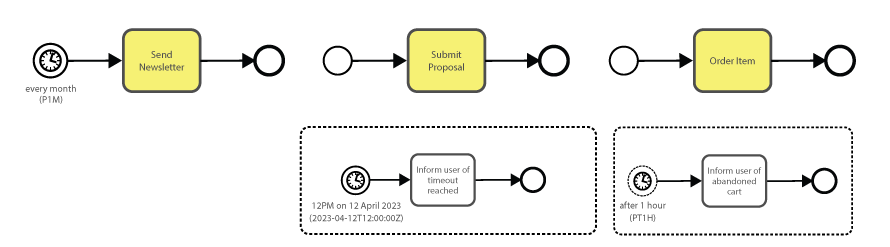
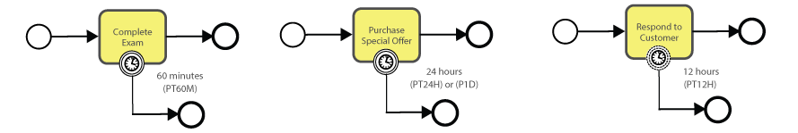
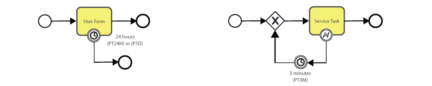
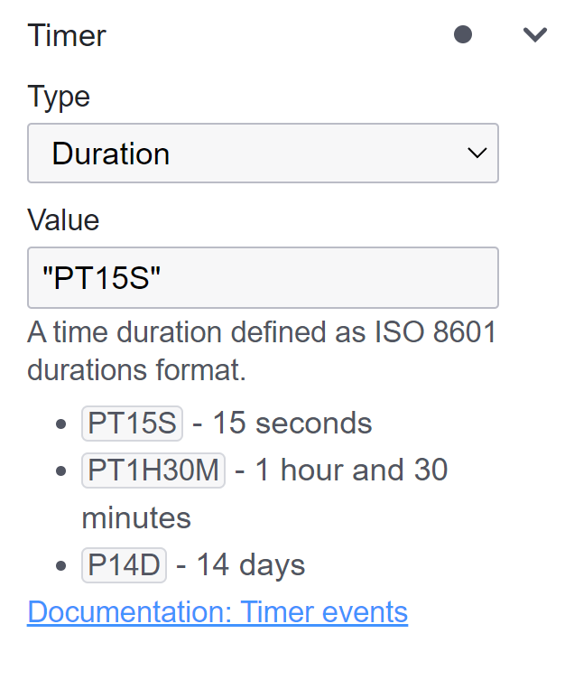

# Timer Event

A Timer Event in BPMN is tied to the concept of time.
It represents a specific moment or duration after which certain actions in a process are initiated or controlled.
Using Timer Events ensures that processes can be designed to factor in time-based conditions, which are common in real-world scenarios.
There are 3 specific types.

**Specific Date/Time Trigger:**
A Timer Event can be set to activate on an exact date and time.
This is like setting an alarm clock.
When the clock hits the designated time, the Timer Event is triggered.
For instance, a monthly system backup could be initiated using a Timer Event set for the first day of each month at 2:00 AM.

- **2023-12-25T09:00:00Z** - This would set the timer to trigger at 9:00 AM (UTC) on December 25, 2023.
- **2024-01-01T00:00:00-05:00** - This would set the timer to trigger at midnight (Eastern Time) on January 1, 2024, accounting for the time zone offset.

**Duration-based Trigger:** This isn't a fixed point in time but a period that is often defined in the format of 'PnYnMnDTnHnMnS' (where P indicates the period, T separates date and time elements, and Y, M, D, H, M, S represent years, months, days, hours, minutes, and seconds, respectively).
It's analogous to using a stopwatch.
Once the task or process starts, the Timer Event begins counting, and after the predefined duration (say, 48 hours), it activates.
An example scenario might be an e-commerce platform setting a Timer Event to automatically cancel unprocessed orders after 72 hours.

- **PT72H** - Represents a period of 72 hours.
- **P2D** - Equates to a period of two days.
- **P3DT12H30M** - Corresponds to a period of three days, twelve hours, and thirty minutes.

**Recurring Trigger:** Advanced uses of Timer Events can involve recurring time patterns, like activating a process every 8 hours for 3 cycles.
This pattern-based time definition can manage repetitive tasks without needing individual Timer Events for each occurrence.
The R denotes recurrence, followed by the number of recurrences, and PT8H is the duration of 8 hours.

- **R3/PT8H** - Every 8 hours for 3 cycles.

**Reasons to Use a Timer Event:**

- A Timer Event is ideal for processes that have to wait for a specific period or set time before starting or progressing to the next step.
- They allow processes to adapt and react based on time-sensitive conditions or deadlines.

## Start Timer Event


A Start Timer Event marks the beginning of a process or sub-process, but only once a specified period has elapsed or at a predetermined time.

**Example:**



**Timer Start Event:** Consider a company that sends out a newsletter on the first of every month.
To achieve this, they could set up a 'Start Timer Event' named 'Monthly Newsletter Timer' with a cyclic timer to activate on the first day of each month.

**Timer Start Event (interrupting):** In a different setting, let's imagine an organization that allows proposal submissions but sets a deadline for a specified date.
Here, a 'Start Timer Event' can be used to automatically close the proposal submission form after this date, ensuring no entries are accepted post-deadline.

**Timer Start Event (non-interrupting):**
Taking a more customer-centric example, envision an online shopping platform.
While a customer browses and adds items to the cart, they might get distracted and forget to check out.
To address this, the platform can trigger a 'Non-Interrupting Timer Event' coupled with a subprocess.
If the cart remains unattended for an hour, this timer triggers the subprocess, sending an email to the customer reminding them of their abandoned cart.
The advantage is that it doesn't disrupt the customer's current session, providing a seamless experience.

## Intermediate Timer Event

 

An Intermediate Timer Event acts as a pause or delay within the flow of a process.
The process flow will only continue after the set time has been reached or elapsed.
Furthermore, as a Boundary Event, it can be linked to specific tasks or sub-processes, potentially interrupting or delaying those tasks based on timing constraints.

**Example:**


**Timer Intermediate Catch Event:**

The intermediate timer event dictates the timing between stages of a process.
For example, in the context of baking, once a cake is removed from the oven, it's essential to let it cool properly before decorating.
This cooling phase ensures that the icing doesn't melt off the hot cake.
To manage this, an 'Intermediate Timer Event' can be set, signaling a baking process to wait for a standard duration of two hours post-baking before decorating.

Transitioning to a logistics scenario, let's consider a company that processes multiple orders throughout the day.
They might spend hours collecting items, packaging, and preparing them for shipment.
However, rather than dispatching each order individually, they follow a batch process strategy, consolidating all orders for a one-time dispatch.
An 'Intermediate Timer Event' can be configured here to accumulate the day's orders and trigger a batch processing subprocess at a specific time, ensuring efficient and streamlined delivery operations.

**Example:**



**Timer Boundary Event (interrupting):**

Imagine an online examination system where students have exactly 1 hour to complete the exam.
A task labeled "Take Exam" will have a timer boundary event attached to it.
If the exam isn't completed within 60 minutes, the timer boundary event activates, automatically submitting whatever has been completed by the student and ending the exam.

On an e-commerce platform, a product is available at a flash sale price for just 24 hours.
When customers add this item to their cart, a timer boundary event of 24 hours is set.
If they don't purchase within this time frame, the timer activates, removing the limited offering.

**Timer Boundary Event (non-interrupting):**

A company prides itself on responding to customer support queries within 12 hours.
When a new query is logged, a task named "Respond to Customer" is initiated.
This task has a timer boundary event set for 12 hours.
If the customer support team hasn't addressed the query within this time frame, the timer boundary event triggers a notification subprocess to alert the team lead or manager about the overdue response.
Note that the original task is still active.

**Best Modeling Practices:**



In process automation, ensuring all tasks and processes reach a definitive end is a fundamental aspect of good modeling practice.
Abandoned or lingering tasks can strain resources and introduce inefficiencies.
Timer events act as watchdogs, monitoring periods of inactivity and auto-terminating stagnant processes.
Given the unpredictability of user behavior, integrating timer events is a proactive strategy to ensure no open instances remain.

Looping based on time is also a possible use case.
For instance, a system might need to retry a failed task every three minutes until successful.
Here, the Timer Event ensures that after every 3 minutes, the task is reattempted.
Just remember to have a mechanism in place to eventually break out of the loop after a certain number of retries or if another condition is met.

## Timer Event Configuration

| 💻 Form                                | ⌨ Field Input                      | 📝 Description                                                                              |
| -------------------------------------- | ----------------------------------- | ------------------------------------------------------------------------------------------- |
|    | **Name:** Cancel Order              | A descriptive name given to the element, providing a human-readable label or title.         |
|        | **ID:** Example - cancel_order      | An identifier used to uniquely identify the element within the BPMN model.                  |
|  | **Type:** Duration **Value:** PT48H | Choose the type of trigger you want to set: Specific Date/Time, Duration, or Cycle Trigger. |

```{admonition} Timer Delay
💡 Note: Timer events, especially those set for short durations, may face delays of 20-30 seconds, varying with the number of active instances.
Despite significant improvements, our ongoing efforts aim to further reduce these delays.
```
