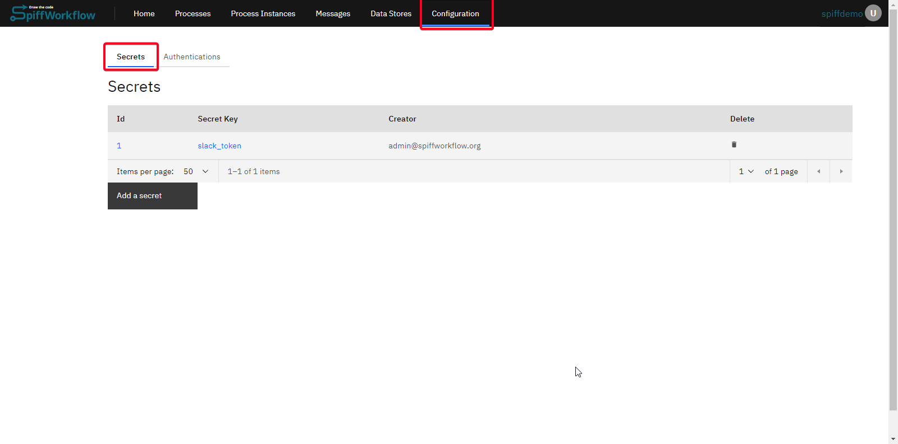
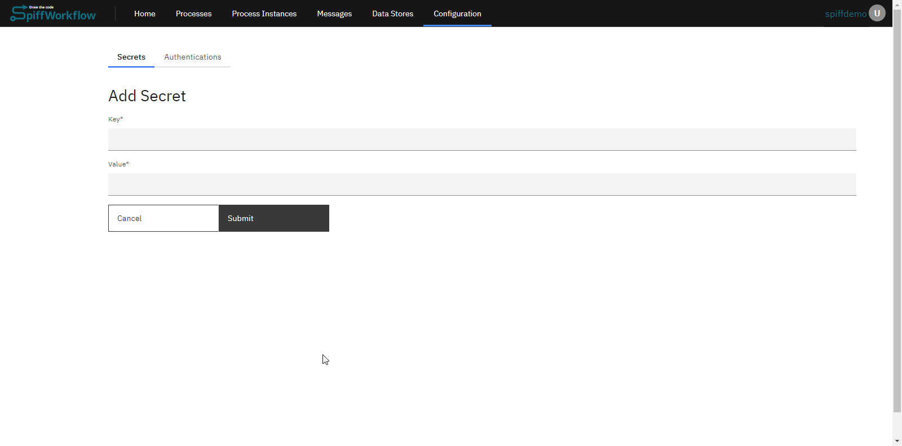
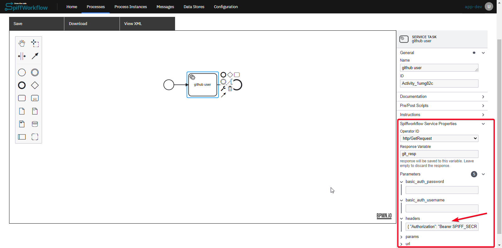

# How to Configure Secrets in SpiffArena

## Introduction

This document aims to guide users and administrators on how to configure secrets in SpiffArena, especially when dealing with BPMN diagrams stored in a public GitHub repository.
The primary use case focuses on ensuring that sensitive information like API keys or OAuth tokens are not exposed while still making the process diagrams publicly available.

## Use Case

You might have service tasks in diagrams that require sensitive information like API keys or OAuth tokens, which you don't want to commit to GitHub.

SpiffArena allows you to create secrets that are stored in an encrypted format in the database.
These secrets can be referenced in the XML of the BPMN diagrams, ensuring that while the process is visible, the sensitive information is not.
Secrets are only used in service tasks.

## Roles and Permissions

- **SpiffArena Admin**: Can add or configure secrets.
- **External Service Admin**: For example, an admin in Bamboo HR can provide the API key that a SpiffArena admin would then configure as a secret.
- **Diagram Author**: Can reference secrets in service tasks but cannot see the actual secret values.
---

## How to Configure Secrets

### Adding a New Secret

1. **Navigate to the Configuration Section**: Go to the configuration section from the top panel and click on "Add a secret." Ensure you have admin access to SpiffArena.


2. **Add New Secret**: Create a new secret by entering a key and its corresponding value. Once saved, the value will be encrypted.


### Using Secrets in Service Tasks

1. **Open the BPMN Diagram**: Open the diagram where you want to configure the service task.

2. **Configure Service Task**: Click on the service task you want to configure and in the service properties panel, search for the Operator ID that you want to add a secret for and mention the response variable to capture the result of the request.

3. **Add Secret Reference**: In the parameters, you can reference the secret using the following format:

    ```xml
    spiffworkflow:parameter id="headers" type="any" value="{ "Authorization": "Bearer SPIFF_SECRET:github_oauth" }"
    ```

    Here, `SPIFF_SECRET:github_oauth` will be replaced by the actual, unencrypted value from the database when the service task runs.

---

Configuring secrets in SpiffArena provides a secure way to handle sensitive information in your BPMN diagrams.
It allows you to make your processes public without exposing critical data, thereby enhancing both transparency and security.
