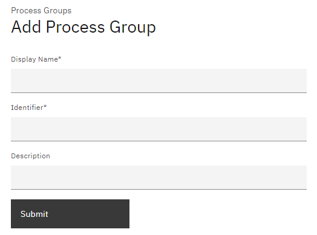
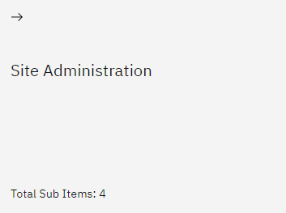
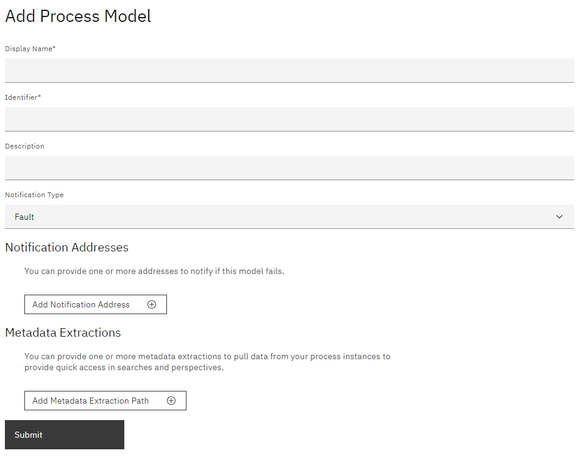
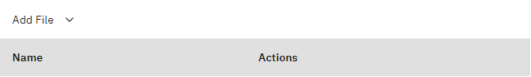
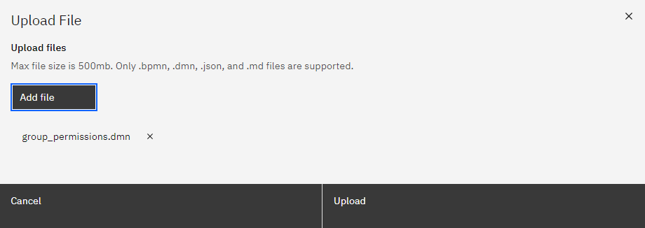
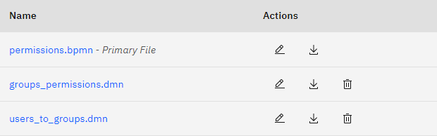
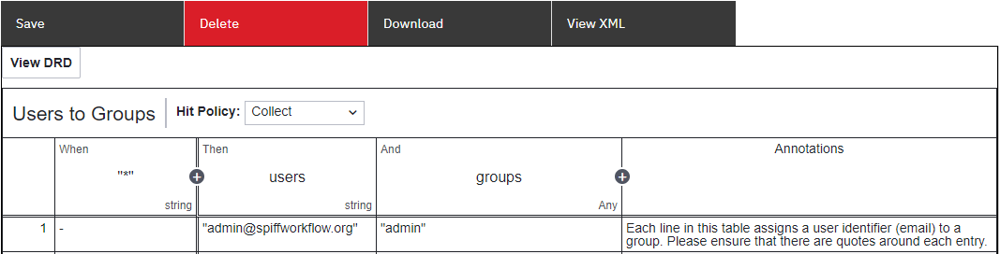
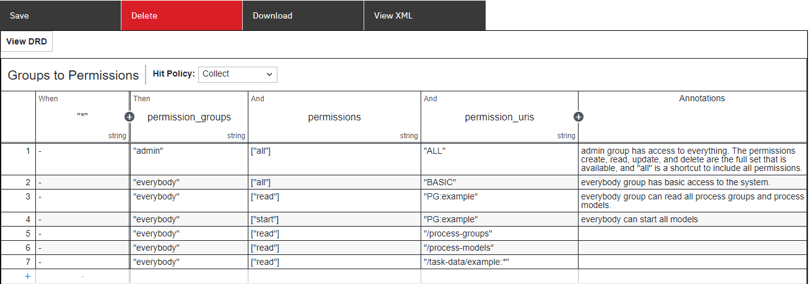

# Admin and Permissions

Permissions can be defined and managed at different levels such as process groups, individual processes, or users.

## Setting up Admin in Config (YAML)

To initiate the creation of a process model, it is necessary to configure the terraform_deployed_environment.yml file by including at least one Admin user.

[Git Repository - Config file](https://github.com/sartography/spiff-arena/tree/main/spiffworkflow-backend/src/spiffworkflow_backend/config/permissions)

```python
groups:
  admin:
    users: [admin@spiffworkflow.org]

permissions:
  admin-type-user:
    groups: [admin]
    actions: [create, read, update, delete]
    uri: /*
```

### Groups

The "groups" section defines a group called "admin."
This group is intended for users who have administrative privileges within the system.
In this example, the "admin" group consists of a single user with the associated email address.
Multiple groups can be added.

### Permissions

Each permission has a name.
This is just for documentation purposes and isn't used by the system.
In this example, we are describing permissions for an "admin-type-user."

There are three keys allowed under each permission:
* groups: lists the groups to which the permission applies (admin in this case)
* actions: lists the specific actions that are permitted for the group
   * actions can be negated by prepending with "DENY:"
* uri: defines the target resource for these permissions
   * /* indicates that the permissions apply to all resources within the system

**Permissions allowed:**

- create

- read

- update

- delete

- start

- all

To allow reading and updating, it would look like this:

````
["read", "update"]
````

To allow reading and DISALLOW updating, it would look like this:

````
["read", "DENY:update"]
````

## Site Administration

Once the basic configuration setup is completed, specifying admin rights, you generally won't require additional permissions for designing processes and using the site.
However, there might be certain situations that call for access control beyond the site or group level.
In such cases, you have the flexibility to define and tailor admin requirements in a more detailed manner to fulfill specific needs.

### Step 1: Create Process Group

From the main menu select 'Processes' and click on the 'Add a process group' button.


Complete the Process Groups form by entering the

- Name (ensuring it reflects admin and permissions)
- Identifier (which must be unique)
- Description.

Once the required fields are filled, the form can be submitted.



The new Process Groups tile will be available under the Process Groups view.



### Step 2: Add Process Model

- Select 'Add a process model' and complete the following form fields:
- Name: Provide a descriptive name for the process model.
- Identifier: Enter a unique identifier for the process model.
- Description: Provide a brief description of the process model, outlining its purpose or functionality.
- Notification Type: Specify the type of notification related to the process model.
- Notification Addresses: Enter the addresses or destinations where notifications should be sent in the event that a process instance encounters an error.
You do not need to worry about setting these values unless you are interested in custom {ref}`process_error_handling`.
- Metadata Extraction Path: You can provide one or more metadata extractions to uplift data from your process instances to provide quick access in searches and perspectives.
Specify the key and path/location where metadata extraction should occur within the process model.
For example, if you have a script task that runs the statement `great_color = "blue"`, then you would set the extraction path to `great_color`.
You would probably also set the extraction key to `great_color`.
But if you wanted to, you could just call it `color`, assuming you wanted that to be the name used in reports, etc.

Make sure to accurately fill in all the required fields in the Process Model form to ensure proper configuration and functionality.



### Step 3: Upload Workflows

All the required workflows can be downloaded from [Github - set-permissions](https://github.com/sartography/sample-process-models/tree/sample-models-1/site-administration/set-permissions)

Select to upload all downloaded files to the newly created Process model.


**Upload the following files:**

- permissions.bpmn - _Primary file_
- groups_permissions.dmn
- users_to_groups.dmn



The Process Model view should now include all uploaded files.


### Step 4: Understand the Process Models

[Read more about DMN tables and how they work here.
](../Building_Diagrams/dmn.md)

#### Users to Groups

Assess the roles and responsibilities of users within your organization or system.
Look for common patterns or similarities in their job functions and tasks related to specific processes or process groups.

Add a user email under the users 'column' and the group name under 'groups' and don't forget to add double quotes.

```{admonition} Note
Based on DMN functionality, leaving the "*" column empty means that all rules ('When') will be triggered without specifying a condition.
Read more about DMN tables to understand how the rules engine can be utilized for many different scenarios.
```



#### Group Permission

Now that the groups have been identified, their permissions can be set by adding the group name under the "permissions_group" column.

- To determine a user's capabilities within the permissible scope, you can define specific permissions.
These permissions can be combined in a sequence if multiple apply to a particular rule.
For instance, ["read", "start"] indicates that the user can perform both reading and starting actions.
Alternatively, [All] can be employed to grant unrestricted access.
- The hit policy is set to "Collect" which means that all conditions that are true will be applied.
[Read more about DMN tables and hit policies here.](../Building_Diagrams/dmn.md)
- The permission URL can be configured to define the user's access privileges.
Our objective is to streamline the process by minimizing the necessity of being familiar with the complete set of permission URLs.
In most instances, utilizing BASIC and ELEVATED permissions, as well as PM/PG, should be sufficient.
However, it is also feasible to directly incorporate any API URL into the permissions.

In truth, what you are doing is writing an expression.
In this case, it would read that if the variable 'permissions_group' type string is equal to 'permissions' variable of type string then set the 'permission_url' equal to the associated value.

```{admonition} Note
If you find coding more familiar and preferable to constructing DMN tables, you may notice similarities between this DMN table and the shared permission configuration file.
This similarity can help clarify or make it easier for you to understand the DMN table structure and its relation to the permission configuration.
```



### Step 5: Start Process

To ensure that User Groups and Permissions take effect, it is necessary to run the process at least once.
Whenever changes are made to any of these diagrams, like adding a user group or permission, the process should be started and completed successfully in order for the changes to be applied.
