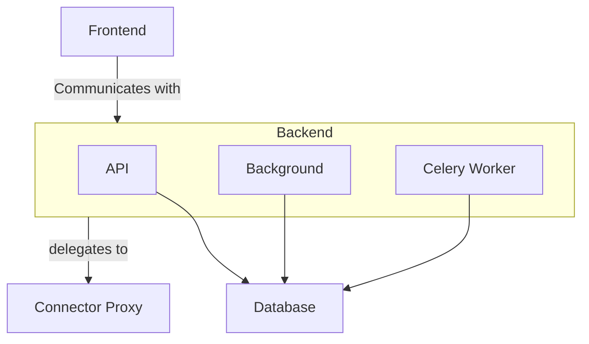

# Deployment

The minimal deployment is to mimic the docker-compose.yml file at the root of spiff-arena.
Steps for a more hardened production setup after that baseline include:

1. Setting up a MySQL or PostgreSQL database for Backend persistence (instead of SQLite)
2. Setting up a Redis/Valkey or RabbitMQ server for a Celery broker.
3. Separating out the Backend deployment into three deployments: 1) API, 2) Background, and 3) Celery worker.

API, Celery Worker, Connector Proxy, and Frontend can run any number of replicas.
The Background container is like a cron container, so it should run only one replica.
