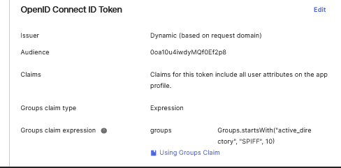

### **Documentation Item: Configuring Okta as an OpenID Provider for SpiffWorkflow**
This guide provides steps to configure Okta as an OpenID Provider (alternative to Keycloak) for SpiffWorkflow. 

The setup involves creating an OpenID Connect (OIDC) application, configuring environment variables, and ensuring group information is passed through correctly.  

### **1. Setting Up OpenID Authentication with Okta**

1. Follow the [Okta App Integration Wizard](https://help.okta.com/en-us/content/topics/apps/apps_app_integration_wizard_oidc.htm) to create an **OpenID Connect (OIDC) Web Application**.
   - This step provides you with a **Client ID** and a **Client Secret** key.
   - Note: For more complex enterprise setups (like Emerson), further Okta configurations may be required.

2. **Key Requirements**:
   - Obtain the following details:
     - OpenID Server URL
     - Client ID
     - Client Secret Key  

### **2. Configuring Environment Variables in SpiffWorkflow**

Set the following environment variables on your SpiffWorkflow backend server to connect with your Okta instance:

```bash
# OpenID Server URL
SPIFFWORKFLOW_BACKEND_OPEN_ID_SERVER_URL=<YOUR_OKTA_ISSUER_URL>

# Client ID and Secret Key from Okta
SPIFFWORKFLOW_BACKEND_OPEN_ID_CLIENT_ID=<YOUR_CLIENT_ID>
SPIFFWORKFLOW_BACKEND_OPEN_ID_CLIENT_SECRET_KEY=<YOUR_CLIENT_SECRET_KEY>

# OpenID Scopes (includes groups)
SPIFFWORKFLOW_BACKEND_OPENID_SCOPE="openid profile email groups"

# Allow OpenID Provider to manage user groups
SPIFFWORKFLOW_BACKEND_OPEN_ID_IS_AUTHORITY_FOR_USER_GROUPS=true
```

### **3. Adding a Groups Claim for Authorization Server**

To pass group information to SpiffWorkflow, configure the **Groups Claim** for your OpenID Connect client app in Okta.

1. Go to **Admin Console > Applications > Applications**.
2. Select the OpenID Connect client app you created.
3. Navigate to the **Sign On** tab and click **Edit** under the OpenID Connect ID Token section.
4. In the **Group claim type**:
   - Select **Filter** (default) or **Expression**.
   - For the **Group claims filter**:
     - Leave the default name `groups` or enter it manually.
     - Set the filter to `Matches regex` and use `.*` to return all user groups.
5. Click **Save**.
6. Click **Back to applications**.
7. Use the **More** dropdown and select **Refresh Application Data** to apply the changes.

📘 **Reference**: [Customize Tokens and Groups Claim](https://developer.okta.com/docs/guides/customize-tokens-groups-claim/main/).

### **4. Passing Through Groups from Active Directory**

If your organization integrates Active Directory (AD) with Okta, follow these steps to include both **Active Directory** and **Okta-sourced groups** in the token:

1. Use the following Okta documentation for guidance:  
   [Retrieve AD and Okta Groups in OIDC Claims](https://support.okta.com/help/s/article/Can-we-retrieve-both-Active-Directory-and-Okta-groups-in-OpenID-Connect-claims?language=en_US).

2. Adjust the configuration to ensure group information is included in the OpenID Connect token passed to SpiffWorkflow.

Example filters and regex:
- `Matches regex: .*` (to include all groups)
- Filter based on specific group attributes as required by your organization.

### **5. Final Notes for Group Configuration**

- Ensure the `groups` claim is correctly configured to match your Active Directory and Okta group requirements.
- Verify that groups are being passed to SpiffWorkflow:
   - Run a test by logging in and inspecting the OpenID token (e.g., using a JWT decoder).
   - Confirm that the group claims are being sent as part of the token payload.

### **Example Configuration for Emerson**

For one of our users, the following setup was used to pass group information to SpiffWorkflow:



- Environment variables included the OpenID details and group scope.
- Groups were fetched from Active Directory and passed through to SpiffWorkflow using Okta's configuration tools.


📘 For additional details, refer to Okta’s documentation or the SpiffWorkflow team for troubleshooting.  
🔗 **Helpful Links**:  
- [Okta App Integration Wizard](https://help.okta.com/en-us/content/topics/apps/apps_app_integration_wizard_oidc.htm)  
- [Groups Claim Documentation](https://developer.okta.com/docs/guides/customize-tokens-groups-claim/main/)  
- [Active Directory Groups in Okta](https://support.okta.com/help/s/article/Can-we-retrieve-both-Active-Directory-and-Okta-groups-in-OpenID-Connect-claims?language=en_US).  