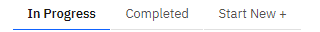
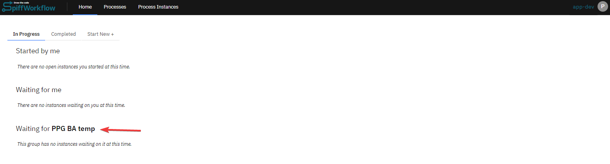
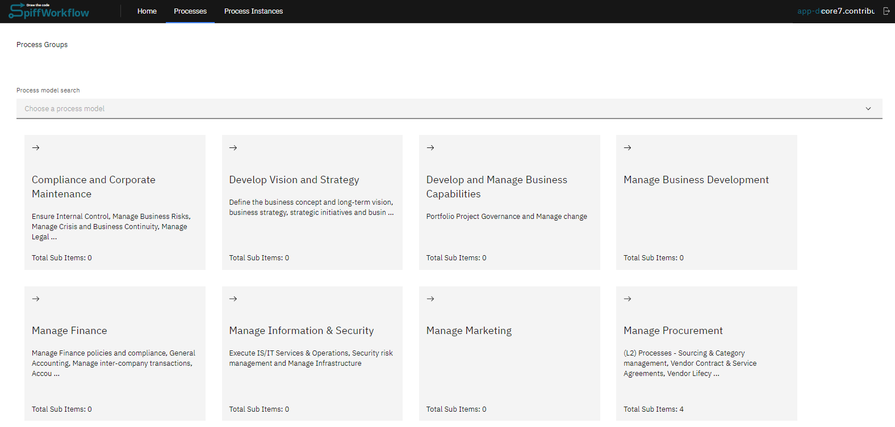
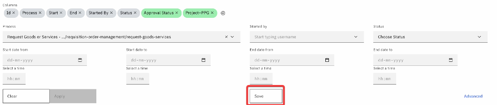
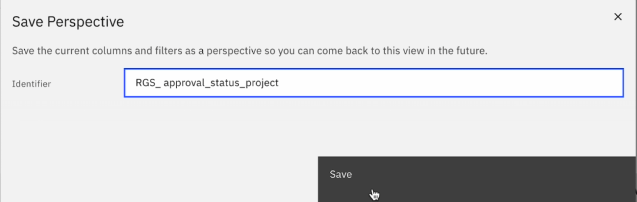

# QuickStart Guide

```{admonition} Welcome to the SpiffWorkflow quick start guide!
:class: info

👇 Throughout this step-by-step guide, we will walk you through key components of SpiffWorkflow, ensuring that you have a clear understanding of how to use the platform effectively.
```

## 🚀 Getting Started with SpiffArena

Sartography, the company that shepherds the SpiffWorkflow and SpiffArena projects, provides users with a platform to explore workflow concepts through a collection of examples, diagrams, and workflows.
Users can interact with pre-built models, make modifications, and visualize process flows.

## How to Log in to SpiffArena

```{image} ./images/Login.png
:alt: Login Screen
:class: bg-primary mb-1
:width: 230px
:align: right
```

To begin your journey with SpiffArena, open your web browser and navigate to the SpiffArena website (currently spiffdemo.org).

On the login screen, you will find the option to log in using Single Sign-On.
Click the Single Sign-On button and select your preferred login method, such as using your Gmail account.

```{admonition} Note:
Stay tuned as we expand our sign-on options beyond Gmail.
More ways to access SpiffArena are coming your way!
```

## How to Navigate through SpiffArena

In this section, we will navigate through the platform and provide a general overview of each section step-by-step, allowing you to understand and engage with the platform more effectively.

### Step 1: Explore the Home section

Once you are signed in, you can start exploring the home page.
The home page has three tab sections: **In Progress**, **Completed**, and **Start New**.



- The "In Progress" section provides an overview of all ongoing process instances, including those initiated by you, those awaiting your action, or those awaiting action from a team you are a member of (Optional).
- The "Completed" section allows you to view all completed process instances, including those initiated by you, those initiated by other SpiffWorkflow users with tasks completed by you, and, if applicable, those with tasks completed by a group of which you are a member.
- The “Start New” section displays the processes you are permitted to start according to your role.

```{admonition} Key terms
:class: info
💡 **Process:** A process is a sequence of tasks that must be completed to achieve a specific goal.

**Instance:** An instance, on the other hand, represents a specific occurrence of a process.
Each instance has its own set of data and state that is updated as the instance progresses through the workflow.
```

If you are a member of a team, you may also have one or more instances with tasks waiting for [team name] lists as well.



### Step 2: Explore the Processes section

The process section provides a comprehensive view of the process ecosystem by showcasing process groups and process models.

```{admonition} Process Groups
A **process group** is a way of grouping a bunch of **process models**, and a **process model** contains all the files necessary to execute a specific process.
```


### Step 3: Explore the Process Instances section

The Process Instance section provides a detailed view of individual process instances, allowing you to track their progress and manage them effectively.

This section includes essential information such as the instance ID, process name, the individual who started the process, the end date, and the current status.


When getting started with SpiffWorkflow, it's essential to take the time to explore and familiarize yourself with the platform's interface and features.
Feel free to ask questions about the platform's features or how to get started.

---

## How to Start a Process

With SpiffWorkflow, you can easily initiate a new process instance.
Here's a step-by-step guide on how to start a process.

### Step 1: Sign in and navigate to the Home section

The first thing you need to do is sign in to your account on SpiffWorkflow.
Once you're signed in, you'll see three tabs in the Home section: In progress, Completed, and Start New.
If you want to start a new process, click the "Start New +" button.
This will bring up the "Processes I can start" section.


```{admonition} The Landing Page
:class: info
💡 The landing page will be the **Home section** by default, and you can navigate to other sections.
```

### Step 2: Select the process

Next, you will see a list of available processes that you have permission to start.
Choose the process you want to initiate and click “Start”.


You have successfully started a new process instance in SpiffWorkflow.

If a process model doesn't have an associated BPMN file, the system will not display a start button.
This is to prevent confusion and errors that might arise from attempting to start an incomplete process model.

---

## How to respond to a request

When using SpiffWorkflow, knowing how to respond to requests is essential to the process.
While each request may have unique requirements, the basic steps for responding are similar.
The following steps will guide you through the process of responding to requests.

### Step 1: Navigate to the home page

Once you are signed in, navigate to the home page of SpiffWorkflow.
On the home page, you will see a list of all the requests that are available to you.

There will be three types of instances shown:

- **Started by me:** This section shows a list of process instances that were started by you, providing you with an overview of the instances you have initiated.
- **Waiting for me:** This section displays a list of process instances with tasks assigned to you and are currently waiting for you to respond to.
- **Waiting for [team name]:** If you are a member of SpiffWorkflow, this section displays a list of process instances with tasks assigned to a group you are a member of and currently waiting for someone in that group to complete them.


In the case of new users who haven't started or been part of any process or been assigned to any team, you won't be able to see any items on the home page.


### Step 2: Respond to the request

Once you have identified the request you need to respond to, simply click on the 'Go' button in the action column to open it.
Upon opening the process instance, you can respond to the request based on the requirements of that task.

Depending on the task requirements, this may involve submitting additional information, reviewing the task, or any other action item.


That's it!
With these simple steps, you can efficiently review tasks in SpiffWorkflow.

---

## How to view process steps for the process you just started

After starting a process, it's important to stay informed about its progress.
Even though you'll receive notifications when your attention is required, it's natural to be curious about what's happening in the background.
Therefore, monitoring the process steps regularly is a great way to ensure everything is moving smoothly.

Here's how you can view the steps of the process you just started.

### Step 1: Navigate to the “Home” or “Process Instance” section

There are two ways of finding your process instances.

Option 1: Once you're signed in, navigate to the home section.
Here you will find a list of all the process instances you've initiated.


Option 2: You can also view the processes you have initiated in the **"Process Instances"** section.


### Step 2: Select the process instance you want to view

Click on the process instance you want to view.
This will take you to the process instance information.
Navigate to the BPMN diagram section.
Here you can see the current task highlighted in **yellow**.
The grey represents the path which was taken by the current process steps.


By following these steps, you can easily view the steps of the process you initiated and keep track of progress.

---

## How to view the Process-defined metadata for a process instance

The Process-defined **metadata can provide valuable insights into its history, current status, and other important details that are specifically created and used within a particular process**.
With the SpiffWorkflow platform, users can easily view the metadata for a process instance.

To check the metadata of a process instance, follow these steps.

### Step 1: Navigate to the “Home” or “Process Instance” section as before

Once you're signed in, navigate to the home section.
Here you will find a list of all the process instances you've initiated under **“Started by me”**.


### Step 2: View metadata for the selected process instance

Click on the process instance you want to view.
Upon clicking this, you will be able to view the information about the given instance.
You'll find the metadata under the details option in the process instance.


By following these simple steps, you can easily view the metadata for a process instance in SpiffWorkflow.

---

## How to view Process Model files

The process model files provide great transparency into our internal business rules and processes.
You can dig deep into the decision-making process and really understand how the process and organization operate.
With these steps, you'll be able to access process models easily and efficiently.

### Step 1: Head over to the process section

Once you have successfully signed in, navigate to the process section.
This section allows you to access all the process groups and process models you have access to.



### Step 2: Find and click on the process

You can either search for a process model using the search bar or navigate through displayed processes to find the process model.


### Step 3: Access the process model files

Once you have clicked on the process you want to view, a list of the model files that are associated with the process will appear.


By following these simple steps, you can easily view process model files in SpiffWorkflow.

If you want to view or create information on specific process models, we allow you to create an about section.


If you are creating a model, you can add information in the about section.
We have integrated Markdown support, enabling you to create rich, formatted descriptions for your process models directly within the platform.
In order to use this feature, simply create a **README File** inside the process model called README.md and document the model, so everyone can be on the same page.

Furthermore, to check the process instances you started, you can also switch to the "My process instance" tab.


---

## How to view and filter process instances

As you work on various process instances in SpiffWorkflow, you may want to view and filter some of them.
This can help you track the status of various instances and manage them more efficiently.

Here are the steps to view and filter process instances in SpiffWorkflow.

### Step 1: Navigate to Process Instances

Once you are signed in, navigate to the "Process Instances" section.
Within the "Process Instances" section, you'll see a list of all the instances for the processes you can access.


If you are on a home page, you can navigate to the table you wish to filter.
Look for the black funnel icon in the top right-hand corner above the table and click on the icon.
By clicking on the filter icon, you'll be taken to a full-screen process view.


### Step 2: Click on Filter option

To filter the list, click on the "Filter" option.
This will expand the filter section where you will be able to provide details about the process instance.
This allows you to enter various details, including the process model, start date, end date, and time.
To refine your search, you can enter multiple filter parameters.


### Step 3: Apply Filters

Once you have entered all the relevant filter details, click on the "**Apply**" button to apply the filters.
The system will then display all the process instances matching the input details.


To filter process instances by **process-defined metadata**, follow these steps:
- Search for the specific **process** you want to filter and click on the column option to select metadata options.

- The metadata fields will be displayed in the dropdown.
Select the field you want to display and click on "**Save**" to apply the changes.


- After saving the details, the newly created column will be displayed.
Finally, click on the “**Apply**” button to reflect the changes.


### (Optional) Step 4: Save Perspectives

If you wish to save the perspectives, click on the "**Save**" button.



A prompt will appear, allowing you to provide a name for the identifier associated with the saved filter.
Enter a descriptive name for the filter identifier and “**Save**” changes.
Now you can search for specific processes using Process Instance Perspectives.




### (Optional) Step 5: Filter by ID


If you want to filter by ID, go to the "Find by Id" section of the page.
Enter the ID and click "Submit".
The system will show you the process instance with the corresponding ID.

You can now view the process instances that you filtered for and take appropriate action based on their status.
This can help you manage your workflows more efficiently and keep track of the progress of various process instances.

---

## How to Interpret Colors in a BPMN Diagram

One of the key features of BPMN diagrams in SpiffWorkflow is the use of colors to represent different states or statuses of process instances.

Here are the colors used in BPMN Process:

1. **Grey Color:**
   - **Meaning:** The task is completed.
   - **Implication:** Tasks or activities associated with this process have been successfully completed, and no further action is required.


2. **Yellow Color:**
   - **Meaning:** The process instance has started and is currently in progress.
   - **Implication:** This color signifies that the task is active and ongoing.
   It may require monitoring or further inputs to proceed.


3. **Red/Pink Color:**
   - **Meaning:** Indicates errors in the task.
   - **Implication:** There might be issues or obstacles preventing the task from proceeding as expected.
   Immediate attention and troubleshooting may be required.


4. **Purple Color:**
   - **Meaning:** The activity has been canceled.
   - **Implication:** This task was intentionally stopped before completion.
   This could be due to time constraints, external triggers, or other predefined conditions that have been set as boundary events.


---
## How to Check Milestones and Events

### Milestones

A milestone is a specific point in a process that signifies a significant event or state.
It provides a high-level overview of the progress made in the process.


In BPMN, if you draw an intermediate event and do not specify its type (like message, signal, start, or end) but give it a name, it becomes a milestone.
Essentially, a milestone is an event that hasn't been set to something specific.

### Events

Events provide a detailed log of everything that happens in a process.
They record every task and its execution time.


The events tab provides a detailed log of all the tasks and their execution times.
It can be noisy due to the granularity of the information, but it's essential for understanding the intricacies of the process.

---
## How to Check Messages

Messages in BPMN allow processes to communicate with each other.
This communication can take various forms:

- Two processes running concurrently, exchanging messages.
- One process initiating another through a message.
- An external system making an API call, passing a payload (like a JSON data structure) that can either communicate with an ongoing process or initiate a new one.

### The Waiter-Chef Illustration

To explain the concept, we are using a relatable example involving two processes: the Waiter and the Chef.

**Waiter Process**:


1. The waiter takes an order.
2. This order is then communicated to the chef via a message.
3. The waiter then waits for a response from the chef, indicating the order's readiness.

**Chef Process**:


1. The chef starts by receiving the order message from the waiter.
2. After preparing the meal, the chef sends a message back to the waiter, signaling that the order is ready.

### Setting Up the Processes

The setup involves creating two process models named "Chef" and "Waiter."
The waiter's process involves taking an order, setting up variables like table number, drink, and meal, and then sending a message to the chef.
The chef's process starts by listening for the order message, preparing the meal, and then sending a confirmation message back to the waiter.

### Correlation Keys and Properties

One of the complexities in BPMN messaging is ensuring that the right processes are communicating with each other, especially when multiple instances are running.
This is achieved using correlation keys and properties.


- **Correlation Keys**: These represent the topic of the conversation.
In the given example, the correlation key is the "order".

- **Correlation Properties**: These are unique identifiers within the conversation.
In the example, the "table number" serves as the correlation property, ensuring the right waiter communicates with the right chef.

### Execution and Observation

Upon executing the waiter's process, it sends a message to the chef and waits.
The chef's process, upon receiving the message, requires user input (indicating the meal's completion).
Once the chef confirms the meal's readiness, a message is sent back to the waiter, completing both processes.

For a more visual understanding and a step-by-step walkthrough, you can watch Dan Funk's full tutorial [here](https://www.youtube.com/watch?v=Uk7__onZiVk).

---
## How to Share Process Instances with Short Links

The short link feature provides a convenient way to share process instances with others without the need to copy and paste lengthy URLs.
This feature is especially useful for quick sharing via email, messaging apps, or within documentation.

To copy the short link:

- **Access the Process Instance**: Open the process instance that you wish to share.
- **Find the Short Link Icon**: Look for the link icon near the process instance heading and click on the link icon to copy the short link to your clipboard automatically. Please refer to the screenshot provided.


Now, you can paste the short link into your desired communication medium to share it with others.

---
## How to View Who Completed User Forms

To access and review completed user forms within a specific process model, follow these guidelines:

1. **Find the Tasks Tab in Process Instance**: Begin by going to the process instance and scrolling to locate the 'Tasks' tab. This area displays all user forms connected to the process.

2. **Examine Completed Forms**:
   - **Forms You Completed**: In this section, you can view the forms that you have completed.
   It allows you to see the specific details and inputs you provided in each task.
   

   - **Forms Completed by Others**: This part shows all the forms completed by any user.
   You can see who completed each form and the last time it was updated.
   However, for privacy and security reasons, you won't be able to view the specific input details of forms completed by others.
   

This approach ensures you can monitor and review the progress of user forms within any process model while maintaining the confidentiality of inputs made by other users.

---
## How to View Task Instance History

Monitoring the history of task instances is helpful for tracking the progress and execution details of a workflow.
This guide provides a step-by-step approach to access and understand the task instance history, including the interpretation of task statuses.

### Steps to Access Task Instance History

1. **Run the Process**: Initiate a workflow process in SpiffWorkflow.

2. **Access the Process Instance**: After running the process, navigate to the specific process instance within the SpiffWorkflow interface.
This is where you can track the progress of the tasks.


3. **View Task Details**: Click on the executed task or event that has been completed.
For instance, in this example, we clicked on "user task".


You will be presented with detailed information about each task instance, including its status and execution timestamp.

For example:
   - `2: 04-01-2024 19:58:11 - MAYBE`
   - `3: 04-01-2024 19:58:10 - COMPLETED`
   - `4: 04-01-2024 19:58:07 - COMPLETED`


- **COMPLETED Status**: Tasks marked as 'COMPLETED' have finished their execution successfully and have moved the workflow forward.
- **MAYBE Status**: Indicates that the task still exists within SpiffWorkflow.
While these tasks could be omitted for clarity, retaining them provides a complete picture of the workflow's execution.

Viewing task instance history in SpiffWorkflow is now more streamlined and informative, thanks to recent updates.
Users can effectively track each task's execution, status, and timing, gaining insights into the workflow's overall performance.
