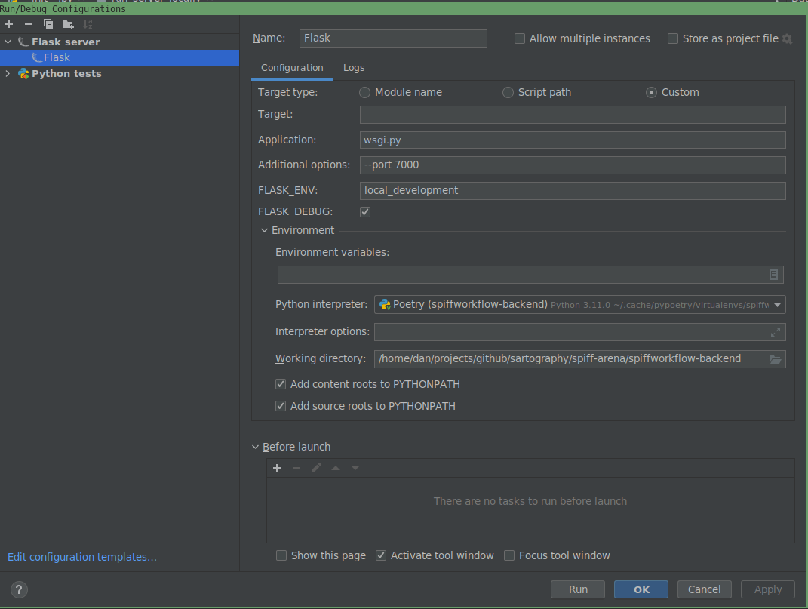
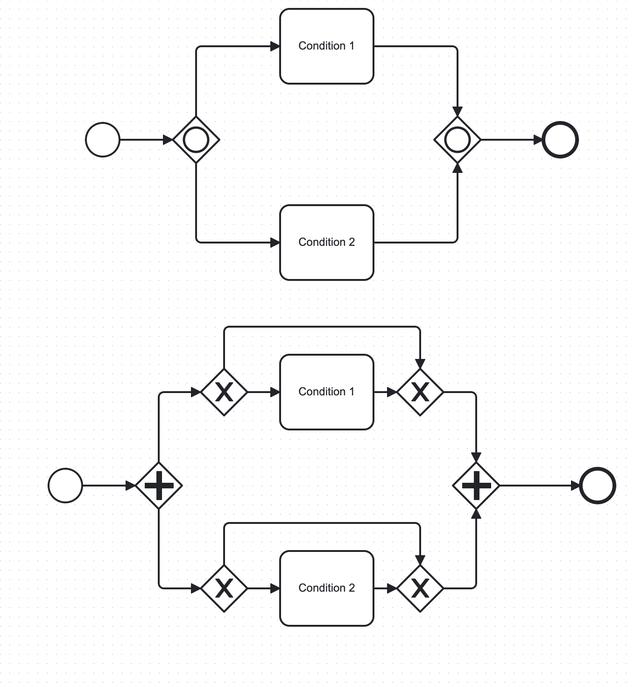

# Frequently Asked Questions

## Support and Administration

### **1. Running SpiffWorkflow in PyCharm**

**Q:** Is there a setup where I can run it within PyCharm?
**A:** Yes, you can run SpiffWorkflow within PyCharm. For detailed settings, refer to the provided screenshot of Flask server details.



### **2. Adding Python Libraries to SpiffWorkflow**

**Q:** Is there documentation available for adding Python libraries to SpiffWorkflow? For example, if I want to run a process to send emails, I would need `smtplib`.
**A:** The default answer for something like sending emails would be to use a service task. We have an SMTP connector designed for this purpose. If you're using SpiffArena, a connector proxy can provide a nice integration into the UI. Here are some helpful links:

- [SMTP Connector](https://github.com/sartography/connector-smtp)
- [Spiff-Connector Demo](https://github.com/sartography/connector-proxy-demo)
- [BPMN, DMN samples for SpiffWorkflow](https://github.com/sartography/sample-process-models/tree/jon/misc/jonjon/smtp)

### **3. Tutorials on Using SpiffWorkflow**

**Q:** Are there any tutorials available on how to use SpiffWorkflow?
**A:** Yes, here are some references:

- [SpiffExample CLI](https://github.com/sartography/spiff-example-cli)
- [SpiffArena Documentation](https://spiff-arena.readthedocs.io/)
- [SpiffWorkflow Documentation](https://spiffworkflow.readthedocs.io/en/stable/index.html)
- [Getting Started with SpiffWorkflow](https://www.spiffworkflow.org/posts/articles/get_started/)

### **4. Understanding Task Data in Custom Connectors**

**Q:** What kind of data can I expect from `task_data`?
**A:** The `task_data` param contains data comprised of variables/values from prior tasks. For instance, if you have a script task before your service task that sets `x=1`, then in the `task_data` param, you should see `{"x": 1}`.

### **5. Understanding and Using Custom Connectors**

**Q:** What are custom connectors and how do I use them?
**A:** Custom connectors in SpiffWorkflow allow for integration with external systems or services. They enable the workflow to interact with other platforms, fetch data, or trigger actions. To use them, you'll typically define the connector's behavior, specify its inputs and outputs, and then use it within your BPMN process as a service task.

### **6. Using Data Object Reference and Data Store Reference**

**Q:** What are some good references for "Data Object Reference" and "Data Store Reference" in SpiffWorkFlow?
**A:** Here are some references to help you understand and implement "Data Object Reference" and "Data Store Reference" in SpiffWorkflow:

- [Understanding BPMN's Data Objects with SpiffWorkflow](https://medium.com/@danfunk/understanding-bpmns-data-objects-with-spiffworkflow-26e195e23398)
- [Data Encapsulation with SpiffWorkflow Video](https://youtu.be/0_PgaaI3WIg)

### **7. Resetting a Workflow**

**Q:** Is there a way of "resetting" a workflow without reloading the BPMN and DMN files?
**A:** Yes, you can reset a workflow using the following code:

```python
start = workflow.get_tasks_from_spec_name('Start')[0]
workflow.reset_from_task_id(start.id)
```

### **8. Integrating SpiffWorkflow with other Python code**

**Q:** How do you integrate your workflow with other Python code?
**A:** Integrating SpiffWorkflow with other Python code is straightforward. You have two primary methods:

1. **Script Tasks**: These allow you to execute Python code directly within your workflow. This method is suitable for simpler integrations where the code logic is not too complex.
2. **Service Tasks**: For more complex integrations, you can write services that can be called via service tasks within your workflow. This method provides more flexibility and is ideal for scenarios where you need to interface with external systems or perform more intricate operations.

### **9. Using Call Activity for preconfigured modular subprocesses**

**Q:** I need my users to generate many BPMN workflows by dropping preconfigured subprocesses into their workflows. Is this possible?
**A:** Yes, you can use a "Call Activity" in SpiffArena to reference other processes in your diagram. SpiffArena provides a way to search for other processes in the system that can be used as Call Activities. This means you can create modular workflows by designing subprocesses (like ‘send to accounts’) and then incorporating them into multiple main workflows as needed. This modular approach not only streamlines the design process but also ensures consistency across different workflows.

### **10. Integrating SpiffWorkflow with External Role Management**

**Q:** How do I make external application user roles affect permissions on a task?
**A:** You can manage the roles externally in an OpenID system and access the user and group information in the Lanes of your BPMN diagram.

### **11. Understanding Workflow Data vs Task Data**

**Q:** What is the difference between the `workflow.data` and `task.data`?
**A:** Task data is stored on each task, and each task has its own copy. Workflow data is stored on the workflow. If you use BPMN DataObjects, that data is stored in workflow data.

### **12. Understanding Secrets and Authentications in SpiffArena**

**Q:** What are 'Secrets' and 'Authentications' used for in SpiffArena?
**A:** Secrets are used for communicating with external services when you use service tasks and connectors. Authentications are used when you need to OAuth into an external service. Check out more information [here](https://spiff-arena.readthedocs.io/en/latest/DevOps_installation_integration/Secrets.html).

### **13. Determining the Lane of a Task in a Workflow**

**Q:** In the pre/post script of a task in a workflow, how do I determine what lane the current task is in?  
**A:** You can access the task and use `task.task_spec.lane` to get the lane as a string. This allows you to programmatically determine which lane a task belongs to during its execution.

### **14. Understanding Script Attributes Context**

**Q:** I'm trying to understand the details of `script_attributes_context`. Where can I find more information?  
**A:** The `ScriptAttributesContext` class is defined [here](https://github.com/sartography/spiff-arena/blob/deploy-mod-prod/spiffworkflow-backend/src/spiffworkflow_backend/models/script_attributes_context.py#L9).

### **15. Using Message Start Event to Kick Off a Process**

**Q:** How do I use a message start event to kick off a process?  
**A:** This [script](https://github.com/sartography/spiff-arena/blob/main/spiffworkflow-backend/bin/run_message_start_event_with_api#L39) is an example of using a message start event to kick off a process.

### **16. Making REST API Calls in SpiffArena**

**Q:** How do I make REST API calls in SpiffArena?  
**A:** You can use Service Tasks driven by a Connector Proxy. Check out the [Connector Proxy Demo](https://github.com/sartography/connector-proxy-demo) for more details.

### **17. Assigning User Tasks in SpiffWorkflow**

**Q:** How does one use camunda:assignee="test" in a userTask with Spiff?  
**A:** In SpiffWorkflow, user task assignments can be managed using Lanes in your BPMN diagram. Each Lane can designate which individual or group can execute the tasks within that Lane. If you're looking to interface permissions based on external application user roles, you can manage roles externally and pass the user and group information to assign them to the Lanes.

### **18. Mimicking an Inclusive Gateway in SpiffWorkflow**

**Q:** How can we mimic an inclusive gateway since SpiffWorkflow doesn't support it?  
**A:** You can work around the absence of an inclusive gateway in SpiffWorkflow by using a Parallel Gateway. Within each path following the Parallel Gateway, you can place an Exclusive Gateway to check for the conditions that are or are not required. This approach is effective if the flows can eventually be merged back together.



### **19. Designing an Approval Process in SpiffWorkflow**

**Q:** I am designing an approval process using SpiffWorkflow. Can SpiffWorkflow handle scenarios where a task should complete
if more than 2 users approve out of 3 assignees?

**A:** Yes, SpiffWorkflow can handle complex approval processes. The [provided video](https://www.youtube.com/watch?v=EfTbTg3KRqc) link offers insights into managing such scenarios using SpiffWorkflow.

### **20. Process Instances in SpiffArena After Docker Compose Restart**

**Q:** I restarted docker-compose, and my process instances in SpiffArena aren't persistent. How can I ensure they remain after a restart?

**A:** Make sure you're using the updated "getting started" `docker-compose.yml` file that uses sqlite to persist the database between docker compose restarts.
This will ensure that your process instances remain after a restart.

If you're still facing issues, refer to the provided documentation on admin and permissions for further guidance.

### **21: Downloading and Re-uploading Process Models in SpiffArena**

**Q:** Is it possible to download a process model in SpiffArena and then re-upload it?

**A:** Yes, in SpiffArena, you can download a process model and then re-upload it. However, it's essential to note that all process IDs must be unique across the system. If you're re-uploading a process model, its ID might need to be modified to ensure uniqueness.

### **22: Understanding "Notification Addresses" and "Metadata Extractions" in SpiffArena**

**Q:** What are the "notification addresses" and "metadata extractions" fields when creating a new process model in SpiffArena?

**A:** When creating a new process model in SpiffArena, the "notification addresses" field is used to specify recipients for notifications related to that process.
The "metadata extractions" field is used to extract specific metadata from the process.
Detailed documentation for both fields is available.
It's worth noting that the functionality of "Notification Addresses" might undergo changes in the future to centralize the logic and avoid splitting configurations.

### **23: Issues with SpiffArena Frontend Loading**

**Q:** Why doesn't the SpiffArena frontend always load completely?

**A:** The issue might arise when the frontend cannot communicate with the backend.
Recent updates have been made to address this specific problem.
Previously, the backend could deadlock when it received a high number of concurrent requests, exhausting the available worker processes.

Since it uses built-in openid, each request would need to communicate with the backend itself.
This issue has been resolved in the newer versions.
To potentially fix this, you can update your setup by running the following commands in the directory where you downloaded the `docker-compose.yml` file:

```
docker compose pull
docker compose down
docker compose up -d
```

By doing this, you'll pull the latest images, shut down the current containers, and then start them up again with the updated configurations.
This should help in ensuring that the frontend loads completely and communicates effectively with the backend.

### **24: Resolving Docker Compose Issues on M1/M2 Mac in SpiffArena**

**Q:** I'm using an M1/M2 Mac and facing issues with docker-compose in SpiffArena. How can I resolve this?

**A:** Ensure that you're using the latest versions of Docker and docker-compose.
If you encounter messages about platform mismatches, note that these may just be warnings and not errors.
Update your images and restart the containers as needed.
Instructions in the getting started guide reference `curl`, but if that is not working for you, `wget` may be an option that is already installed on your system.

### **25: Importing External Modules in Script Tasks in SpiffArena**

**Q:** Why can't I import an external module in a script task in SpiffArena?

**A:** In SpiffArena, script tasks are designed for lightweight scripting and do not support importing external modules.
If you need to communicate with external systems, it's recommended to use a ServiceTask instead.
ServiceTasks in SpiffArena utilize a concept called Connector Proxy, an externally hosted system that adheres to a specific protocol.
For tasks like checking if an API is functioning correctly, you can set up a Connector Proxy to handle the request.
Detailed documentation available [here](https://spiff-arena.readthedocs.io/en/latest/DevOps_installation_integration/configure_connector_proxy.html).
If you want to bypass security features of the restricted script engine and import modules from your script tasks, you can set the environment variable: `SPIFFWORKFLOW_BACKEND_USE_RESTRICTED_SCRIPT_ENGINE=false`

### **26: Storage of Properties Data in SpiffArena**

**Q:** Where is the properties data stored in the properties panel?

**A:** The properties data is stored directly within the XML of the BPMN diagram. Some of this data is stored in extension elements.
For instance, the configuration for a service task can be found [here](https://github.com/sartography/sample-process-models/blob/sample-models-1/misc/jonjon/ham/ham.bpmn#L13) and instructions can be found [here](https://github.com/sartography/sample-process-models/blob/sample-models-1/misc/documentation/user-guide-basics/user-guide-basics.bpmn#L24). If you're considering bypassing the properties panel, it's essential to ensure that the XML output remains consistent with the expected format.

### **27: Starting a Task in SpiffArena**

**Q:** How do I start a task? What do I need besides BPMN?

**A:** To start a task, you'll need to have a proper BPMN diagram and a configured environment. The docker compose file, as mentioned on the [spiffworkflow.org](https://www.spiffworkflow.org/posts/articles/get_started/) website, provides a containerized environment for both the API and asynchronous processing. For a more robust production deployment, it's recommended to use separate containers for different functionalities.

### **28: Setting Up Own OpenID Provider**

**Q:** Any documentation on how to set up our own openid provider?

**A:** If you're using the spiff-arena/spiffworkflow-backend, there's a script named `./keycloak/bin/start_keycloak` that can initiate a container serving as an example OpenID provider. This can be a good starting point if you're looking to set up your own OpenID provider.

### **29: Configuring SMTP Server for Email Notifications in SpiffWorkflow**

**Q:** Where can I configure an SMTP server for Spiffworkflow to send email notifications?

**A:** To configure an SMTP server for email notifications, you can utilize connectors and service tasks within SpiffWorkflow. For instance, connectors can be set up to send notifications to platforms like Slack.

### **30: Accessing Timer Event Value/Expression in Code**

**Q:** Is there any way to access the timer event value/expression in my code?

**A:** Yes, in SpiffWorkflow, you can access timer event values directly from the backend. There are specific sections in the codebase where timer event values are checked and utilized for various functionalities.

### **31: Creating New Users in SpiffWorkflow**

**Q:** How can I create new users for my co-workers in SpiffWorkflow?

**A:** There are multiple methods to manage this, such as using OpenID or the process model. However, for beginners eager to add a user quickly, you can adjust the 'example.yml' configuration file within the app identified as ` 'SPIFFWORKFLOW_BACKEND_PERMISSIONS_FILE_NAME: "example.yml"`
After making changes, restart the container to update user details. For more information, refer to the [Spiff-Arena documentation](https://spiff-arena.readthedocs.io/en/latest/installation_integration/admin_and_permissions.html). The mentioned file can be found [here](https://github.com/sartography/spiff-arena/tree/main/spiffworkflow-backend/src/spiffworkflow_backend/config/permissions).

### **32: Understanding the Collaboration Flag in Spiff-Example-CLI**

**Q:** Explain the functionality and purpose of the collaboration flag in spiff-example-cli?

**A:** The collaboration flag enables the simultaneous loading of multiple top-level processes within a single workflow. This results in the creation of a subworkflow for each process, allowing them to initiate concurrently.

A practical application of this might be when two processes need to interact but remain independent of each other.

### **33: Custom Tasks and Services in Modeler**

**Q:** How can I draw custom tasks or services in the modeler that can run in Python SpiffWorkflow when loaded using the BPMN YAML file?

**A:** To create custom tasks or services in SpiffWorkflow, you have several options:

1. **Using SpiffArena**: You can author a diagram in SpiffArena, which provides a user-friendly interface for designing your workflow. Once your diagram is complete, save it in the standard BPMN XML format. This diagram can then be executed in the SpiffWorkflow library as per the documentation available [here](https://spiffworkflow.readthedocs.io/en/latest/).
2. **BPMN IO Extensions**: If you prefer to work outside of SpiffArena, you can use the BPMN IO extensions directly, available at [this GitHub repository](https://github.com/sartography/bpmn-js-spiffworkflow). Similar to SpiffArena, you'll save your custom diagram in BPMN XML format for execution in SpiffWorkflow.
3. **Service Tasks**: For creating service tasks within your custom BPMN diagrams, refer to the detailed documentation provided by SpiffWorkflow [here](https://spiffworkflow.readthedocs.io/en/latest/bpmn/advanced.html?highlight=service#service-tasks). This documentation will guide you on how to effectively integrate service tasks into your workflow.
4. **Defining Custom Applications**: If your workflow requires calling custom applications, you can define these within your BPMN diagram. For working outside of SpiffArena, ensure to provide hooks in the diagram editor to list available methods, services, etc. While SpiffArena and its Connector Proxy offer a streamlined approach for this, you have the flexibility to write your own connectors if needed.

By following these guidelines, you can create custom tasks or services tailored to your specific workflow requirements in SpiffWorkflow.

### **34: configure SpiffWorkflow to work with hostname instead of "localhost**

**Q:** How can I configure SpiffWorkflow to work with my computer's hostname instead of "localhost"?

**A:** To configure SpiffWorkflow to work with your computer's hostname, follow these steps:

1. **Modify Docker Compose File**: If you're using the Docker Compose file from the root of SpiffArena, you need to adjust the backend URL used by the frontend. Add a line in the environment section of your Docker Compose file to configure `SPIFFWORKFLOW_FRONTEND_RUNTIME_CONFIG_BACKEND_BASE_URL`. For example:

   ```yaml
   environment:
     APPLICATION_ROOT: "/"
     SPIFFWORKFLOW_FRONTEND_RUNTIME_CONFIG_BACKEND_BASE_URL: "http://itsm.local:8000"
     PORT0: "${SPIFFWORKFLOW_FRONTEND_PORT:-8001}"
   ```

2. **Using NPM Start**: If you're booting the frontend with `npm start`, set the environment variable like this:

   ```
   REACT_APP_BACKEND_BASE_URL=http://itsm.local:8000
   ```

3. **Add Extra Hosts in Docker Compose**: To ensure that both the SpiffWorkflow frontend and backend can resolve the hostname (e.g., `itsm.local`), add `extra_hosts` to your Docker Compose file. This step is crucial if your hostname is broadcasted on the network (like with avahi-daemon) and not known to the containers. Here's an example of how to add it:

   ```yaml
   services:
     spiffworkflow-frontend:
       ...
       environment:
         ...
         SPIFFWORKFLOW_FRONTEND_RUNTIME_CONFIG_BACKEND_BASE_URL: "http://${HOSTNAME}:${SPIFF_BACKEND_PORT:-8000}"
       ...
       extra_hosts:
         - "${HOSTNAME}:10.89.0.1"

     spiffworkflow-backend:
       ...
       environment:
         ...
         SPIFFWORKFLOW_BACKEND_URL: "http://${HOSTNAME}:${SPIFF_BACKEND_PORT:-8000}"
         ...
         SPIFFWORKFLOW_BACKEND_OPEN_ID_SERVER_URL: "http://${HOSTNAME}:${SPIFF_BACKEND_PORT:-8000}/openid"
         ...
         SPIFFWORKFLOW_BACKEND_URL_FOR_FRONTEND: "http://${HOSTNAME}:${SPIFFWORKFLOW_FRONTEND_PORT:-8001}"
       ...
       extra_hosts:
         - "${HOSTNAME}:10.89.0.1"
   ```

   In this configuration, `${HOSTNAME}` should be replaced with your actual hostname (e.g., `itsm.local`), and `10.89.0.1` represents the gateway IP address of your network, translating to the Docker host IP address.

4. **Update `/etc/hosts` Inside Containers**: By adding `extra_hosts`, the `/etc/hosts` file inside each container will contain an entry for your hostname, allowing both containers to access and resolve it.

By following these steps, you can successfully configure SpiffWorkflow to work with your computer's hostname, ensuring smooth operation outside the "host" computer environment.

### **35: Approval process in SpiffWorkflow**

**Q:** How do I model an approval process in SpiffWorkflow where each task may require a different approver?

**A:** To model an approval process in SpiffWorkflow with multiple tasks, each requiring a different approver, follow these steps:

1. **Understand the Approval Process**: First, clearly define the approval process, including the number of tasks and the specific approvers required for each task.

2. **Use User Tasks for Approval**: In SpiffWorkflow, you can use User Tasks to represent approval tasks. Each User Task can be assigned to a different approver based on your process requirements.

3. **Define Task Properties**: For each User Task, define properties such as the task name, description, and the approver's role or identifier. This ensures that the right approver is associated with each task.

4. **Sequence the Tasks**: Arrange the tasks in the order they should be executed. You can use sequence flows in your BPMN model to define the order and conditions under which each task should be initiated.

5. **Utilize Conditional Flows**: If your approval process has conditional paths (e.g., different paths based on the outcome of an approval), model these using exclusive gateways and conditional sequence flows.

6. **Review and Test**: Once you have modeled the approval process, review it to ensure it accurately represents the required workflow. Test the process to confirm that each task is assigned to the correct approver and that the workflow behaves as expected.

7. **Refer to SpiffWorkflow Documentation**: For detailed guidance and examples, refer to the SpiffWorkflow documentation, particularly the section on approval processes. The documentation provides valuable insights and best practices for modeling complex workflows. You can find more information at [SpiffWorkflow Approval Process Deep Dive](https://www.spiffworkflow.org/posts/deep_dives/approval).

By following these steps and utilizing the features of SpiffWorkflow, you can effectively model an approval process with multiple tasks and approvers, ensuring a smooth and efficient workflow.

### **36: Timer Start Event and internal scheduler**

**Q:** How does the Timer Start Event work in SpiffWorkflow, and is there an internal scheduler to execute workflows at the specified timer value?

**A:** In SpiffWorkflow, Timer Start Events are managed by an internal scheduler within the backend. This scheduler is
responsible for triggering workflows based on the timer values set in the Timer Start Events. To ensure that the scheduler
functions correctly, you need to start an instance of the process, which will then schedule the event for the appropriate time
based on the timer.
Additionally, there are environment variables like `SPIFFWORKFLOW_BACKEND_BACKGROUND_SCHEDULER_NOT_STARTED_POLLING_INTERVAL_IN_SECONDS` that control the polling time for the
scheduler. For more details, you can refer to the [SpiffWorkflow Backend Initialization Code](https://github.com/sartography/spiff-arena/blob/main/spiffworkflow-backend/src/spiffworkflow_backend/__init__.py).

### **37: Authentication tokens in SpiffWorkflow**

**Q:** How does authentication work in SpiffWorkflow, particularly regarding the use of authentication tokens?

**A:** A common approach for handling authentication involves using bearer tokens in the "Authorization" header of API
requests. If you encounter issues like "token invalid" responses, it's recommended to inspect the network traffic using your
browser's developer tools. This can help you understand how the token is being passed and whether it's correctly formatted. You
can copy any request to the backend as a curl command or inspect the headers to see how the bearer token is being used.
If the standard openid flow is not ideal for your use case, Service Account / API Token management can be implemented using a process model.

### **38: Configure SpiffArena to run behind a proxy server**

**Q:** How can I configure SpiffArena to run behind a proxy server, such as Traefik, and resolve issues with redirects and OpenID provider authentication?

**A:** Running SpiffArena behind a proxy server like Traefik involves several configuration steps to ensure proper communication between the frontend, backend, and the OpenID provider. Here are key points to consider:

1. **Subdomain Configuration:** When setting up SpiffArena with Traefik, it's common to create subdomains for different components (e.g., "traefik", "auth", "workflow", "workflow-backend"). However, you might encounter issues like redirect loops or authentication errors if the subdomains are not correctly configured.

2. **Environment Variable Settings:** The `SPIFFWORKFLOW_BACKEND_URL` environment variable is crucial as it informs the frontend about the backend's URL. If you're experiencing HTTP and HTTPS mismatches, it might be due to misconfiguration in Traefik and Flask communication. To resolve this, you can set the `FORWARDED_ALLOW_IPS='*'` environment variable, which allows the backend to correctly report its URL as HTTPS.

3. **Compatibility Check:** The `SPIFFWORKFLOW_BACKEND_CHECK_FRONTEND_AND_BACKEND_URL_COMPATIBILITY` environment variable is used to ensure that the frontend and backend URLs are compatible, particularly for cookie sharing. If you encounter issues with this check, you might need to adjust your domain setup to ensure that the frontend and backend are on the same domain or subdomain structure.

4. **Domain Structure:** A common setup involves having the frontend on `example.com` and the backend on `api.example.com`. This structure allows for seamless cookie sharing and authentication. If you initially set up different subdomains (e.g., `workflow.<domain_name>.com` and `workflow-backend.<domain_name>.com`) and face issues, consider switching to a structure like `api.workflow.<domain_name>.com` for the backend, or consider using path-based routing, where the same host is used for both frontend and backend, but the proxy server routes a specific path prefix (/api, /frontend) to each app as needed.

5. **Debugging and Testing:** Utilize the new API endpoint `/v1.0/debug/url-info` on the backend to verify how Flask perceives the URL. This can help identify any mismatches or misconfigurations in your setup, specifically if you access the app using https but the correct information from the request does not make it all the way to the flask application, and it therefore thinks it using running on http without SSL.

6. **Community Support:** If you encounter specific issues or need further assistance, consider reaching out to the community on platforms like GitHub or Discord. Sharing your configuration and experiments in detail can help others provide more targeted advice.

For more detailed guidance and examples of SpiffArena deployment configurations, you can refer to resources like the [Terraform Kubernetes Modules](https://github.com/mingfang/terraform-k8s-modules/blob/master/examples/spiffworkflow/README.md).

Remember, each deployment scenario can be unique, so it's important to tailor these guidelines to your specific setup and requirements.

### **39: Change in states of script tasks**

**Q:** Why does my script task in SpiffWorkflow change to the "STARTED" state instead of "COMPLETED" after execution, and how
can I resolve this?

**A:** The behavior of a script task transitioning to the "STARTED" state instead of "COMPLETED" can occur due to the way SpiffWorkflow handles potentially long-running tasks. Here's what you need to know:

1. **STARTED State Purpose:** SpiffWorkflow introduced the "STARTED" state to manage tasks that might take a long time to complete. This state allows these tasks to be processed outside the workflow without delaying the entire workflow's progress.

2. **Return Values from Run Method:** The state transition of a script task is determined by the return values from the `run` method. This is part of SpiffWorkflow's design to provide flexibility in handling different task scenarios.

3. **Quick Fix for Completion:** If your script task is simple and should be marked as "COMPLETED" immediately after execution, ensure that the `execute` method in your scripting environment returns `True`. This return value explicitly indicates that the task has completed its execution successfully.

4. **Documentation Reference:** For more detailed information on how SpiffWorkflow handles task states and hooks, you can refer to the [SpiffWorkflow documentation](https://spiffworkflow.readthedocs.io/en/latest/concepts.html#hooks). This resource provides insights into the internal workings of task state management and how you can customize it for your specific needs.

5. **Custom Code Integration:** If you observe different behaviors between the Spiff CLI environment and your platform, it's important to ensure that the scripting environment and return values are consistently implemented across both. Differences in the scripting environment or the way the `execute` method is defined can lead to varying task states.

**Q**: Can SpiffWorkflow be used to integrate with external systems, such as a CRM?

**Answer:**

Yes, SpiffWorkflow is well-suited for integrating with external systems, including CRM platforms.
SpiffWorkflow can interact with these systems through various mechanisms to enhance your workflow capabilities.

**Key Integration Features:**

1. **Service Tasks for External Communication**:

   - SpiffWorkflow supports the use of Service Tasks to connect to external applications like a CRM. These tasks can perform operations such as showing user dialogs, creating, reading, updating, and deleting (CRUD) objects within the CRM.

2. **Control and Automation**:

   - You can control your CRM directly from the workflow engine, allowing for dynamic interactions based on workflow conditions. This includes automating data exchange between SpiffWorkflow and the CRM to streamline processes and reduce manual intervention.

3. **API Triggers**:
   - Workflows in SpiffWorkflow can be triggered from an external CRM via API endpoints. This capability enables you to start workflows in response to specific events or conditions within the CRM, creating a responsive and interconnected system environment.

**Example and Resources**:

For practical implementation, refer to examples and guides available on SpiffWorkflow’s documentation site, such as the [external services integration example](https://spiffdemo.org/process-groups/examples:2-in-depth:2-2-external-services).
This resource provides detailed steps on how to set up and utilize Service Tasks for calling external APIs.
By adjusting the return value of your script task's `execute` method and understanding the underlying mechanics of task state management in SpiffWorkflow, you can effectively control the flow of your workflow processes.

### **40: Event Design in SpiffWorkflow**

**Q:** How are internal and external events managed within SpiffWorkflow?

**A:** **Event Handling in SpiffWorkflow:**

- **Internal vs. External Events:** The distinction between internal and external events in SpiffWorkflow is primarily for deciding whether an event should be handled within the workflow or passed up to a parent workflow from a subprocess. This is now managed by targeting a particular subworkflow or leaving the target as None for internal handling.
- **External Event Management:** For real external events, SpiffWorkflow allows the creation of an event object and passing it to the `send_event` function. This approach is used for events that need to be handled outside the workflow system.
- **Event Translation and Messaging:** External systems should translate their events into SpiffWorkflow's format and call `send_events` to trigger the workflow. SpiffWorkflow collects all unhandled events, which the workflow system should periodically check using `get_events`. This process allows for the translation and sending of these events to external systems.
- **Practical Application:** In real-world applications, tasks like UserTasks can be mapped to ApprovalTasks or FormTasks, and ServiceTasks can be mapped to API calls to external systems. The approach to handling events or messages, such as using RabbitMQ for pub/sub events or direct messaging via email or SMS, depends on the specific requirements and design of the workflow system.

### **41: SpiffWorkflow Backend Support**

**Q:** How does the SpiffWorkflow backend support different worker types and modular integrations?

**A:**
The SpiffWorkflow backend is highly modular, supporting various worker types through well-defined mechanisms:

- **External APIs and Service Tasks:** We utilize Service Tasks and a Connector Proxy to facilitate connections to external APIs. This setup allows for parameters of service calls to be directly accessible under the Service Task properties in the BPMN diagram, enabling custom task configurations.
- **Custom Tasks and Workflow Nesting:** SpiffWorkflow allows the nesting of workflows and the creation of custom tasks through service tasks, scripts, and Decision Model and Notation (DMN).

**Q:** Do multiple instances of the SpiffWorkflow backend require a shared filesystem for storing process models?

**A**
No, multiple instances of the SpiffWorkflow backend do not require a shared filesystem. Each backend instance can write to a local directory, and configurations can be extended to commit process models to a Git repository. This allows each instance to maintain an independent set of models while ensuring access to updated versions through Git synchronization.

**Q:** What steps should I take if I encounter errors related to environment variable settings during backend configuration?

**A**
If you encounter errors, first verify the current settings of your environment variables. This can often be done by accessing the backend container and running diagnostic commands, such as:

```bash
from flask import current_app
print(current_app.config['SPIFFWORKFLOW_BACKEND_URL_FOR_FRONTEND'])
```

If issues persist, consider deploying an updated version of your backend from the main branch, which might include improved error messages that can help diagnose the problem.

### **42: Managing Service Task Connectors**

**Q:** Is it possible to manage service-task connectors via the API instead of including them in the main deployment?

**A:**
Service-task connectors in SpiffWorkflow are typically included in the deployment of a connector proxy rather than the main backend deployment. This setup allows for more flexibility in managing connectors separately from the core workflow engine.

For a detailed guide on setting up and managing a connector proxy in just five minutes, refer to the [Connector Proxy Quick Start Guide](https://github.com/sartography/spiff-arena/wiki/Connector-Proxy-in-5-mins).

### **43: Implementing and Troubleshooting Service Tasks in SpiffWorkflow**

**Q:** How can I create a process that retrieves data from a REST endpoint using a service task in SpiffWorkflow?

**A:**
To retrieve data from a REST endpoint using a service task (`serviceTaskOperator: "http/GetRequest"`), you need to define a connector. When running SpiffWorkflow as a library, service tasks act as placeholders and require a custom script engine or connector proxy to execute the tasks. Ensure your service task is correctly configured with parameters such as URL, headers, and authentication details. The URL must be properly quoted in the configuration to avoid syntax errors.

**Example Configuration:**

```xml
<bpmn:serviceTask id="Activity_0wu4fqk" name="get employee">
  <bpmn:extensionElements>
    <spiffworkflow:serviceTaskOperator id="http/GetRequest" resultVariable="data">
      <spiffworkflow:parameters>
        <spiffworkflow:parameter id="url" type="url" value="'https://example.com/api/employee'" />
        <spiffworkflow:parameter id="headers" type="any" />
        <spiffworkflow:parameter id="params" type="any" />
        <spiffworkflow:parameter id="basic_auth_username" type="str" />
        <spiffworkflow:parameter id="basic_auth_password" type="str" />
      </spiffworkflow:parameters>
    </spiffworkflow:serviceTaskOperator>
  </bpmn:extensionElements>
</bpmn:serviceTask>
```

**Q:** Why do I receive different behaviors when running the same service task in SpiffWorkflow library vs. SpiffArena?

**A:**
In SpiffWorkflow library, service tasks do not have built-in functionality and are essentially placeholders that require external implementations to function. In contrast, SpiffArena requires connectors to be set up for service tasks to function, which might lead to errors if the connectors or their configurations are incorrect. Errors such as "invalid syntax" typically occur when expressions (like URLs) are not properly formatted.

### **44: not JSON serializable error in Script Task**

Please see [documentation on what is possible in Script Tasks](/Building_Diagrams/Script_Tasks.md#what-can-you-do-and-not-do-in-script-tasks).
