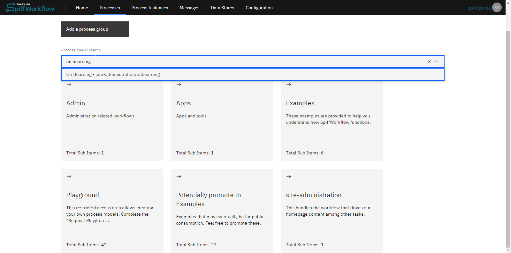
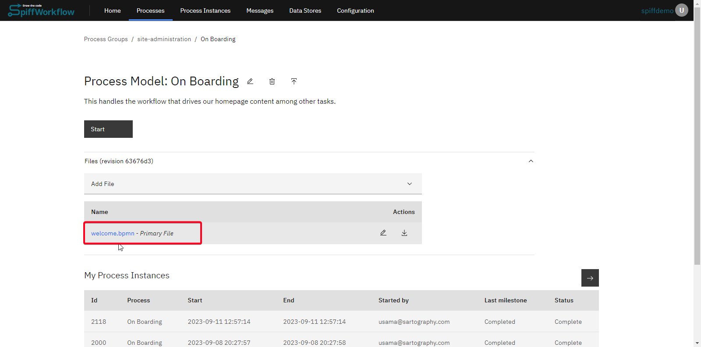
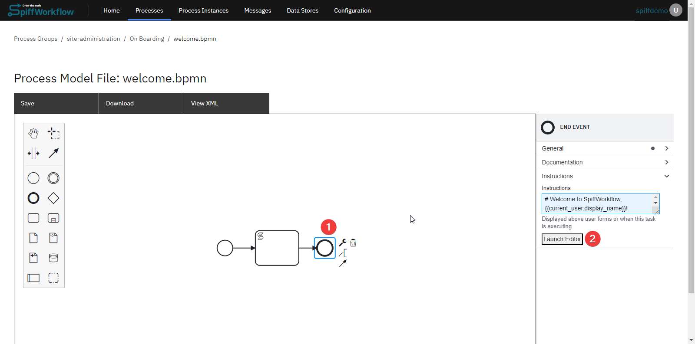
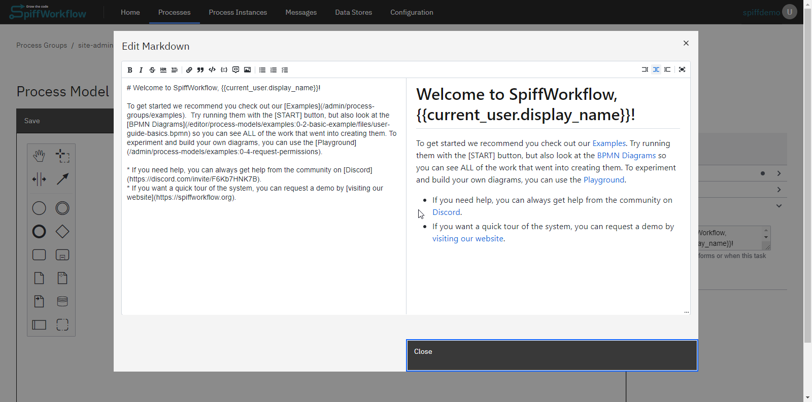

# Welcome Messages in SpiffWorkflow

## Introduction

The welcome message is the greeting users see when they log into the platform.
It sets the tone for their experience and can be customized to fit the needs of your organization or specific user groups.
By customizing the welcome message, **administrators** can tailor the user experience, making it more personalized and relevant to the audience.

This guide will walk you through the steps to modify this message in SpiffWorkflow.

## Steps to Update the Welcome Message

1. **Open the Process:**
   Navigate to the onboarding process model within SpiffWorkflow.

   

2. **Access the `welcome.bpmn` File:**
   This is the specific file where the welcome message is configured.
   Ensure you're at the path `siteadministration.onboarding`.
   This path is crucial as it's the trigger for the welcome message.

   

3. **Locate the End Event:**
   The end event within this process contains the welcome message.
   Any message configured in this end event will be displayed to users upon login.

   

4. **Launch the Editor:**
   Use the built-in editor to modify the content of the welcome message.
   Ensure that your changes are clear, concise, and welcoming to provide users with a positive experience.

   

After making your desired modifications, save the changes to update the welcome message.

Once you've updated the welcome message, it will be displayed prominently on the home page after users log in.
The message will be positioned in a way that it's one of the first things users see, ensuring they receive the intended greeting every time they access the platform.
