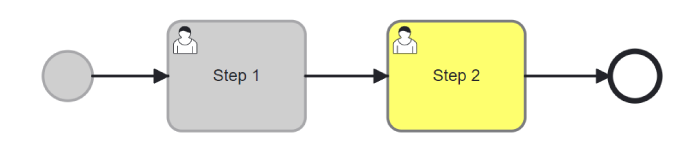
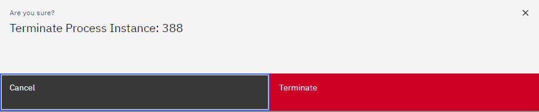
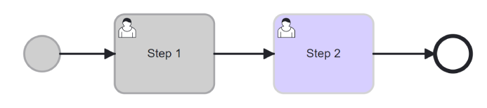
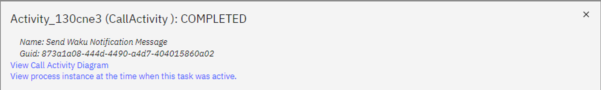
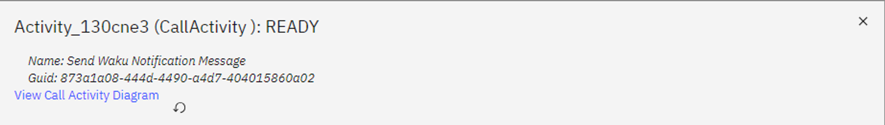
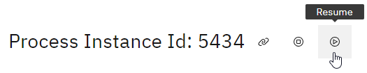
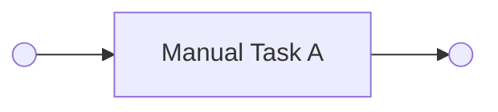
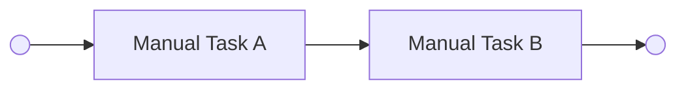

# Manage Processes

| ⚙ How do I get there \| Menu Hierarchy |
| --------------------------------------- |
| Follow steps to find a process instance |

## Suspend a Process Instance

By suspending a process instance, you temporarily halt its execution, allowing you to access and modify the necessary data or configurations associated with that specific instance.
This feature is not only useful for making updates, but also enables the possibility to redo a previous step with different metadata if needed.

> **Step 1: Find the Active Process Instance**

- In order to locate the active process instance, have a look at these pages to find an instance to suspend.

```{admonition} Note

⚠ Note that the suspension of a process instance is only applicable to active instances.
If an instance is not active, it indicates that the process has already been completed, and therefore, it cannot be suspended.

```

> **Step 2: Locate Suspend Icon**


- Next to the Process Instance Id, look for the icon that resembles the 'Suspend' icon and select it to initiate the suspension of the process instance.

> **Step 3: Select Suspend Button**

Click on the 'Suspend' icon.
This action will pause the process instance, granting you the ability to make edits and modifications.
When ready, the process instance can be resumed.
The process instance remains highlighted in yellow.



|                            ✅ Success                             |
| :---------------------------------------------------------------: |
| Confirm that the status has changed from ‘waiting’ to ‘suspended’ |
|                                 |

## Resume a Process Instance

Resuming a process is essential for ensuring that the process can continue its execution, recover from interruptions, and proceed with the necessary updates or corrections.

> **Step 1: Locate Resume Icon**


- Next to the Process Instance Id, look for the icon that resembles the 'Resume' icon and select it to resume the suspended process instance.

> **Step 2: Select Resume Button**

- Click on the 'Resume' button.
  This action will cause the process instance to go back to its active state, allowing the process instance to continue.
  Depending on where the process instance is in its journey, the status might be waiting or some other active status.
  The process instance remains highlighted in yellow.


|                                ✅ Success                                 |
| :-----------------------------------------------------------------------: |
| Confirm that the status has changed from ‘suspended’ to an active status. |
|                                             |

## Terminate a Process Instance

Terminating refers to ending the execution of a specific occurrence of a process before it reaches its natural completion or final outcome.
There are various reasons for terminating a process instance such as the instance is no longer required or it's in an error state.

> **Step 1: Locate Terminate Icon**


- Next to the Process Instance Id, look for the icon that resembles the 'Terminate' icon and select it to terminate the process instance.

> **Step 2: Select Terminate Button**

- Click on the 'Terminate' button.
  Note that the process instance will be terminated permanently, and this action cannot be undone.

> **Step 3: Confirm Termination**

- Before proceeding with the termination, it is essential to be absolutely certain about your decision.
  

- The process status will now be 'Terminated' and the last active task will be highlighted in purple.
  

|                              ✅ Success                              |
| :------------------------------------------------------------------: |
| Confirm that the status has changed from ‘suspended’ to 'terminated' |
|                                     |

## Reset a Process Instance

> **Step 1: Find the active Process Instance**

> **Step 2: Navigate to the active User Task**

👤 Note that you need Admin rights to complete the following steps.

> **Step 3: Suspend the Process**

Ensure the status has changed from _user_input_required_ to _suspended_


> **Step 4: Go to the relevant past activity**

Only a previously completed section highlighted in grey can be chosen.

> **Step 5: Select 'View process instance at the time when this task was active.
> '**



> **Step 6: Observe the task once highlighted in grey should now be yellow.
> **

A previously completed section is now active and shown in yellow.

> **Step 7: Select 'Reset Process Here' icon in the popup window.
> **



> **Step 8: "Resume" process instance.
> **

The process instance should be resumed by selecting the ‘Resume’ icon next to the Process Instance Id.



> **Step 9: Refresh page**

Wait for Resume action to complete, this may take some time.
Refresh the page to ensure it has transitioned to the next activity, replacing the current one.

|                                   ✅ Success                                   |
| :----------------------------------------------------------------------------: |
| From this point onward, the remaining part of the process can smoothly proceed |

## Migrate Process Instance

The process instance migration feature allows users to migrate a process instance to a different version of the associated process model.

### How to use

Let's say you have a process model like this and you start a process instance:



Let's assume A is a manual task, so flow stops there.

Then you want to update the process model, like this:



If you want your existing process instance to execute Manual Task B, it calls for a migration.
First, suspend your process instance.
Next, click on the migration icon.
You will be presented with information about whether your process instance is allowed to migrate to the newest process model version.

```{admonition} Note
You can migrate a process instance as long as the tasks that are added/updated/deleted have not yet been executed by your process instance.
```

If the process instance is allowed to migrate, you can click the button to migrate your process instance.
In the case of the example, once you resume the instance and complete Manual Task A, you will be presented with Manual Task B.

### Caveats

#### Cannot migrate in these situations

Migration is not possible when the following activities are active (started/ready/waiting):

- Call activity/Subprocess - The task itself cannot be changed once it is active.
  Tasks inside the call activity or subprocess can be updated if they have not been reached.
  Tasks that directly follow one of these activities are special, and you cannot migrate an instance if you add or remove one of these.

- Multi Instance tasks
- Loop tasks
- Signal boundary event - add/remove signals
- Looping back through a part of a process which has already completed once
#### Forms

Forms are not serialized as part of the process model specification, and therefore are not considered during migration.
Instead, they rely on the git revision to determine what version of the file to use.
Therefore, if you change only a form, the system will not allow you to migrate the process instance.

### APIS

- `GET /process-instances/{modified_process_model_identifier}/{process_instance_id}/check-can-migrate`
  - Checks if the process instance can be migrated to the newest version of the process model or the target_bpmn_process_hash if given.
  - Query params:
    - **target_bpmn_process_hash** OPTIONAL
      - the hash value of the bpmn process serialized form
      - this can be found from the migration events listed in the migration event list api
- `POST /process-instance-migrate/{modified_process_model_identifier}/{process_instance_id}`
  - Performs the migration of the process instance to newest version of the process model or the target_bpmn_process_hash if given.
    - The process instance must be suspended to do this.
  - Query params:
    - **target_bpmn_process_hash** OPTIONAL
      - the hash value of the bpmn process serialized form
      - this can be found from the migration events listed in the migration event list api
- `GET /process-instance-events/{modified_process_model_identifier}/{process_instance_id}/migration`
  - Get a list of migrations that have already been performed on the process instance.

General path params:

- **modified_process_model_identifier**: the process model identifier separated by colons - `:` - instead of slashes
- **process_instance_id**: the id of the process instance to run on.
