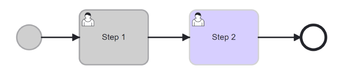

# Suspend, Resume and Terminate a Process

| ⚙ How do I get there \| Menu Hierarchy |
| -------------------------------------- |
| Follow steps to find a process instance |


## Suspend a Process

By suspending a process instance, you temporarily halt its execution, allowing you to access and modify the necessary data or configurations associated with that specific instance. This feature is not only useful for making updates but also enables the possibility to redo a previous step with different metadata if needed.

> **Step 1: Find the Active Process Instance**

- In order to locate the active process instance, have a look at these pages to find an instance to suspend.

```{admonition} Note

⚠ Note that the suspension of a process instance is only applicable to active instances. If an instance is not active, it indicates that the process has already been completed, and therefore, it cannot be suspended.

```

> **Step 2: Locate Suspend Icon**

 

- Next to the Process Instance Id, look for the icon that resembles the 'Suspend' icon and select it to initiate the suspension of the process instance.

> **Step 3: Select Suspend Button**

Click on the 'Suspend' icon. This action will pause the process instance, granting you the ability to make edits and modifications. When ready the process instance can be resumed. The process instance remains highlighted in yellow.


| ✅ Success                                                    |  
|  :----:  | 
| Confirm that the status has changed from ‘waiting’ to ‘suspended’|
|| 

## Resume a Process

Resuming a process is essential for ensuring that the process can continue its execution, recover from interruptions, and proceed with the necessary updates or corrections.

> **Step 1: Locate Resume Icon**

 

- Next to the Process Instance Id, look for the icon that resembles the 'Resume' icon and select it to resume the suspended process instance.

> **Step 2: Select Resume Button**

- Click on the 'Resume' button. This action will cause the process instance to go back to its active state allowing the process instance to continue. Depending on where the process instance is in its journey the status might be waiting or some other active status. The process instance remains highlighted in yellow.


| ✅ Success                                                    | 
| :----:  |
| Confirm that the status has changed from ‘suspended’ to an active status.|
| 

## Terminate a Process Instance

Terminating efers to ending the execution of a specific occurrence of a process before it reaches its natural completion or final outcome. There are various reasons for terminating a process instance such as the instance is no longer required or in an error state. 

> **Step 1: Locate Terminate Icon**

 

- Next to the Process Instance Id, look for the icon that resembles the 'Terminate' icon and select it to resume the suspended process instance.

> **Step 2: Select Terminate Button**

- Click on the 'Terminate' button. Note that the process instance will be terminated permanently, and this action cannot be undone. 

> **Step 3: Confirm Terminatation**

- Before proceeding with the termination, it is essential to be absolutely certain about your decision.


- The process status will now be 'Terminated' and the last active task will be highlighted in purple.


| ✅ Success                                                    | 
| :----:  |
| Confirm that the status has changed from ‘suspended’ to 'terminated'
 | 
