# Building Blocks of the System
These process models serve as the foundational components of our 
system, forming the building blocks for creating powerful workflows. 

It is essential to gain a thorough understanding of each process model
on an individual level, comprehending their functionalities and
capabilities. 

Here are fundamental blocks of our system:

## Displaying Content
The SpiffArena platform offers powerful features for displaying 
content  within your BPMN processes.

In this guide, we'll explore how to effectively display content in 
SpiffArena, providing a seamless user experience and engaging 
presentation of information. 

Let's dive in and learn the key aspects of displaying content within 
your workflows.

- **Markdown**: Markdown is a powerful tool for formatting and styling your content in 
SpiffArena. With Markdown, you can easily add headings, lists, tables, 
hyperlinks, and more to enhance the readability and visual appeal of 
your displayed content. 

- **Jinja Templating**: Jinja Templating in SpiffArena empowers you to generate dynamic content based on variables, conditions, and logic. By leveraging Jinja's syntax and functionality, you can customize your content to adapt to specific scenarios, display personalized information, or perform calculations based on collected data.

By utilizing the strengths of Markdown and Jinja, you can create rich, 
interactive, and data-driven content that goes beyond static text.
We'll demonstrate using an example on how to leverage Markdown and 
Jinja together to create captivating content that responds to user 
input and presents  dynamic information.

### Basic Example for displaying content

In our SpiffArena dashboard, we have a simple example of how to 
display content in the basics section. Now, let's explore the process 
workflow of the content display process model and discover various 
ways to present content in different scenarios.

#### Display Content Process Overview:

Here is a summary of the process:

1. **Start Event and Introduction Manual Task**

The process begins with a Start Event, signaling the start of the 
workflow.

It is followed by a Manual Task called "Introduction" that displays a 
welcome message or instructions for the users. The content to be 
displayed is specified in the task's properties panel.

2. **User Task with Form**

A User Task named "simple form" is included, allowing users to 
complete a form.
The properties panel of the User Task contains a JSON form schema, 
defining the structure of the form.
The instructions panel of the User Task guides users to fill out the 
form, indicating that the entered values will be shown in the 
subsequent Manual Task.

3. **Script Tasks**

Three Script Tasks are incorporated into the process, each serving a 
specific purpose.
Script Task 1 introduces a delay using the code "time.sleep(3)" and 
generates a dictionary of colors.
Script Task 2 includes a delay with the code "time.sleep(1)" and 
focuses on making the colors more playful.
Script Task 3 includes a delay with the code "time.sleep(2)" and aims 
to increase the silliness level.

4. **Manual Task to Display Content**

A Manual Task will display content based on the collected data 
and script-generated information. The instructions panel of the Manual 
Task provides the content to be displayed, which includes the form 
data entered by the user.
It also offers an optional Chuck Norris joke based on user preference 
and a table of silly color names generated using Jinja templating.

5. **End Event**

The process concludes with an End Event, indicating the end of the 
workflow.
The instructions panel of the End Event suggests next steps, such as 
exploring the diagram in edit mode and completing the "Request a 
Playground" task.

## Using Forms

This feature allows you to create custom forms for collecting and 
managing data within your workflows. Whether you need a simple 
feedback form or a complex multi-step form, SpiffArena provides you 
with the tools to build and integrate forms seamlessly.

With SpiffArena's form builder, you can start with basic form elements 
and gradually add more advanced components as your form requirements 
evolve. 
Let's dive in and explore the possibilities of creating forms in 
SpiffArena.

### Instructions on Creating Forms

Forms play a crucial role in capturing data, and SpiffArena offers a 
powerful form-building capability. Here are the ways to create forms:

1. **Leveraging JSON Schema**

JSON Schema is an emerging standard for describing the structure of 
data in a JSON file. JSON Schema forms the foundation for building 
forms in SpiffArena.

To simplify the form creation process, we leverage the React JSON 
Schema Form (RJSF) library. RJSF is a powerful tool that uses JSON 
Schema as its basis. It enables you to create dynamic and interactive 
forms with ease. The RJSF library is open source, free to use, and 
follows the principles of open standards.

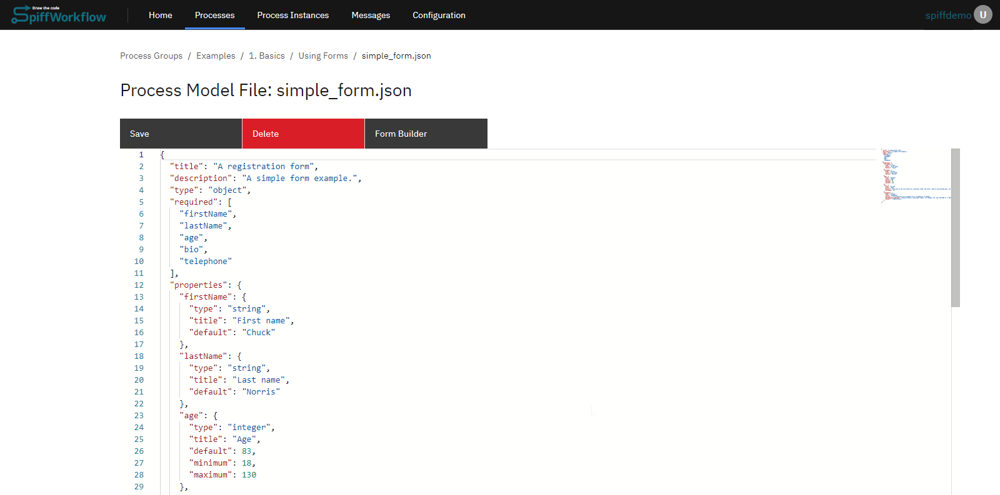

Please note that while this guide provides a basic understanding of 
JSON Schema and RJSF, there is much more to explore. We encourage you 
to refer to the official [RJSF documentation](https://rjsf-team.github.
io/react-jsonschema-form/docs/) for comprehensive details 
and advanced techniques.

2. **Using Form Builder**

An alternative approach to creating JSON code is to utilize the form 
builder feature, which allows you to easily create various fields 
without the need for writing JSON manually. 

However, it's important to 
note that the form builder may have certain limitations in terms of 
features and may not be as powerful as using the JSON editor directly. 

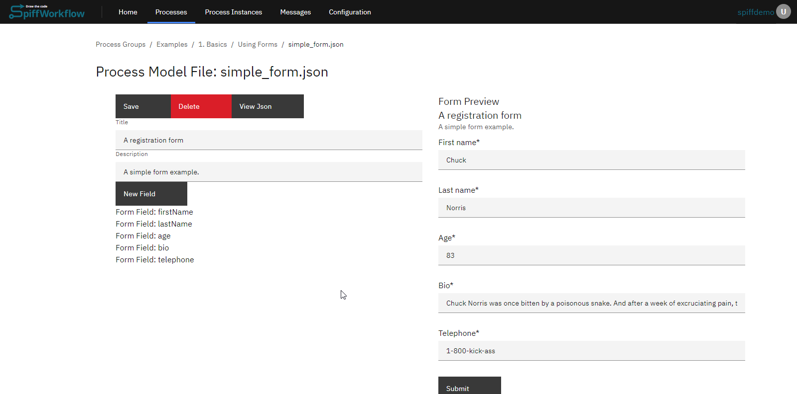

### Basic Example for Using Forms
Now that you have a grasp of how to create forms in SpiffArena using 
JSON Schema and RJSF, it's time to put your knowledge into action. 
Lets cover the example of using forms process model in the basics.

1. **Start Event**

The BPMN diagram initiates with a start event, which is followed by a 
manual task aimed at providing a comprehensive understanding of web 
forms and the various approaches to displaying them. 

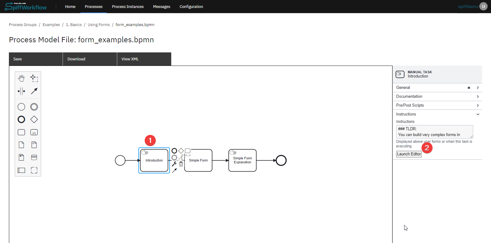

The expected output of the form during the process execution can be 
observed in the attached image.

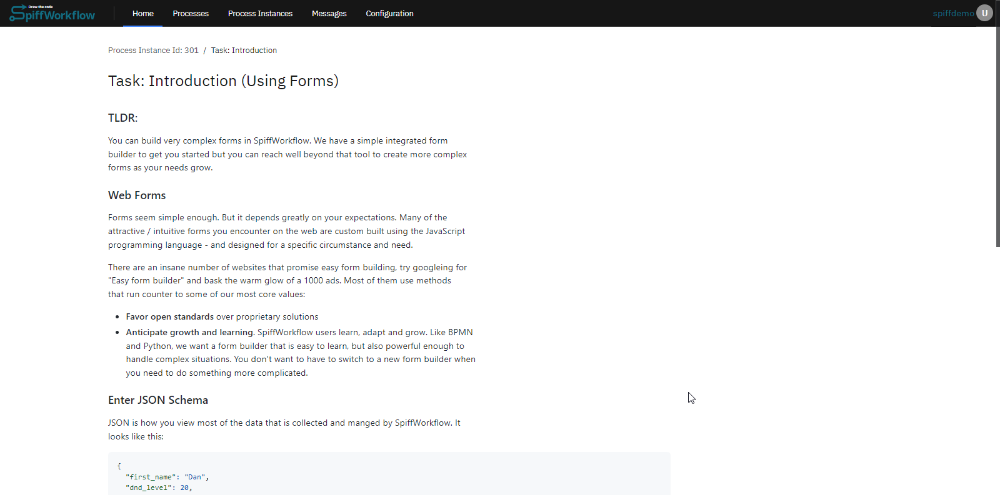

2. **User Task to display form**

Moving forward, the diagram incorporates a user task specifically 
designed for form display. Within the properties panel of the user 
task, two essential files are included: a JSON Schema (containing the 
form description in RSJF format) and a UI Schema (outlining the rules 
for displaying the form based on the RSJF schema). 

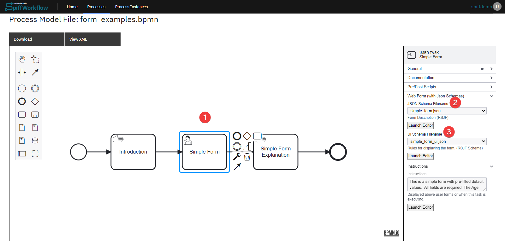

The anticipated output of the form when the process is executed can be 
visualized in the attached image.

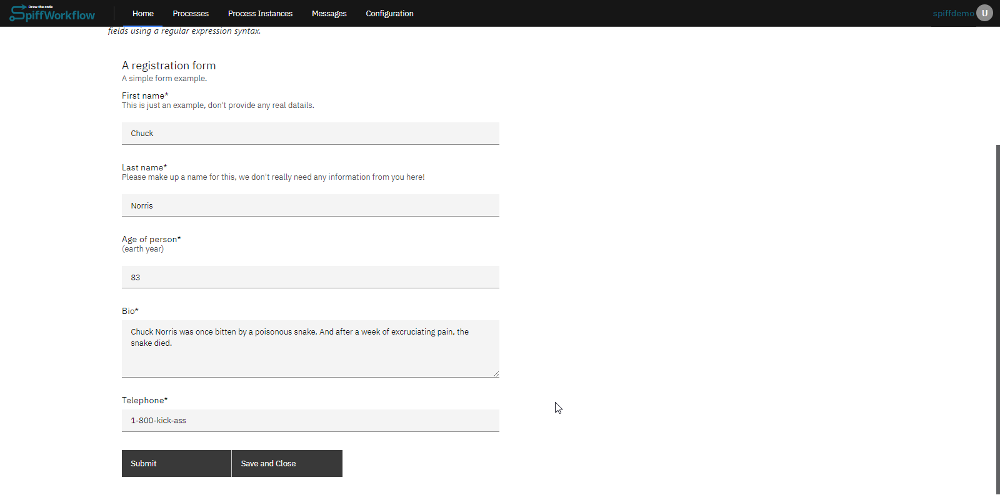

3. **Manual Task to display infomation**

Following that, a manual task is included, offering a simple form 
explanation. As users submit the form, the manual task will display 
the respective explanation.

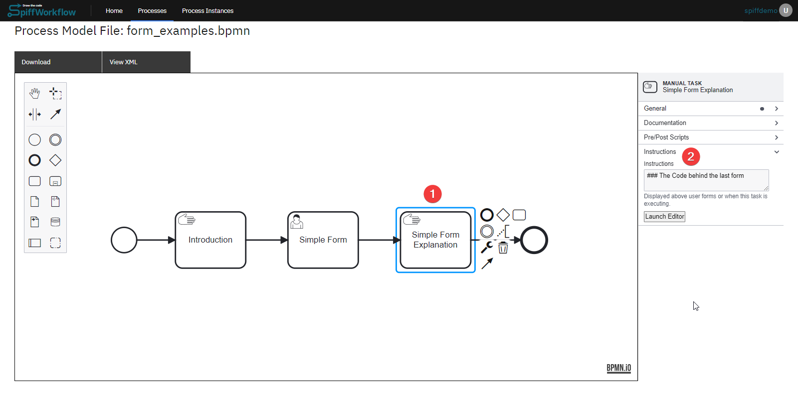

An attached image provides an overview of the expected form output 
during the process execution.

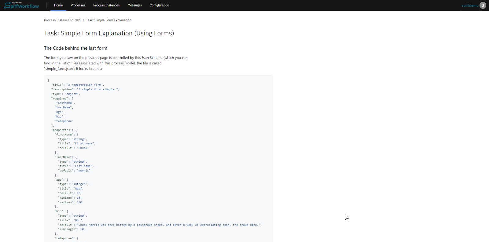

## Writing Scripts 
Writing scripts refers to the process of creating custom code or scripts to increase the functionality and automation of a software application or system. 

In SpiffArena, writing scripts involves creating code snippets or 
specific tasks, manipulate data, or handle complex logic.

The scripting language used for writing scripts in SpiffArena is  Python, a widely used programming language. Python provides a rich set of libraries, frameworks, and tools that facilitate script development, making it a popular choice for implementing custom logic and automation.

Let's explore an example of a Script Task in our basics section:

1. **Start Event and User Task - "Form"**

The process begins with a Start Event, followed by a User Task named "Form." Users will fill out the form, and the data will be passed to the next task, which is a Script Task.
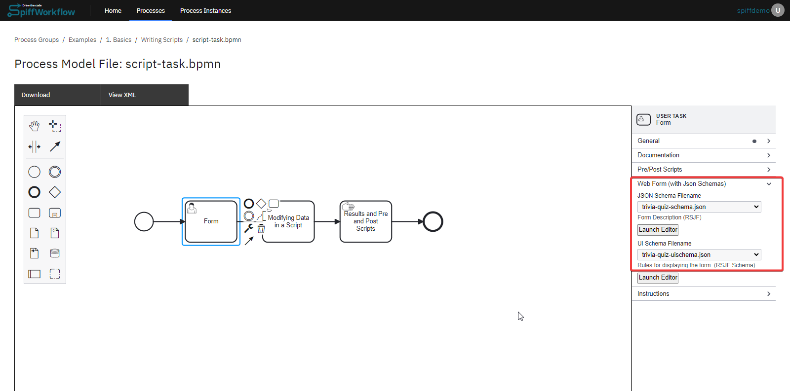

2. **Script Task to collect data**

In the Script Task, we have created a script that collects three variables from the form and calculates a score based on certain conditions. The score is then stored in the "score" variable.

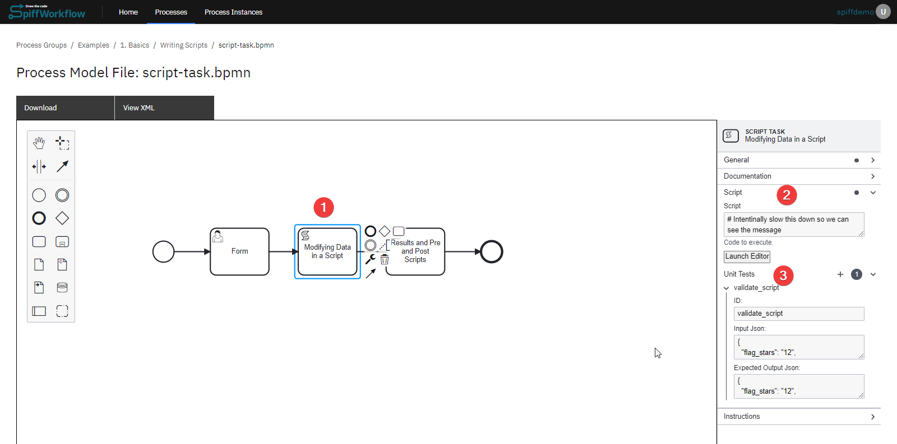

Here's the script:

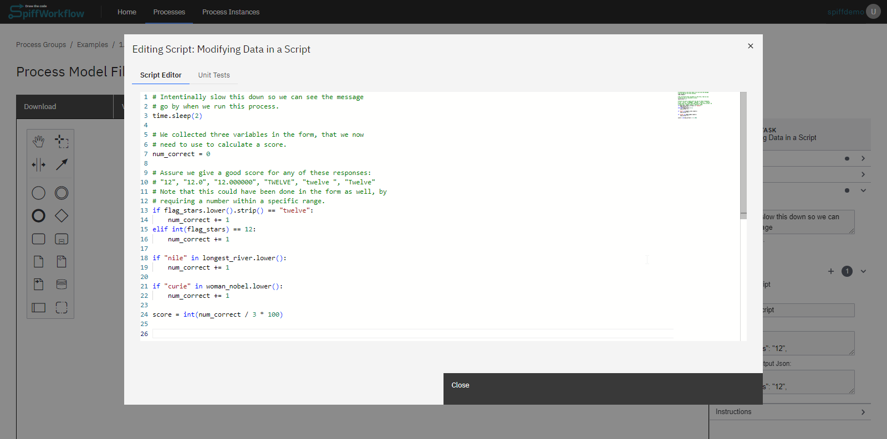

3. **Manual Task with Pre-Script**

After the Script Task, we have a Manual Task with a pre-script and instructions to display the score. 
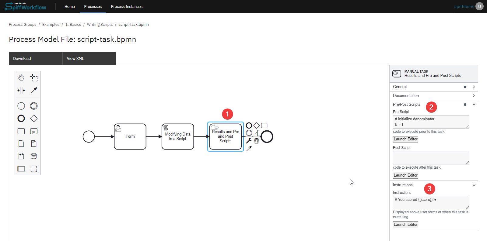

- **Prescript** is added as an example, While you can have tasks that are dedicated scripts, it can become a bit noisy, and we want our diagrams to convey a clear sense of the business logic and rules. For this reason it is also possible to add scripts to all Task types - using Pre and Post Scripts. This manual task contains a pre-script that also calculated PI using the Leibniz’s formula.

- **Post Scripts** are also available on most task types, but they execute AFTER the task is completed. These are great for user forms where you want to modify and clean up the form results before moving on to the next task.

## Making Decisions
DMN tables are powerful tools for modeling and implementing business rules and decision logic. They allow you to define rules and their associated conditions and actions in a structured manner. By evaluating the conditions in each rule, the DMN engine can determine which rules are triggered based on the provided inputs and execute the corresponding actions. This provides a flexible and configurable approach to decision-making in various scenarios.

More detailed information [here](https://spiff-arena.readthedocs.io/en/latest/appendices/bpmn_references.html#).

Let's delve into a practical example of a process workflow by examining a basic Decision Model and Notation (DMN) table. This sample illustrates how real-world workflows incorporate decision tables.

Here's a concise outline of the process workflow:

The workflow springs into action with a start event. Next in line is a user task which includes a form. Here, the customer fills out the form and makes a selection from a variety of pizzas.

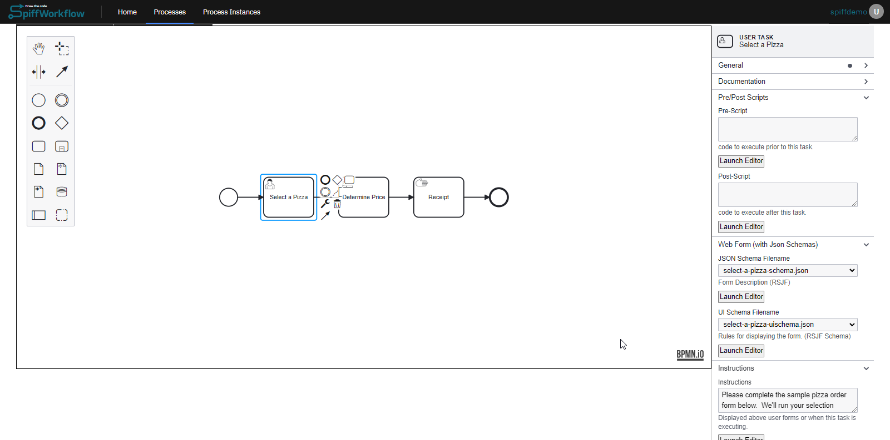

To establish the price, we use bussiness properties tasks. Upon clicking on the element within the workflow, the properties tab located on the right side will display a section labeled 'Select Decision Table'.

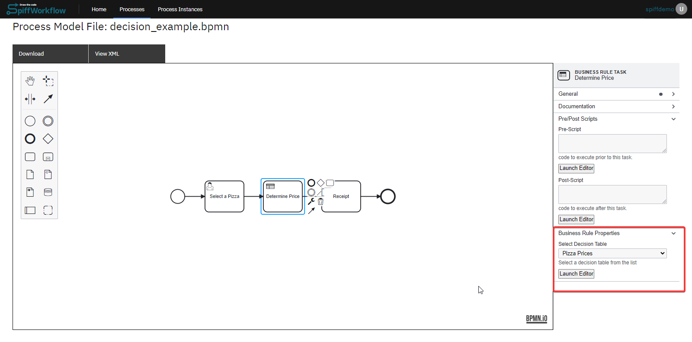

The relevant Decision table must be created within the directory by producing a .dmn file. This file is then attached to the workflow by selecting it under 'Select Decision Table'.

This is what a typical DMN table looks like:

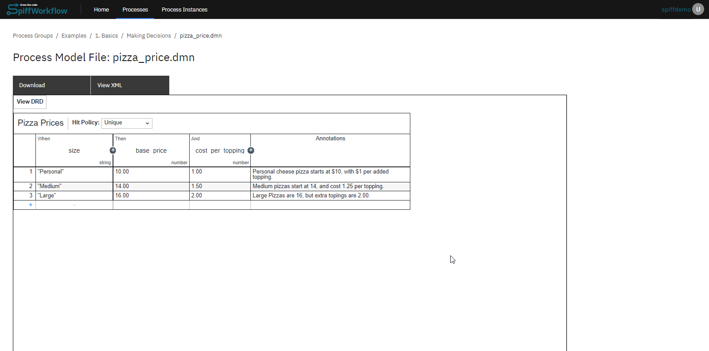

See more details for DMN Components [here](https://spiff-arena.readthedocs.io/en/latest/appendices/bpmn_references.html#dmn-components)

After integrating the DMN element, the next step involves a manual task titled 'Receipt'. This task incorporates a pre-script which is designed to compute the total cost. Additionally, it includes instructions to display the outcome.

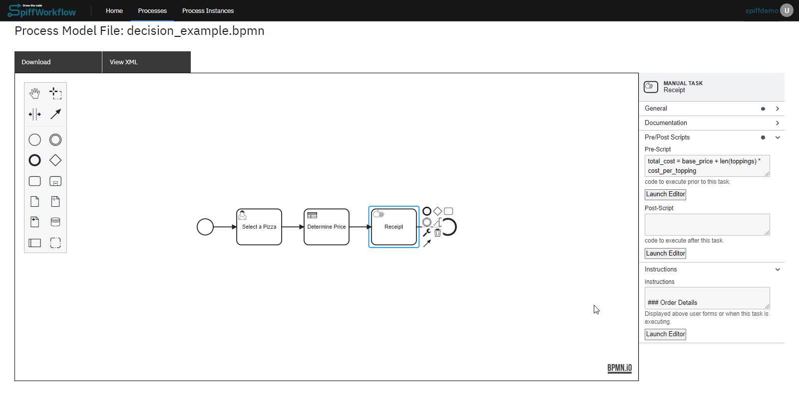

Overall, this simplified workflow exemplifies the practical application of DMN tables within a process, showcasing their critical role in decision-making and task automation.

## Assigning Tasks

asda
## Gathering Information
asdads