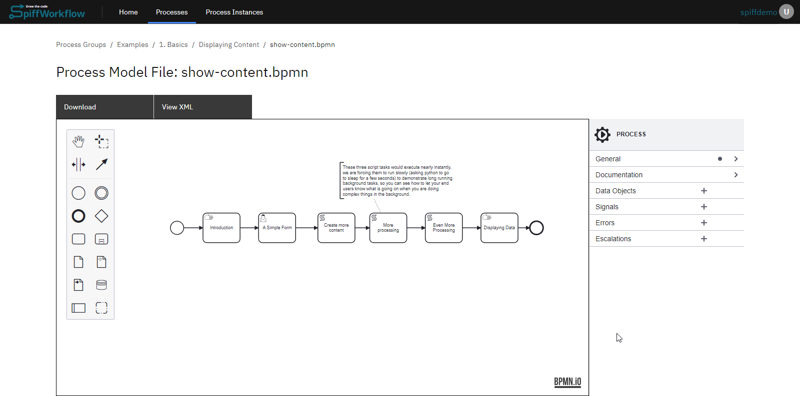
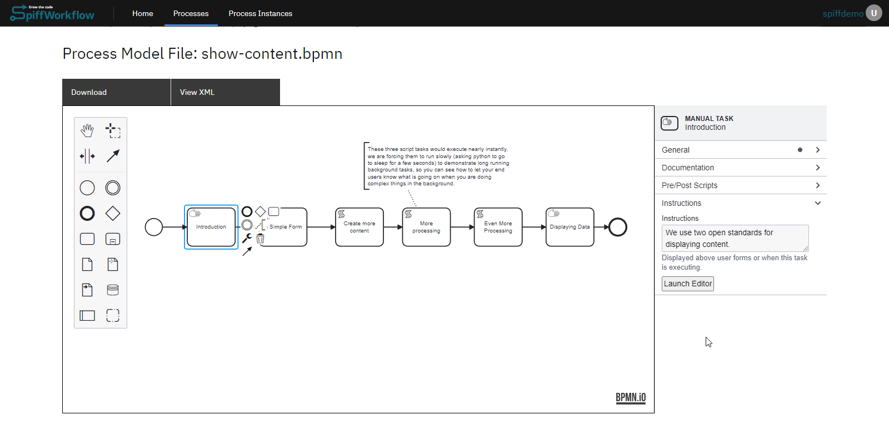
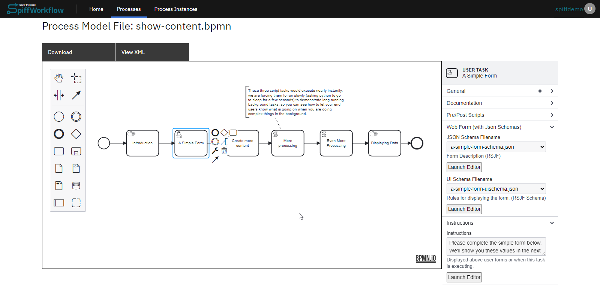
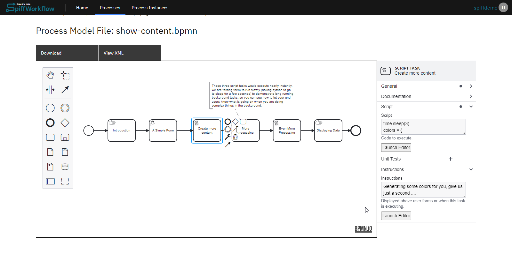
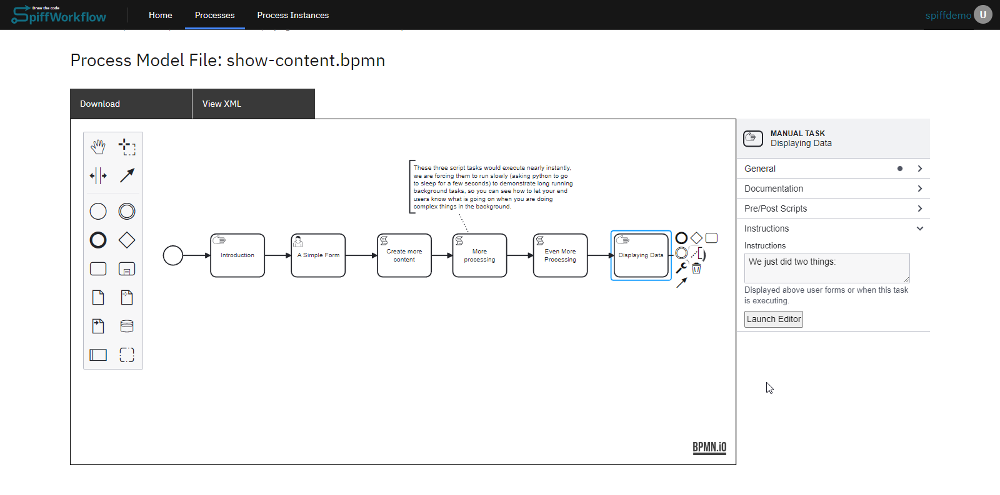
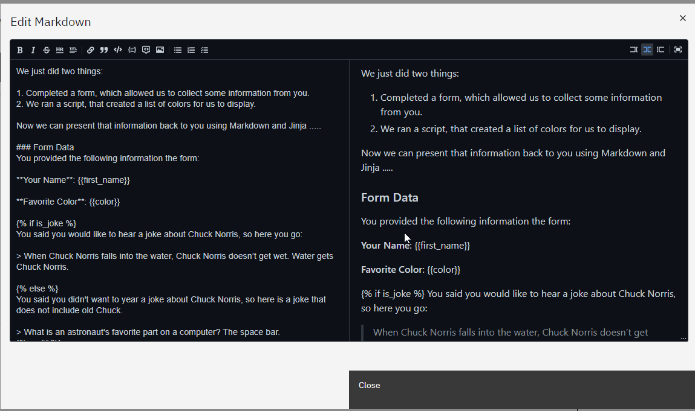
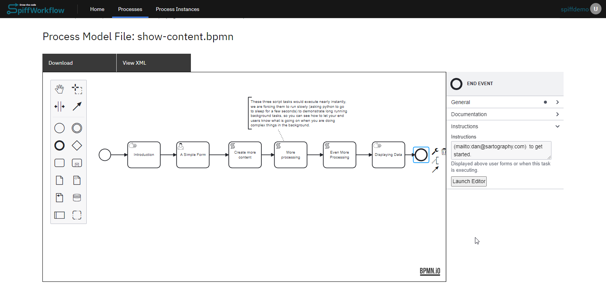
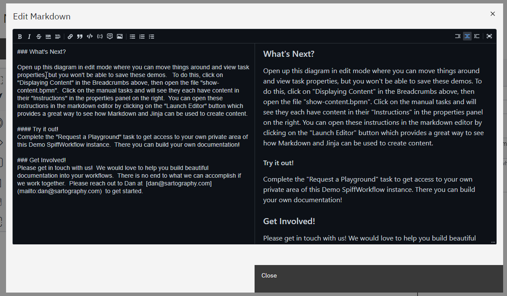

# Building Blocks of the System
These process models serve as the foundational components of our 
system, forming the building blocks for creating powerful workflows. 

It is essential to gain a thorough understanding of each process model
on an individual level, comprehending their functionalities and
capabilities. Once you have grasped the intricacies of these models,
you can unleash your creativity and combine them in limitless ways,
shaping workflows that align with your unique needs and imagination.

## Displaying Content
The Spiffdemo platform offers powerful features for displaying content 
within your BPMN processes. Whether you need to present instructions, 
messages, or dynamic data, Spiffdemo provides various tools to make 
your content engaging and informative. Follow the steps below to 
effectively display content in your processes:

### Display Content Process Overview:

Here is a summary of the process:

1. **Start Event and Introduction Manual Task**

The process begins with a Start Event, signaling the start of the 
workflow.

It is followed by a Manual Task called "Introduction" that displays a 
welcome message or instructions for the users. The content to be 
displayed is specified in the task's properties panel.

2. **User Task with Form**

A User Task named "simple form" is included, allowing users to 
complete a form.
The properties panel of the User Task contains a JSON form schema, 
defining the structure of the form.
The instructions panel of the User Task guides users to fill out the 
form, indicating that the entered values will be shown in the 
subsequent Manual Task.

3. **Script Tasks**

Three Script Tasks are incorporated into the process, each serving a 
specific purpose.
Script Task 1 introduces a delay using the code "time.sleep(3)" and 
generates a dictionary of colors.
Script Task 2 includes a delay with the code "time.sleep(1)" and 
focuses on making the colors more playful.
Script Task 3 includes a delay with the code "time.sleep(2)" and aims 
to enhance the silliness level.

4. **Manual Task to Display Content**

A Manual Task is used to display content based on the collected data 
and script-generated information.
The instructions panel of this task explains the actions performed, 
including form completion and script execution.
The instructions panel of the Manual Task provides the content to be displayed, which includes the form data entered by the user.
It also offers an optional Chuck Norris joke based on user preference and a table of silly color names generated using Jinja templating.

5. **End Event**

The process concludes with an End Event, indicating the end of the workflow.
The instructions panel of the End Event suggests next steps, such as exploring the diagram in edit mode and completing the "Request a Playground" task.

## Using Forms

asdasd
## Writing Scripts 

asdas
## Making Decisions

asda
## Assigning Tasks

asda
## Gathering Information
asdads