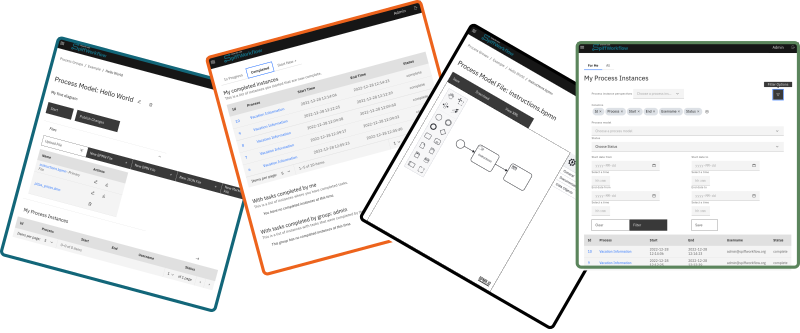

# Introduction

## Overview of SpiffArena

SpiffArena is a comprehensive, web-based application designed to manage workflows. It integrates multiple tools into a single platform, providing a turnkey solution for workflow management. 

SpiffArena is built around the SpiffWorkflow library, which is responsible for all the BPMN processing. SpiffArena serves as a wrapper around the library, making it more accessible to a larger audience and solving many common problems that people face when running processes. 

The SpiffWorkflow library provides a Python API for managing processes with minimal dependencies. Its primary purpose is to allow workflow execution and workflow serialization/deserialization. It can run a workflow and execute all "engine" tasks, and it knows how to save the state of a workflow to JSON and how to resurrect that workflow from JSON back to an executable state.

The full source code for SpiffArena is available on GitHub, encouraging contributions from the community. Users can test out SpiffArena by following the provided Getting Started guide. 

## Purpose vs Applications

The purpose of SpiffArena is to streamline the management of workflows, combining many tools into one application. It is designed to be a tool for professionals and scientists, not a simple paint-by-numbers solution. The platform is built on the belief in a future filled with human innovation, supported by software that increases transparency, understanding, and collaboration. It aims to create transparency, automate tasks, and deliver on schedule.

In terms of applications, SpiffArena can be used by Python developers who want to create custom workflow systems or embed BPMN features into existing applications. It can be used to pull information from one system and use it in another, reducing the need for manual intervention. It also allows for the automation of tasks, freeing up time for more important work. 

### SpiffArena Features

- **Database Persistence of Processes**: Supports MySQL, Postgres, SQLite, etc.
- **Web Forms**: Ability to present web forms.
- **GIT Management of BPMN Files**: Manages process models.
- **CRUD Operations**: Supports Create, Update, Delete operations on processes and process instances.
- **Searchable Process Metadata**: Allows for easy retrieval of process information.
- **Built-in BPMN Modeler/Viewer/Editor**: Provides a visual interface for managing workflows.
- **User/Group Management**: Integrates with OpenID platforms for user and group management.
- **User/Group Permissions**: Allows assigning groups access to specific areas of the system.
- **Containerized Deployments (Docker)**: Supports deployment in Docker containers.
- **Service Tasks to External APIs and Applications**: Connects with external systems via connectors and connector proxies.
- **Error Handling**: Provides built-in error handling mechanisms.