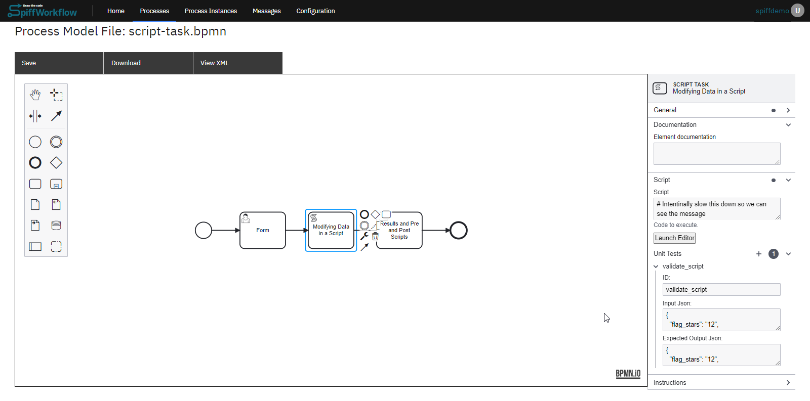
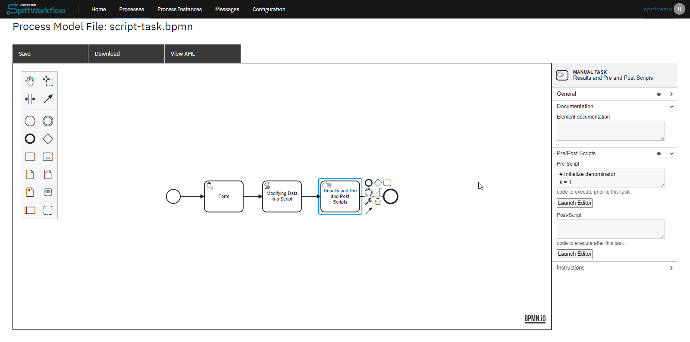

# Script Tasks
Writing scripts refers to the process of creating custom code or scripts to increase the functionality and automation of a software application or system. 

The scripting language used for writing scripts in SpiffArena is  Python, a widely used programming language. Python provides a rich set of libraries, frameworks, and tools that facilitate script development, making it a popular choice for implementing custom logic and automation.

Let's explore an example of a Script Task in our basics section:

1. **Start Event and User Task - "Form"**

The process begins with a Start Event, followed by a User Task named "Form." Users will fill out the form, and the three values from the form will be passed to the next task, which is a Script Task.

2. **Script Task to collect data**

In the Script Task, we have created a script that collects three variables from the form and calculates a score based on certain conditions. The score is then stored in the "score" variable. Lets delve into how we configured the script tasks:



**Step 1**: With the script task selected, you will notice the properties tab. 

**Step 2**: Within the properties tab, there should be a field where you can write or edit a script. Paste or write your script in this field.

Here's the script we added for this example:

``` python
if flag_stars.lower().strip() == "twelve":
    num_correct += 1
elif int(flag_stars) == 12:
    num_correct += 1

if "nile" in longest.lower():
    num_correct += 1

if "curie" in woman_nobel.lower():
    num_correct += 1

score = int(num_correct / 3 * 100)
```
**Step 3**: After adding the script, the next step is to configure unit tests. Within the unit tests section, there are fields to add test inputs and Outputs.

``` json
// Test Inputs
{
  "flag_stars": "12",
  "longest_river": "nile",
  "woman_nobel": "curie"
}

// Test Outputs
{
  "flag_stars": "12",
  "longest": "nile",
  "num_correct": 3,
  "score": 100,
  "woman_nobel": "curie"
}
```
Now we have a configured our script task with a script and unit tests.

3. **Pre Scripts and Post Scripts**

After the Script Task, we have a Manual Task with a pre-script and instructions to display the score. 



- **Prescript** is added as an example, While you can have tasks that are dedicated scripts, it can become a bit noisy, and we want our diagrams to convey a clear sense of the business logic and rules. For this reason it is also possible to add scripts to all Task types - using Pre and Post Scripts. This manual task contains a pre-script that also calculated PI using the Leibniz’s formula. Here is the pre-script:

``` python
# Initialize denominator
k = 1
 
# Initialize sum
s = 0
 
for i in range(1000000):
 
    # even index elements are positive
    if i % 2 == 0:
        s += 4/k
    else:
 
        # odd index elements are negative
        s -= 4/k
 
    # denominator is odd
    k += 2
     
pi = s
del(k)
```

- **Post Scripts** are also available on most task types, but they execute AFTER the task is completed. These are great for user forms where you want to modify and clean up the form results before moving on to the next task.