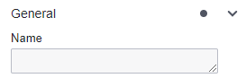
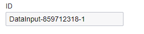
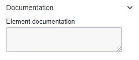

# Gateways

Gateways in BPMN are essential for controlling the flow of a business process. They act as decision points where the process flow can diverge into multiple paths or converge back into a single flow. Gateways are used to evaluate conditions or rules and determine the appropriate path for the process to follow. 

## Exclusive Gateway

 

Exclusive Gateway (XOR): An exclusive gateway represents a decision point where only one outgoing sequence flow can be taken. It is used when the process flow needs to make a mutually exclusive choice between different paths. Each outgoing sequence flow has a condition associated with it, and the flow with a true condition is selected.

### Inclusive Gateway

Inclusive Gateway (OR): An inclusive gateway also represents a decision point, but it allows multiple outgoing sequence flows to be taken. It is used when the process flow needs to make an inclusive choice, where multiple paths can be followed simultaneously. Each outgoing sequence flow can have a condition associated with it, but even if multiple conditions evaluate to true, all the flows are taken.

### Parallel Gateway

Parallel Gateway (AND): A parallel gateway is used to split the process flow into multiple parallel paths. It allows for concurrent execution of activities. All outgoing sequence flows from a parallel gateway are taken, and the process flow continues along all the paths simultaneously.

### Event-Based Gateway

 

Event-Based Gateway: An event-based gateway is used to represent a branching point based on events occurring in the process. It is often associated with intermediate events in the process flow. When an event occurs, the gateway determines the subsequent flow based on event definitions and conditions.

## Gateway Configuration

Unlike most tasks, gateways in BPMN are configured on the outgoing sequence flows rather than in the side panel. Each gateway, except for the parallel gateway, requires one or more conditions to be set on the outgoing sequence flows. These conditions determine the path the process flow should take. It's important to note that incoming sequence flows for gateways do not require conditions to be set.

| 💻 Form | ⌨ Field Input | 📝 Description |
| --- | --- | --- |
|  | **Name:** Update Customer Information | An identifier used to uniquely identify the element within the BPMN model. |
|  | **ID:** Example - updateCustomerInformation | A descriptive name given to the element, providing a human-readable label or title. |
|  | **Element Documentation:** URL, Raw Data, Plain Text | Additional information or documentation related to the element, such as URLs, plain text, or raw data. |

