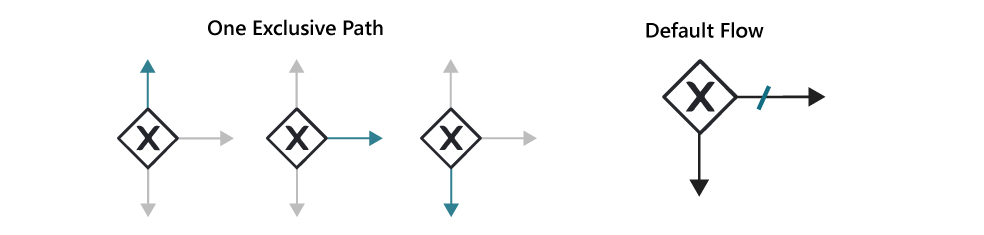

# Gateways

Gateways in BPMN are essential for controlling the flow of a business process. They act as decision points where the process flow can diverge into multiple paths or converge back into a single flow. Gateways are used to evaluate conditions or rules and determine the appropriate path for the process to follow. 

## Exclusive Gateway

Exclusive Gateway (XOR): An exclusive gateway represents a decision point where only one outgoing sequence flow can be taken. It is used when the process flow needs to make a mutually exclusive choice between different paths. Each outgoing sequence flow has a condition associated with it, and the flow with a true condition is selected.

**Default Flow:**

If the default flow is used, the instance will follow the default path whenever the condition on the other paths is not true. In other words, if none of the conditions for the outgoing sequence flows are met, the default flow provides an alternative route for the process to follow. This ensures that the process can still progress even if none of the explicitly defined conditions are satisfied, providing a fallback option for handling unexpected scenarios.


 

**Challenges:**
Avoiding conflicting conditions is straightforward when evaluating only one variable that can have only one value (see image 1 below). However, as conditions become more complex, it becomes crucial to carefully structure logical expressions to ensure that only one condition can be true at a time. This becomes especially important when dealing with multiple variables or scenarios that could potentially lead to conflicting conditions.

 

For example, consider a scenario where multiple variables are involved in a process, and it's possible for more than one variable to be true in the process context (see image 2 above). To guarantee that only one condition will be true, you can use additional expressions, such as "voucher == false" to specify distinct paths for each condition. This ensures that only one branch of the expression will be true, preventing conflicts and providing a clear direction for the process flow (see image 3 above).

In cases where there can be more options to evaluate later, and all options will follow the same route, consider using a default flow. This can be particularly useful when dealing with scenarios where additional payment gateways might be added in the future, but they will all follow the same processing path. By using a default flow, you won't have to modify the expression whenever new payment gateways are added, only if the underlying logic changes (see image 4 above).

**Join:**
To join or merge an exclusive gateway (see image 1 below) is not mandatory; it depends on the specific scenario. When the process encounters the exclusive merge, only one of the incoming sequence flows will be activated, indicating which path was completed first or satisfied its specific condition.

While the exclusive merge is commonly utilized alongside the exclusive gateway, it is also compatible with other gateway types in BPMN. It serves as a valuable mechanism for synchronizing and consolidating multiple parallel paths, ensuring that only one path is followed based on the given conditions.


### Inclusive Gateway

Inclusive Gateway (OR): An inclusive gateway also represents a decision point, but it allows multiple outgoing sequence flows to be taken. It is used when the process flow needs to make an inclusive choice, where multiple paths can be followed simultaneously. Each outgoing sequence flow can have a condition associated with it, but even if multiple conditions evaluate to true, all the flows are taken. 

```{admonition} Note
⚠ Note that default flow is not possible with Inclusive Gateways
```


**Challenges:**
In an inclusive gateway, at least one path should be true for the process to continue. Unlike an exclusive gateway, where only one path can be taken based on the conditions, the inclusive gateway evaluates all incoming sequence flows and enables all the paths for which the conditions are met.


For example, in a career matching system, individuals can input their skillsets, educational qualifications, and work experience. An inclusive gateway can be employed to assess the compatibility of the individual's skillsets with various job roles. The process may diverge into multiple paths, each representing different job categories. For example, some candidates may possess strong problem-solving skills but lack coding proficiency, making them suitable for specific departments that require problem-solving expertise. On the other hand, other candidates might have a combination of problem-solving and coding skills, making them eligible for multiple departments where these skills are essential, the result is not exclusive to one path.

**Join:**

The purpose of an inclusive gateway merge is to bring together and merge multiple parallel paths that were previously split by an inclusive gateway. Unlike an exclusive gateway merge, which selects only one path based on conditions, the inclusive gateway merge evaluates all incoming sequence flows and allows all paths with true conditions to proceed. This means that if multiple paths were activated during the parallel execution, all these paths will converge and merge at the inclusive gateway merge.


It's important to note that the use of an inclusive gateway and its corresponding merge is not mandatory in a process. They can be used independently, depending on the specific scenario and process requirements. In some cases, only the inclusive gateway might be used to split the flow into multiple paths based on different conditions without necessarily requiring a merge later in the process. Similarly, the inclusive gateway merge can be used without an inclusive gateway to consolidate parallel paths from other types of gateways, or even from different parts of the process.

### Parallel Gateway

Parallel Gateway (AND): A parallel gateway is used to split the process flow into multiple parallel paths, allowing concurrent execution of activities. All outgoing sequence flows from a parallel gateway are taken simultaneously, and the process flow continues along all the paths simultaneously.

Unlike other gateways, a parallel gateway does not dictate the flow based on conditions. Instead, it ensures that all outgoing paths are followed concurrently, regardless of any conditions that may exist. This means that tasks or activities connected to the outgoing sequence flows will be executed simultaneously and independently from one another.

```{admonition} Note
⚠ Note that default flow is not possible with Parallel Gateways
```


**Challenges:**
Since a parallel gateway does not dictate the flow based on conditions, it avoids conflicts that may arise from complex decision-making logic. 

**Join:**

Note that the behavior for a parallel join, also known as a parallel gateway merge, is to synchronize and consolidate multiple parallel paths into a single flow. When the process flow reaches the parallel join, it evaluates the completion of all incoming sequence flows from the corresponding parallel split. The parallel join ensures that all parallel paths have completed their execution before the process continues along the single outgoing sequence flow after the join. 

### Event-Based Gateway

 

Event-Based Gateway: An event-based gateway is used to represent a branching point based on events occurring in the process. It is often associated with intermediate events in the process flow. When an event occurs, the gateway determines the subsequent flow based on event definitions and conditions.

## Gateway Configuration

Unlike most tasks, gateways in BPMN are configured on the outgoing sequence flows rather than in the side panel. Each gateway, except for the parallel gateway, requires one or more conditions to be set on the outgoing sequence flows. These conditions determine the path the process flow should take. It's important to note that incoming sequence flows for gateways do not require conditions to be set.

**Gateway:**

| 💻 Form | ⌨ Field Input | 📝 Description |
| --- | --- | --- |
|  | **Name:** Update Customer Information | An identifier used to uniquely identify the element within the BPMN model. |
|  | **ID:** Example - updateCustomerInformation | A descriptive name given to the element, providing a human-readable label or title. |
|  | **Element Documentation:** URL, Raw Data, Plain Text | Additional information or documentation related to the element, such as URLs, plain text, or raw data. |

**Outgoing Sequence:**

| 💻 Form | ⌨ Field Input | 📝 Description |
| --- | --- | --- |
|  | **Condition:** payment_method == "credit_card" | Pyhton expression. Note that multiple conditions can be strung together using AND/OR |
