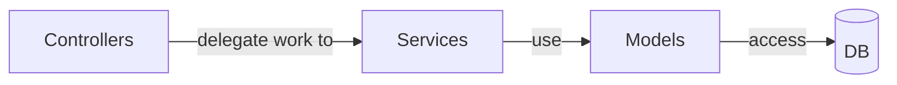

# Backend / API

spiffworkflow-backend is a Python Flask application that functions purely as a REST API.
It has API documentation available at `/v1.0/ui` generated by OpenAPI ([example hosted docs](https://api.spiffdemo.org/v1.0/ui)).

## Layers

### Controllers / routes

Requests come in through the controller layer.
An example controller is src/spiffworkflow_backend/routes/health_controller.py.
In order to know which controller a request should go to, src/spiffworkflow_backend/api.yml is used by the Connexion library.
For example, in api.yml, a GET of /status is mapped to spiffworkflow_backend.routes.health_controller.status, where status is a function in health_controller.py.
Controllers can use services (preferred) and models (allowed) to do their work, but they can never use another controller.

### Services

Services are where most of the business logic lives.
Services can use other services, but the direction of usage must be one way.
If serviceA uses serviceB, then serviceB cannot use serviceA.
Services are allowed to use models, but models are not allowed to use services.
Services cannot use controllers.
Keeping calls flowing in a single direction makes things easier to understand and avoids circular imports.

- We have a general notion that services should not call other services (or at least it must be calls in a single direction. If you call serviceB with serviceA, then serviceB cannot call serviceA).
- Services should get called by routes.
- We have a general notion that services can call models, but models should not call services (again, to avoid circular dependencies).

### Models

Models are how Flask code interacts with the database.

## Database

The backend uses the SQLAlchemy library to connect to a required relational database.
This database can be one of MySQL, PostgreSQL, or SQLite.
All of these database engines are tested in CI.

## Serialization

When serializing models to JSON:

- Avoid json.dumps when you are creating JSON. Use jsonify (a Flask thing) instead.
- Avoid Marshmallow when possible and instead use @dataclass on your model.
- If you need to represent your object in a very custom way (the default dataclass columns are not working out), write a method called `serialized` on your model (this is used by the default serializer).

## Exceptions

Do not define BlahError (exceptions) inside other classes.
All exception classes should be defined in 1) one file, if there are not too many, or 2) files that contain only other exception class definitions, again to avoid circular imports.

## Deployment

The Gunicorn web server is used to serve the application in the default Dockerfile.
Many of the environment variables that can be set are documented in src/spiffworkflow_backend/config/default.py.
