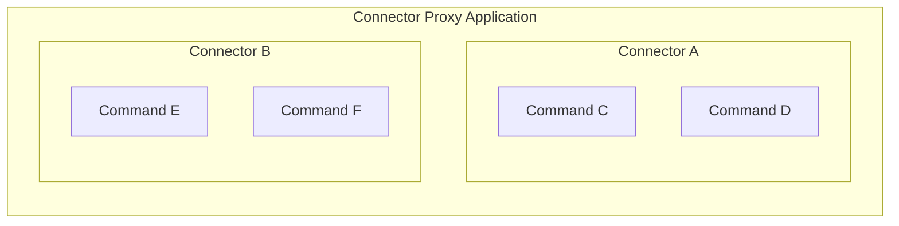

# Connector Proxy

A connector-proxy is an application that is generally deployed alongside the frontend and backend.
Please see [Connector Proxy in 5 mins](https://github.com/sartography/spiff-arena/wiki/Connector-Proxy-in-5-mins).

Connector proxies are containers for connectors.
Connectors are usually Python libraries that are included in connector proxy codebases, but they can also be embedded directly inside of connector proxies.
Our connector-proxy-demo includes a few connectors, including [connector-aws](https://github.com/sartography/connector-aws) and [connector-http](https://github.com/sartography/connector-http).
Connector-http can be used for many API interactions, but you can also [write your own connectors](/dev/how_to_build_a_connector).
