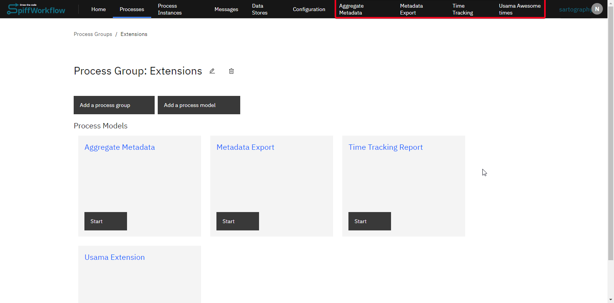
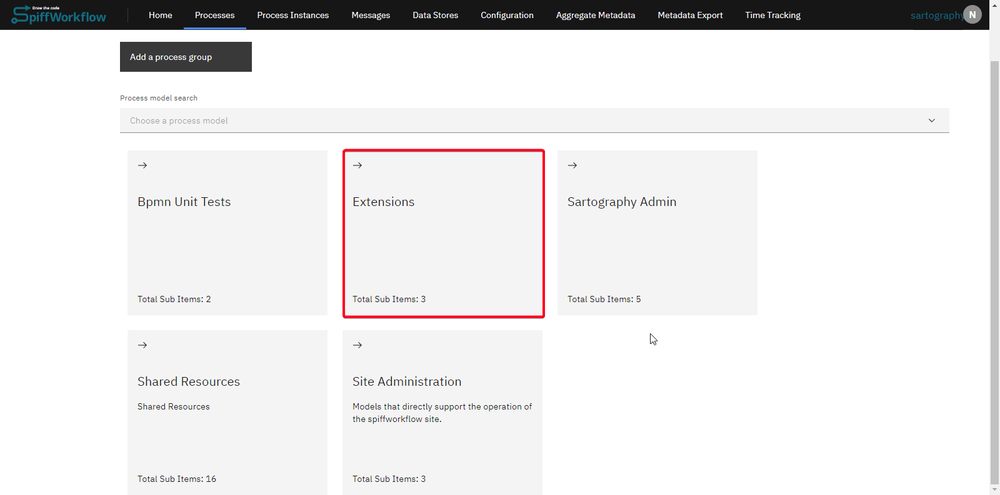
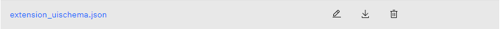

# Extensions
Extensions in SpiffArena provide a mechanism to augment the software with custom features and functionalities.
By leveraging extensions, users can implement functions or features not present in the standard offering.
This powerful feature ensures adaptability to various business needs, from custom reports to specific user tools.

At a high level:

- Extensions are implemented as process models within the process model repository.
- Configuration for an extension can be found and modified in its `extension_uischema.json` file.
- Access to an extension can be set up via permissions.

## Getting Started with Extensions

### Environment Variable Activation

To utilize extensions, an environment variable must be set.
This variable activates the extensions feature in the SpiffWorkflow backend:

    SPIFFWORKFLOW_BACKEND_EXTENSIONS_API_ENABLED=true

By default, SpiffArena will look for extensions in `[SPIFFWORKFLOW_BACKEND_BPMN_SPEC_ABSOLUTE_DIR]/extensions`, but that can be configured using `SPIFFWORKFLOW_BACKEND_EXTENSIONS_PROCESS_MODEL_PREFIX`.

### Creating an Extension

After enabling extensions from the backend, you can create extensions in the SpiffArena frontend.
To create your own custom extension, follow these steps:

- Navigate to the process group repository where extensions are to be implemented.

- Create a process model in this group. You can give it whatever name you want. Then create a file inside the process model called `extension_uischema.json`. This will control how the extension will work.

As an example, we have created an extension that adds a link to the profile menu in the top right and also adds a new "Support" page to the app so that users of the application know who to talk to if they have issues.
You can find the full example [on GitHub](https://github.com/sartography/sample-process-models/tree/sample-models-1/extensions/support).

Notice how the `display_location` "user_profile_item" tells it that the link belongs in the user profile menu (this is the top right menu where the logout link can be found).
Also, notice that the extension uischema defines a page ("/support") and defines the list of components that should show up on this page.
In this case, that is just a single MarkdownRenderer, which defines how to contact people.

An entirely new application feature with frontend and backend components can be implemented using an extension.
[This TypeScript interface file](https://github.com/sartography/spiff-arena/blob/main/spiffworkflow-frontend/src/extension_ui_schema_interfaces.ts) codifies the configuration of the extension uischema.

## Use Cases

If your organization has specific needs not catered to by the standard SpiffArena features, you can use extensions to add those features.

Here are some of the use cases already implemented by our users:

- Implementing a time tracking system
- Creating custom reports tailored to your business metrics
- Incorporating arbitrary content into custom pages using markdown (as in the above example)
- Creating and accessing tailor-made APIs
- Rendering the output of these APIs using Jinja templates and markdown

Extensions in SpiffArena offer a robust mechanism to tailor the software to unique business requirements.
When considering an extension, also consider whether the code would be more properly included in the core source code or as a connector inside your [connector proxy](/dev/connector_proxy.md).
In cases where an extension is appropriate, by following the instructions in this guide, organizations can expand the system's functionality to meet their unique needs.
