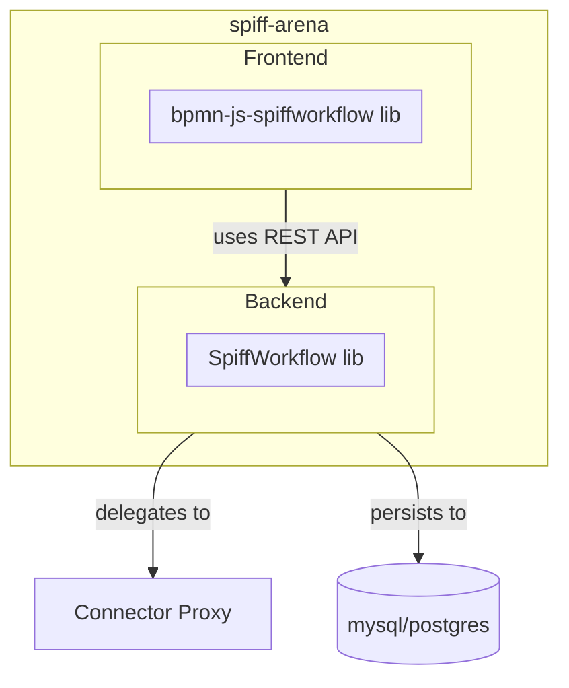

# Technical Overview

## Components

SpiffArena is a system that allows users to build and execute BPMN diagrams.
It is composed of three applications, [spiffworkflow-frontend](frontend), [spiffworkflow-backend](backend), and, optionally, a [connector proxy](connector_proxy).

## Source code layout

From a source code perspective, there are three repositories that may be of interest:

* [spiff-arena](https://github.com/sartography/spiff-arena) - Includes spiffworkflow-frontend, spiffworkflow-backend, and connector-proxy-demo.
* [SpiffWorkflow](https://github.com/sartography/SpiffWorkflow) - The core SpiffWorkflow library, 10 years old, Python, awesome, [well-documented](https://spiffworkflow.readthedocs.io/).
* [bpmn-js-spiffworkflow](https://github.com/sartography/bpmn-js-spiffworkflow) - The frontend library that extends bpmn-js to work with SpiffWorkflow.
