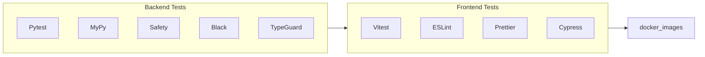
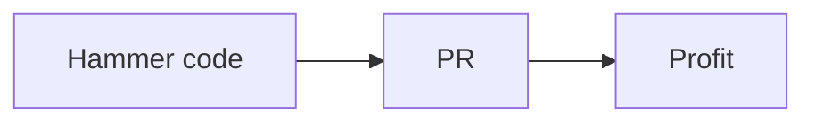

# Process

## Ticket management

We use github projects to manage our work.
You can find our board [here](https://github.com/orgs/sartography/projects/3) and issues can be filed [here](https://github.com/sartography/spiff-arena/issues).

## CI

We use Github Actions for CI.
The workflows are defined in the `.github/workflows` directory.
The main things that happen, not necessarily in this order, are represented in this chart:

## Security

We have security checks in place for both the backend and the frontend.
These include the security lib in backend, and snyk in frontend and backend.
Two independent security reviews have been performed on the codebase and mitigations have been implemented to the satisfaction of the reviewers.

## Contributing

It would be great to have you contributing to the project.
There is a [Contributing doc](https://github.com/sartography/spiff-arena/blob/main/CONTRIBUTING.rst) that you can follow.
You can find other like-minded people in our [Discord](https://discord.gg/F6Kb7HNK7B).

