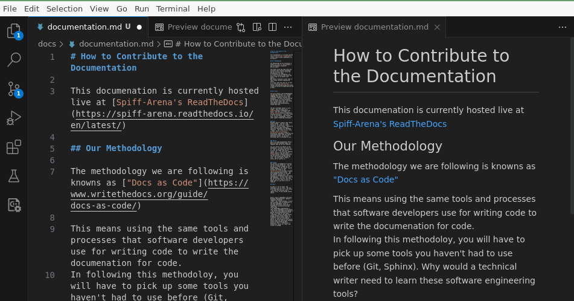
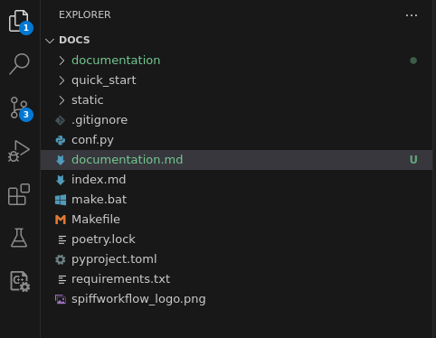
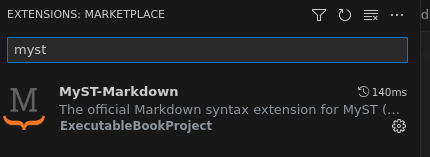

# How to Contribute to the Documentation

This documentation is currently hosted live at [Spiff-Arena's ReadTheDocs](https://spiff-arena.readthedocs.io/en/latest/).

Please set aside a couple of hours to work through this, as getting this set up correctly once is 10,000 times better than having problems every day for the rest of your life.

## Our Methodology

The methodology we are following is known as ["Docs as Code"](https://www.writethedocs.org/guide/docs-as-code/).

This means using the same tools and processes that software developers use for writing code to write the documentation for code.
In following this methodology, you will have to pick up some tools you haven't had to use before (Git, Sphinx).
Why would a technical writer need to learn these software engineering tools?
I'll never make the case as well as an article by [Tom Johnson](https://idratherbewriting.com/trends/trends-to-follow-or-forget-docs-as-code.html).

You might notice, when looking at the markdown files, that every sentence starts on a new line.
Like this one.
Unless there is a blank line between sentences, Markdown will still render this as a paragraph.
This is called [Ventilated Prose](https://vanemden.wordpress.com/2009/01/01/ventilated-prose/) and can be very helpful when working in Markdown.

## Our Tools

[Markdown](https://www.markdownguide.org/getting-started/) is a "markup language that you can use to add formatting elements to plain text documents."
You won't be writing the documentation in a word processor, but in simple plain text, and some special syntax that will consistently and professionally format that text.

The basic Markdown syntax is very simple.
Here are some [quick examples](https://commonmark.org/help/).
And here is a great [10-minute tutorial](https://commonmark.org/help/tutorial/).
This will cover a lot of the basics, like bolding text, italics, paragraphs, lists, and other common formatting techniques.



### MyST

Markdown doesn't support some really useful formatting options.
You can't add footnotes, or create an "aside" comment or build a table.
Because of this, there are many extensions, and these are typically referred to as Markdown "Flavors."
The flavor we are using is MyST.
There is [excellent documentation on MyST](https://myst-parser.readthedocs.io/en/v0.13.5/using/syntax.html) that you should definitely review, so you know everything that is available to you.

### Sphinx

This is a large documentation effort.
Many different Markdown pages will together make up the full website.

You will mostly use Sphinx in the background - you won't even be aware of it.
But if you decide that you want to alter the theme (the colors, styles, etc.)
of the final website, Sphinx controls this and offers [themes](https://sphinx-themes.org/) and the ability to change styles/colors and formatting throughout the site.

You just need to learn a little CSS to control it.

### GitHub

Our project is managed by a version control system called Git.
You can use Git to submit changes to the documentation, in the same way we use to submit changes to our code.
It is available on GitHub as the [spiff-arena project](https://github.com/sartography/spiff-arena).
GitHub also manages versions of the code and handles running tests.
Readthedocs observes changes in Git and manages an automated process that triggers our documentation to be built and deployed.
It will take a bit to get comfortable with Git, but when you do, you will come to love it (or maybe hate it, but with a lot of respect).

## Setup

So that's a lot of tools, and seemingly a lot to learn.
But you will find that most of it just works - and that once you get into a regular flow, it will become second nature.

### Step 1: Pre-Requisites

Ensure you have been granted write access to our Git repository.
Make sure you have an account on GitHub and then contact `dan@sartography.com` and ask him to add you as a contributor.

### Step 2: Install VSCode

[Download VSCode](https://code.visualstudio.com/) and install it on your computer.

### Step 3: Install Python

We need Python in order to build the website locally so we can really see what our content is going to look like once we publish.
It's going to be handy for other reasons as well.
We'll want Python to be properly set up inside of VSCode.
Follow [these directions and brief tutorial](https://code.visualstudio.com/docs/python/python-tutorial) to ensure this is set up.

### Step 4: Connect VSCode to Git

VSCode comes with Git built in.
So you can use VSCode to "pull" changes from others down to your local computer and "push" changes back up to share with others (and to trigger our docs site to rebuild).

Here are directions for how to [clone Spiff-Arena](https://learn.microsoft.com/en-us/azure/developer/javascript/how-to/with-visual-studio-code/clone-github-repository?tabs=create-repo-command-palette%2Cinitialize-repo-activity-bar%2Ccreate-branch-command-palette%2Ccommit-changes-command-palette%2Cpush-command-palette#clone-repository).

**IMPORTANT**: Follow those directions, but be sure to check out `https://github.com/sartography/spiff-arena` instead of the project they are using!
You can save the project to any directory on your computer.
We strongly suggest you create a sub-folder called "projects" in your "home" or "Desktop" folder and check out the code into this directory.

### Step 5: Open just the Docs Folder

We've checked out the whole spiff-arena project, but we are only going to be working inside of the docs directory.
So let's open just that folder in VSCode.

- Go to File -> Open Folder
- Select the "docs" folder inside of spiff-arena.

Now click on the two pieces of paper at the top corner of your screen, and you should see a project that looks like this without all the rest of the code in your way:



### Step 6: Add some extensions

- Inside VSCode, go to File -> Preferences -> Extensions
- Search for "myst"
- Click the "install" button.
- Repeat, this time installing the "Python" extension for VSCode (from Microsoft)



### Step 7: Install Python Dependencies

This project requires a few Python dependencies to work correctly.
We are going to set up a Virtual Environment for Python to keep us sane later on.
You can do that by following these steps:

1. Open the Command Palette (Ctrl+Shift+P), start typing the **Python: Create Environment** command to search, and then select the command.
2. Select **Venv**
3. Select Python 3.11 from the list of options if there is more than one thing to select.
4. Be sure the checkbox next to "requirements.txt" is selected.
5. Click OK.

### Step 8: Fire up the website

1. Go to Terminal -> New Terminal
2. Type: **sphinx-autobuild . \_build/html -W -a -j auto -n** at the prompt and hit enter.
3. Open your browser and go to [http://127.0.0.1:8000](http://127.0.0.1:8000).

### Step 9: Make a change

1. Open up a markdown file, and make a change.

### Step 10: Commit your changes and push them up for everyone

1. Select the "git" button on the left-hand side of the toolbar (circles with lines between them) 
2. Press the blue "Commit" button.
3. Any changes you pushed up should be live on our website within 5 to 10 minutes.

## Linting

```{admonition} Linting is just an idea
:class: warning

Documentation people: please ignore this for now.
```

We may decide to check the documentation with a "linter" which is designed to keep the documentation consistent and standardized.
One option is [markdownlint-cli](https://github.com/igorshubovych/markdownlint-cli), which uses David Anson's [NodeJS-based markdownlint](https://github.com/DavidAnson/markdownlint), which these days seems to be more popular than the [ruby-based markdownlint](https://github.com/markdownlint/markdownlint).
A `.markdownlint.jsonc` file has been added that configures the same markdownlint program (basically to ignore the rule about long lines, since we are using ventilated prose).
