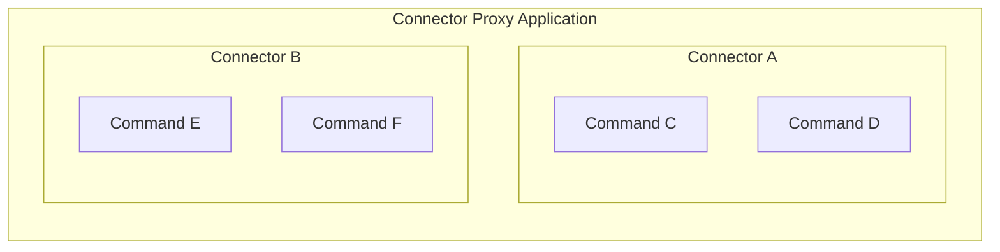

# Connector Proxy

A connector-proxy is an optional application that can be deployed alongside (or separately from) the frontend and backend.
Please see [Connector Proxy in 5 mins](https://github.com/sartography/spiff-arena/wiki/Connector-Proxy-in-5-mins).



Connector proxies are containers for connectors.
In this repository, connectors are Python libraries that are included in connector proxy codebases, and some proxies embed connector logic directly (see the async-http example below).
Our connector-proxy-demo includes a few connectors, including [connector-aws](https://github.com/sartography/connector-aws), [connector-http](https://github.com/sartography/connector-http), [connector-slack](https://github.com/sartography/connector-slack), and [connector-smtp](https://github.com/sartography/connector-smtp).
Connector-http can be used for many API interactions, but you can also [write your own connectors](/how_to_guides/extend_the_system/how_to_build_a_connector).

## async-http Example

The **async-http** example demonstrates a simple and explicit connector proxy pattern:

- A command discovery endpoint that returns available commands and parameter schemas
- A set of execution routes, one per command
- A consistent response envelope for results, with a versioned contract

**Implementation notes:**
- Built with **Falcon ASGI** (`falcon.asgi.App`)
- Uses **httpx.AsyncClient** for outbound requests (`timeout=None` in the sample)
- Uses **orjson** for JSON parsing
- Enables CORS (`cors_enable=True`)

> **Important:** This implementation is intentionally minimal (for example, error handling is marked TODO) and should be hardened before production use. See **Security & Production Hardening**.

---

## Running async-http with Docker Compose

Example compose service:

```yaml
services:
  connector-proxy-async-http:
    build:
      context: connector-proxies/async-http
      dockerfile: Dockerfile
    environment:
      HOST: "0.0.0.0"
      PORT: "${CONNECTOR_PROXY_ASYNC_HTTP_PORT:-8200}"
      XDG_CACHE_HOME: "/app/.cache"
    ports:
      - "${CONNECTOR_PROXY_ASYNC_HTTP_PORT:-8200}:${CONNECTOR_PROXY_ASYNC_HTTP_PORT:-8200}/tcp"
```

Start the service:

```bash
docker compose up --build
```

By default, the port published is:

- `http://localhost:8200` (when `CONNECTOR_PROXY_ASYNC_HTTP_PORT` is not set)

---

## API: Command Discovery

### `GET /v1/commands`

Returns a list of supported commands and their parameter schemas. This makes the connector proxy **self-describing**.

The async-http example exposes these commands:

- `http/DeleteRequest`
- `http/GetRequest`
- `http/HeadRequest`
- `http/PatchRequest`
- `http/PostRequest`
- `http/PutRequest`

Each command includes a `parameters` array describing:

- `id` (parameter name)
- `type`
- `required` (true/false)

---

## API: Command Execution

Each command is executed through a dedicated route:

- `POST /v1/do/http/DeleteRequest`
- `POST /v1/do/http/GetRequest`
- `POST /v1/do/http/HeadRequest`
- `POST /v1/do/http/PatchRequest`
- `POST /v1/do/http/PostRequest`
- `POST /v1/do/http/PutRequest`

All execution routes:
- accept a JSON request body
- make an outbound HTTP request using `httpx.AsyncClient.request(...)`
- return a standard response envelope

---

## Parameters (`/v1/commands`)

These are the schema definitions returned by async-http and should be treated as the public contract.

### Common parameters (all commands)
- `url` *(required, string)* — Target URL
- `headers` *(optional, any/object)* — Request headers

### Optional basic authentication (supported)
- `basic_auth_username` *(optional, string)*
- `basic_auth_password` *(optional, string)*

### GET / HEAD commands
- `params` *(optional, any/object)* — Query string parameters

### DELETE / PATCH / POST / PUT commands
- `data` *(optional, any/object)* — JSON request body

> **Note:** In this example, `DeleteRequest` is advertised with `data` (not `params`) in the command schema.

---

## Examples

### List available commands

```
curl -s http://localhost:8200/v1/commands | jq
```

### Execute a GET request

Endpoint:

```
POST /v1/do/http/GetRequest
```

Payload:

```json
{
  "url": "https://api.example.com/items",
  "headers": { "Accept": "application/json" },
  "params": { "limit": 10 }
}
```

### Execute a POST request

Endpoint:

```
POST /v1/do/http/PostRequest
```

Payload:

```json
{
  "url": "https://api.example.com/items",
  "headers": { "Content-Type": "application/json" },
  "data": { "name": "example" }
}
```

### Execute with basic auth

```json
{
  "url": "https://api.example.com/secure",
  "basic_auth_username": "user",
  "basic_auth_password": "pass"
}
```

---

## Response Contract

All commands return a response envelope with this structure:

```json
{
  "command_response": {
    "body": {},
    "mimetype": "application/json",
    "http_status": 200
  },
  "command_response_version": 2,
  "error": null,
  "spiff__logs": []
}
```

### Response parsing behavior

- If the upstream response `Content-Type` includes `application/json`, the proxy parses JSON into `command_response.body`.
- Otherwise, it returns:

```json
{ "raw_response": "<text>" }
```

> **Note:** The example sets `mimetype` to `"application/json"` for all responses, including raw text responses.

---

## Error Handling Notes

The async-http example is intentionally minimal:

- `error` is included but may not be populated in all cases
- the HTTP client is configured with `timeout=None`

For production use, implement:
- consistent error objects in `error`
- exception handling for upstream failures and parsing errors
- timeouts and retry policies appropriate for your environment

---

## API Key Authentication

If SpiffArena is configured with a `SPIFFWORKFLOW_BACKEND_CONNECTOR_PROXY_API_KEY`, it will include a `Spiff-Connector-Proxy-Api-Key` header on every request it sends to the connector proxy.
Your connector proxy implementation can validate this header to restrict access to authorized SpiffArena instances only.
See [Configure a Connector Proxy](../../how_to_guides/deployment/configure_a_connector_proxy) for how to set the key.